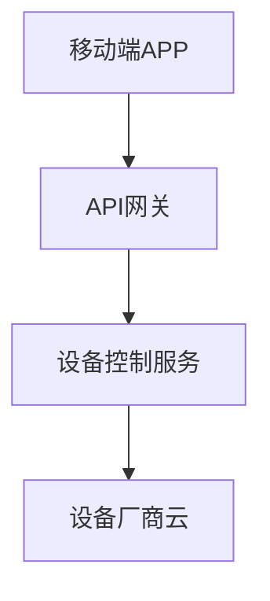

# AI 智能云盘项目
## 课程介绍

**课程背景**

- 准备近2年的综合性实战项目，结合后端分布式开发 + AI大模型智能体开发 + 业务应用
- 目标：打造新一代AI智能化云盘，集成新技术 + 后端业务解决方案 + AI大模型多场景落地
- 技术栈：
  - 后端：Java（Spring Boot 3.X + JDK21 + 大文件传输处理）
  - AI板块：JavaScript + Python 3.1X（FastAPI框架 + 向量数据库Milvus + 多模型支持）
- **无需Python基础**：课程从零教学，覆盖AI大模型开发、Agent实战及三方类库应用


**注意事项**

- 适合人群：后端/前端业务研发工程师（无需机器学习基础）
- 课程重点：**业务系统 + LLM大模型应用开发**，非底层理论，专注编码落地与场景解决方案
- 价值：互联网未来10年关键竞争力，覆盖90%应用的AI智能化重构需求

### **核心技术体系**

1. **后端业务**
   - Spring Boot 3.X全家桶 + JDK21 + 大文件处理（上传/秒传/下载/分享）
   - 私有化云盘开发（类似阿里云盘/NAS）
2. **AI大模型**
   - Python 3.1X + FastAPI + Milvus向量数据库
   - 支持多模型调用：ChatGLM、GPT-4、通义千问、LLaMa等（在线调用或私有化部署）
3. **AI Agent开发**
   - Prompt工程、RAG知识库构建、智能体开发（LCEL/Tools/Memory）
   - MaaS模型服务搭建

后端业务全新技术:SpringBoot3.X全家桶+JDK21+超多实用java生态类库+大文件传输处理0AI大模型全新技术:Python3.1X+FastAP|框架+全新Langchain框架+向量数据库Milvus+多个大模型
o 智能化云盘 多数一线大厂正在研发的业务领域，全网首个后端业务+AI大模型一起的项目教程
。LLM大模型支持在线大模型调用和本地私有化部署，包括不限于chatGLM、GPT-4、通义千问、LLaMa等
o 后端业务开发板块:打造私有化云盘，大文件上传、秒传、下载、在线分享等核心模块

### **核心应用场景**

- **智能云盘功能**：多类型文件存储/处理、多架构支持

  AI Agent落地案例：

  - 智能机器人（Chat助理、客服、销售顾问）
  - 长短期记忆的个人助理
  - 基于云盘文件的智能检索与业务交互

**课程特色**

- 全网首个**后端业务 + AI大模型**整合项目
- 从0到1教学：AI基础 + 项目实战，拓展工程师AI实战能力
- 型存储架构angyangccd-xingyange基于云盘存储文件，
- 结合LLM大模型，开发多个Agent智能体，应用多个业务场景，包括不限于
- 从0到1讲解AI大模型基础+项目实战，拓展前端/后端工程师必备的人工智能知识和应用实战智能机器人chat助理:长短期记忆的个人助理、智能客服、智能销售顾问等


### 适合人员

**课程适合人员**
​**​·多年CRUD老手/技术组长/CTO，工作多年技术成长遇到瓶颈，项目亮点稀缺？​**​

AI大模型重塑后端业务，打造不一样大厂简历，掌握后端业务+AI大模型解决方案

大模型为核心的人工智能新时代到来，市场对大模型应用开发需求“指数级”飙升

· 用于电商、教育、金融、物流、营销…各行业都可冲刺，下一个互联网十年


**·计划跳槽一二线互联网大厂，想突破成为技术组长/架构师（技术+管理）**

· 从0到1架构智能云盘项目，包括需求文档+架构图+技术选项+AI解决方案+部署上线

· 超多不同领域的通用解决方案+应用场景，达到举一反三的思考能力

· 各行业都需要AI大模型的知识与解决方案+应用能力，个人能力的分水岭重新划分

· 掌握后端业务+人工智能下的MSASS服务架构


**·工作1到7年的后端工程师（传统IT企业转行互联网项目）**

· 采用全新互联网主流技术栈，整合AI大模型提升编码能力+业务应用落地

· 超通用的大型互联网项目经验，90%公司都可以包装，且适合直接使用

· 通过AI大模型提高自己行业竞争力的，适合各类技术人员

**·校招计划进大厂，本科、研究生的同学（国内/海外大厂都可以）**

· 告别烂大街没亮点的简历项目，课程项目来自一线大厂实际业务应用

· 避免本地虚拟机部署，从0到1手把手+多角度实战+生产服务器落地部署

· 满足不同业务场景的AI智能化解决方案，带你实战互联网大厂开发流程


**AI大模型的行业解决方案和案例库参考**
· https://page.dingtalk.com/wow/dingtalk/Default/dingtalk/10HFYX4QStBlpLgxNO.E
· https://wolai.dingtalk.com/jVUBRtv4HXRnBSWRWj6
· https://bigmodel.cn/


#### 市场岗位方向

o 高级java工程师/技术组长/架构师(本身后端能力+AI大模型应用开发能力)o AI应用开发工程师(前端、后端、测试、运维、大数据等其他方向转)

O AI大模型开发工程师(前端、后端、测试、运维、大数据等其他方向转)


### 课程解决方案

问题：大模型是直接调用API吗，就是调用通义千问或者文心一言接口吗？

#### 核心讨论
- **常见误解**  
  "不少同学认为，LLM大模型只是简单调用API？那如何和后端业务+数据库数据库数据库数据库数据库数据库"

- **实际挑战**  
  "架构也和微服务类似，LLM重试机制、兜底降级机制等等怎么做？敏感数据敢上传外部？"

#### 技术细节
1. **失败处理与系统管理**  
   "某一次失败之后应该怎么处理，还有日志生成、管理资源、性能优化、准确性等等  
   某一次失败之后应该怎么处理，还有日志生成、管理资源、性能优化、准确性等等  
   这一些都是很关键的，靠普通的API是解决不了的，这个就是大课的部分解决方案，还有更多！！！！！"

2. **大模型定位**  
   "通义千问或者文心一言都是一个基层模型底座，这些大模型类似我们的操作系统，不是商业应用程序"

#### 商业化应用
- **开发模式**  
  "类似我们会基于操作系统上开发App软件；那AI应用就是基于这些大模型作为底座，开发上层的商业智能化应用"

- **行业限制**  
  "公司需要做智能知识库、行业智能客服、智慧政务、AI律师、AI客服等，那就没法用这些平台  
  因为你公司不可能把敏感数据上传上去，而且也没法做到；  
  比如律师行业，医疗行业，财税行业等领域知识都是"

- **私有化需求**  
  "像很多公司都是有沉淀很多历史的


问题：学完这个大课，可以开发怎么样的项目和应用呢？

#### AI文档助手
你可以给一堆专业文档，包括word文档、PDF等，让AI工具帮你生成文档总结做周报、季度汇报等  
给公司培训的的时候，可以从网上寻找很多资料，但是杂乱分散，可以让AI帮你整理和汇总，排版清晰  
让AI帮你写多类型跳槽简历，毕业论文  

#### 企业知识库
将企业的各类知识资源进行智能化归类、整合，形成一套问题与答案的集合  
【企业内部知识共享】作为企业内部的知识共享平台，帮助员工快速获取所需知识，提高团队协作效率  
【客户服务】AI企业问答知识库可以为客户提供快速准确的解答服务理解客户的问题并给出相应的答案  
【员工培训】AI企业问答知识库还可以作为员工培训的平台，根据员工的个人需求进行定制化培训  

#### 私人AI助理
聊天与陪伴：私人AI助理可以陪伴用户聊天、讲笑话、玩小游戏等，提供轻松愉快的休闲娱乐体验。  
个性化推荐：根据用户的喜好和行为习惯，推荐音乐、电影、书籍等娱乐内容。  
健康管理：监测家庭成员的健康状况，提供运动、饮食建议，甚至可以协助医生进行诊断  

#### 特定领域智能聊天机器人
通过给AI一系列资料，单独训练特定领域，然后让帮我们做出决策  
比如  
各个大公司财报和历史股票行情信息，让AI汇总和给出指导建议  
给出医院检查报告等，AI训练可以给出诊断和建议  
给出特定领域销售部门的日常话术和专业知识，充当智能客服  

问题：IT行业工作从事前端开发或后端开发、测试方向、大学生等是否适合学习？大专是否可以？

#### 学习适配性说明
- **课程侧重点**  
  `LLM应用开发`，更贴近企业实际业务场景，学习难度较常规人工智能/深度学习更低  
  `AI大模型是前沿知识`，属新风口领域，课程提供基础内容帮助快速上手  

- **适合人群**  
  ✓ 大学生（需至少学过编程语言）  
  ✓ 前端/后端/测试/运维/大数据从业者  
  ✓ 技术组长/架构师  
  `下一个互联网10年风口方向！`  

- **学历要求**  
  ▸ 中大型企业通常要求本科  
  ▸ 大专学历需技术能力过硬  
  `建议做好职业规划，提升技术/项目竞争力`  

#### 课程内容对比
| 类型         | AI大模型应用开发                       | AI大模型底层原理        |
| ------------ | -------------------------------------- | ----------------------- |
| **特点**     | 开发智能应用（如客服机器人、政务系统） | 研究算法原理、数学模型  |
| **市场需求** | 90%（App/网站等产品开发）              | 10%（科研/算法岗）      |
| **学习建议** | 适合喜欢编码、快速见效的学员           | 需高等数学/英文论文基础 |

#### 电脑配置要求
- **基础要求**  
  `常规电脑即可学习`（后端项目+LLM训练可通过云服务器解决）  
- **生产环境**  
  ▸ 课程教授多LLM模型封装技术  
  ▸ 练习用小参数模型，生产按需选择参数规模  
  `硬件问题可用三方算力平台（几十元成本）`  


### 大课技术栈概览

#### 基础工具环境
○ AI大模型编码插件  
○ JDK21  
○ IDEA旗舰版  
○ VSCode  
○ Python3.1X  
○ Linux服务器  

#### 后端高并发技术
○ 新版SpringBoot3.X  
○ MybatisPlus  
○ Lombok  
○ Hutool  
○ Mysql8.X  
○ 多个开源工具包  

#### 中间件+存储技术
○ Redis7.X  
○ Kafka3.X-Kraft架构  
○ 分布式文件存储MinIO或OSS存储引擎  

#### 前端技术
○ Vue3  
○ AntDesign  
○ Nginx网关  
○ 多个前端开源组件（提供完整代码）  

#### AI大模型技术
○ 新版GPT/ChatGLM/通义千问等  
○ Huggingface/Modelscope等模型库  
○ FastAPI框架  
○ 全新Langchain框架  
○ 向量数据库Milvus  
○ 多个大模型高频类库  

#### LLM框架组件
○ Model  
○ Prompt  
○ Agent  
○ Chains  
○ Memory  
○ Indexes  
○ RAG  
○ ReAct  

#### DevOps上线部署
○ Jenkins CI/CD  
○ 阿里云Git仓库  
○ 阿里云ECS服务器  
○ Docker容器编排调度  

#### 内容安排说明
○ 前置必备技术栈：SpringBoot+Mysql+Redis+Kafka+Docker+Linux（不会的去官网学习）  
○ 其他新技术栈：Python+LangChain+FastAPI+Milvus+MinIO等大课里面会讲  
○ 课程有多个板块，讲课安排是逐个技术栈进行击破，然后整合到项目里面，持续改进方案  

#### 注意事项
○ 此大课不需要【Python和人工智能】相关基础，大项目应用前都会从0到1讲，然后再实战！！！  
○ AI智能网盘LLM大模型Agent智能体开发代码不多，但是关联的全新知识很多，务必仔细学  
○ 整个过程大家需要学会思考，发现问题，里面也会留代码和设计的坑，要求大家细心发现并给出优化方案  


### 技术组长的你知道如何编写需求文档不？

#### 简介
技术组长的你知道如何编写需求文档不？  
程序，你快下来吧我们不改功能了  

#### 为什么技术Leader需要掌握产品需求文档？
○ **核心**：有些不懂技术的产品经理没法编写特定领域的项目需求文档  

○ **技术知识缺乏**：  
特定领域的项目可能需要特定的技术知识。  
如果产品经理缺乏相关技术背景，难以理解技术实现的复杂性和可行性，从而难以准确描述技术需求。  

○ **沟通障碍**：  
产品经理需要与技术团队紧密合作，以确保需求的可实现性。  
如果产品经理不懂技术，他们可能难以与技术团队有效沟通，导致需求文档中的技术细节不准确或不完整。  

○ **风险评估不足**：  
能导致项目在实施过程中遇到预料之外的问题。"不口0/↗  

○ **需求优先级判断**太小  


```
# 智能家居控制系统产品定义文档

## 目录
1. 引言
2. 产品概述
3. 产品目标
4. 用户与市场分析
5. 功能需求说明
6. 技术实现方案
7. 项目里程碑

---

## 1. 引言
### 1.1 文档目的
明确智能家居控制系统的产品定位、目标用户群体和核心功能要求，为开发团队提供明确的产品开发方向。

### 1.2 适用范围
适用于产品经理、开发团队、测试团队及市场运营团队。

---

## 2. 产品概述
### 2.1 产品背景
随着物联网技术的发展，家庭设备智能化需求日益增长。本产品旨在通过统一的控制平台，实现家居设备的智能联动。

### 2.2 产品定位
面向中高端家庭用户的智能家居控制中枢，支持跨品牌设备接入。

---

## 3. 产品目标
### 3.1 核心目标
- 实现90%以上主流品牌设备的接入兼容
- 用户操作响应时间<0.5秒
- 系统稳定性达到99.9%可用性

### 3.2 商业目标
- 上市6个月内占据15%市场份额
- 年销售额突破5000万元

---

## 4. 用户与市场分析
### 4.1 目标用户画像
| 用户类型 | 特征 | 使用场景 |
|---------|------|----------|
| 科技爱好者 | 25-40岁 | 设备自动化场景定制 |
| 高端家庭 | 35-55岁 | 语音控制家电 |

### 4.2 市场分析
2023年全球智能家居市场规模达$1500亿，年增长率12%

---

## 5. 功能需求说明
### 5.1 核心功能
1. **设备控制**
   - 支持100+设备类型控制
   - 自定义场景模式

2. **智能联动**
   - 条件触发规则设置
   - 多设备协同场景

### 5.2 扩展功能
- 第三方服务接入（天气/交通）
- 能源消耗分析

---

## 6. 技术实现方案
### 6.1 系统架构



### 需求文档

太多了


#### 温故而知新-架构图的作用和绘制技巧

**简介：温故而知新-架构图的作用和绘制技巧**

* 什么是架构图？
  - 架构图 = 架构 + 图
  - 用图的形式把系统架构展示出来，配上简单的文案


* 架构图是给人看的，这些人我们习惯称为【业务方、客户】，有哪些人？

  - 人员
    - 上级：你的公司Leader(晋升汇报)、老板、外部投资人
    - 团队内：产品、运营、测试、技术、运维同学
    - 外部：最终系统使用的用户
  - 好比阿里这边评定绩效，有一项就是业务方评分
    - 你做的外部用户的活动系统，测试同学会进行测试，太多bug肯定就不行
    - 你做的给运营同学使用的系统，不能提升她运营的效率，业务方是否满意？

* 画架构图是为了什么

  - 一图胜千言，解决沟通障碍，给不同的【业务方】看懂
  - 业务方很多，不同人看到角度不一样，你让【产品经理】看 【物理部署视图】他看得懂？

  

* 为什么要搞出这么多个架构图？用一个图不行吗？

  - 一开始确实是一个图表示系统架构设计
  - 但是业务方很多，不同人看到角度不一样，你让软件用户看物理部署视图？他看得懂？
    - 要明确沟通交流面向的客户
    - 开发人员、运维人员、项目经理、软件最终用户、客户
  - 架构图包括 功能需求、部署需求、流程需求等太复杂，所以还是要单一职责模式
  - 不同架构视图承载不同的架构设计决策，支持不同的目标和用途
  - 架构图也不能太多（过度文档化）维护更新起来成本大


- 不同架构图应该使用哪种方法来画?
  - 可以用的表示法和工具很多，没有太多的限制，把握对应的视图关注点才是关键
    - Xmind、EdrawMax、PPT、PowerDesigner
    - OmniGraffle、Visio、Process On
  - 开始阶段不要陷入过度设计中，没那么多需求不一定要那么多图（你是否有那么多客户）


* 常见架构图作用对比
  * 业务架构
    - 表达业务是如何开展的，服务于业务目标，通过描绘业务上下层关系，简单的业务视图降低业务系统的复杂 
  * 应用架构
    - 是对整个系统实现的总体架构 ,  应用架构和**系统架构**很大类似
    - 一方面承接业务架构的落地，一方面影响技术选型
    - 注意：一般应用架构图【不加入太多技术框架和实现】
  * 技术架构
    - 应用架构本身只关心需要哪些应用系统，不关心在整个项目中你需要使用哪些技术
    - 技术架构则是实现应用架构的承接方，识别技术需求，进行技术选型，描述技术之间的关系
    - 解决的问题包括
      - 技术层面的分层、开发语言、框架的选择
      - 通信技术、存储技术的选择、非功能性需求的技术选择等


#### 老王是个画家-教你画高大上的业务架构图

**简介：老王是个画家-教你画高大上的业务架构图**

- 在画架构图之前，想清楚3个问题，架构图想表达什么？有什么用？给谁看？
  - 表达是业务系统之间的关系，梳理业务结构
  - 将复杂的业务逻辑简单化，降低理解难度，更方便业务方理解
  - 给业务方查看，业务相关干系人


- 业务架构图
  - 表达业务是如何开展的，服务于业务目标，通过描绘业务上下层关系，简单的业务视图降低业务系统的复杂度，提高客户理解度
  - 图中【尽量不出现技术】的字眼，不同架构图的读者是不同的，确保能看懂。
  - 架构图中模块的划分粒度，一定要合适，既不能太宽泛，也不能太细粒度
  - 无技术背景人员可参与实现的讨论，向技术人员描述解决方案核心要做什么，必须实现的关键是什么
  - 明白一个点
    - 先有业务，再有系统，微服务/系统/中心  是类似概念
    - 系统是来实现业务的，比如电商业务里面A系统、B系统

* 业务架构类型

  - 上中下结构：用户展现层-业务平台层-公共能力层-数据存储层-基础资源层
    - 案例一（图片来源-阿里云数字政府）

  

  - 左中右结构：上游产业 - 业务平台- 下游产业
    - 相对较少用，就是倒置过去

* 画图三步走（**不同架构图通用法则**）

  - 分层 
    - 业务按照层级进行划分，各个层级属于独立的版块 
    - 下层为上层提供服务能力支撑，比如：laaS / PaaS / SaaS 
  - 分模块
    - 同层级中进行小归类；属于平行关系，可以独立存在
    - 理清架构图类型、业务要全面、专业术语一致、图形清晰美观、颜色类型划分合理
      - 不同颜色可以表示当下要做的，未来要做的
  - 分功能
    - 独立功能划分出来，即业务入口
    - 业务方重点关注的功能点，可以认为是微服务划分

* 

* 如何判断架构图的好和坏？

  - 业务抽象设计的合理性，是否满足高内聚、低耦合的要求，不能太宽泛，也不能太细粒度
  - 层级划分目标系统边界，自下而上 或 由上而下，一般包括 基础设施、数据层、应用层、用户层四个层次
  - 纵向分层 上层依赖于下层越底层，越是基础服务；横向并列关系，级别相同
  - 理清架构图类型、业务要全面、专业术语一致、图形清晰美观、颜色类型划分合理
  - 最重要是：**你的业务方能 满意+看懂！！！**


#### 滴云自动化测试平台应用架构图介绍

**简介：滴云自动化测试平台业务架构图介绍**

* 什么是应用架构图

  - 是对整个系统实现的总体架构 ,  应用架构和**系统架构**很大类似

  - 一方面承接业务架构的落地，一方面影响技术选型

    * 注意：一般应用架构图【不加入太多技术框架和实现】

  - 作用

    - 根据业务场景 对系统进分层，指出开发的原则、系统各个层次的应用服务
    - 指导软件的研发，包括不限于 制定应用规范、定义接口和数据交互协议，满足功能性需求和非功能性需求

  - 业务方

    - **研发人员，各层级架构师，各层级技术管理者**

  - 分类

    - 多系统应用架构，用来分层次说明不同系统间的业务逻辑关系、系统边界等，比如 分布式、微服务
    - 单系统应用架构，用来分层次说明系统的组成模块和功能点之间的业务逻辑关系，比如单体应用

  - 常规分层
    - 表示-展现层：负责用户体验
    - 业务-服务层：负责业务逻辑
    - 数据-访问层：负责数据库存取

* 画图三步走
  - 分层 
    - 业务按照层级进行划分，各个层级属于独立的版块 
    - 下层为上层提供服务能力支撑，比如：laaS / PaaS / SaaS 
  - 分模块
    - 同层级中进行小归类；属于平行关系，可以独立存在
    - 理清架构图类型、业务要全面、专业术语一致、图形清晰美观、颜色类型划分合理
      - 不同颜色可以表示当下要做的，未来要做的
  - 分功能
    - 独立功能划分出来，即业务入口
    - 业务方重点关注的功能点，可以认为是微服务划分

* 滴云自动化测试平台应用架构图（找bug）


### AI大模型下的技术工程师的开发神器

AI会淘汰程序员?
 AI技术的发展一定程度上改变我们程序员的工作方式，例如自动化一些重复性任务，辅助程序员进行代码审查和优化等

也可以编写包括中等程度的CURD、算法等;但AI很难完全替代程序员，可以很大程度辅助我们工程师

程序员在创造力、人际沟通、适应新技术、解决复杂问题以及法律责任等方面具有不可替代的优势，AI背锅?

如果程序员不懂技术，你能判断AI写的代码上生产环境?出问题你可以排查?


AI编码插件对比

CODEGEEX(清华大学+智普AI)

##### **官方地址**

- 官网：https://codegeex.cn
- GitHub：https://github.com/THUDM/CodeGeeX

##### **✅ 优势**

1. **国产自研**：由清华大学和智谱AI联合开发，支持中文代码生成优化。
2. **多语言支持**：130+ 编程语言（尤其擅长 Python、Java、C++）。
3. **本地化部署**：支持私有化部署，适合企业数据安全需求。
4. **免费可用**：个人版免费，适合国内开发者。

##### **❌ 缺点**

1. **代码质量不稳定**：复杂业务逻辑生成能力弱于 Copilot。
2. **上下文理解有限**：跨文件分析能力较弱。
3. **生态整合不足**：插件功能较简单（VS Code/JetBrains），缺少 Copilot 的深度 IDE 集成。
4. **更新较慢**：模型迭代速度不如 GitHub Copilot 和通义灵码。


#### **通义灵码（阿里云）**

##### **🔗 官方地址**

- 官网：https://tongyi.aliyun.com/lingma

##### **✅ 优势**

1. **阿里云生态整合**：深度支持阿里云服务（如函数计算、OSS）。
2. **中文优化**：对国内开发场景（如政务、金融）适配更好。
3. **企业级功能**：支持私有化部署，适合 ToB 客户。

##### **❌ 缺点**

1. **闭源**：不像 CodeGeeX 提供开源版本。
2. **语言覆盖较少**：主要聚焦 Java/Python/Go，小众语言支持弱。


#### **GitHub Copilot（微软）**

##### **🔗 官方地址**

- 官网：https://github.com/features/copilot

##### **✅ 优势**

1. **行业标杆**：基于 GPT-4，代码生成质量最高。
2. **跨文件理解**：能分析整个项目上下文。
3. **生态强大**：完美适配 VS Code/Visual Studio/JetBrains。

##### **❌ 缺点**

1. **付费**：$10/月（个人版），企业版更贵。
2. **数据隐私问题**：代码默认上传云端，不适合敏感项目。
3. **中文支持一般**：对国内开发场景优化较少。


#### **横向对比总结**

|     工具     | 代码质量 | 中文支持 | 本地部署 |  价格  |      适合场景       |
| :----------: | :------: | :------: | :------: | :----: | :-----------------: |
| **CodeGeeX** |   ⭐⭐⭐☆   |   ⭐⭐⭐⭐   |    ✅     |  免费  |    国内个人/企业    |
| **通义灵码** |   ⭐⭐⭐⭐   |   ⭐⭐⭐⭐   |    ✅     | 订阅制 |   阿里云生态用户    |
| **Copilot**  |  ⭐⭐⭐⭐⭐   |   ⭐⭐☆    |    ❌     | $10/月 | 国际团队/全栈开发者 |


比较牛逼的 cursor


#### 第1集 新一代AI技术变革下-如何认清方向

**简介：新一代AI技术变革下-如何认清方向**

* 国外的AI平台

  * ChatGPT,地址 https://platform.openai.com/playground

  

* 国内AI平台

  * 百度

    * 文心一言，地址 https://yiyan.baidu.com/ 

  * 讯飞

    * 星火大模型，地址 https://xinghuo.xfyun.cn/

  * 阿里云

    * 通义，地址  https://tongyi.aliyun.com/

    

* ChatGPT、AIGC对我们IT行业的影响有多大？包括但不限于以下几种：

  * **对话系统**：
    * ChatGPT模型可以用于构建对话系统，实现自然语言问答、客服机器人等功能。
    * 例如智能音箱中的语音助手、在线聊天服务中的客服机器人等。
  * **文本生成**
    * ChatGPT模型可以用于生成各种类型的文本，如新闻报道、小说、诗歌等，
    * 例如自动化写作软件、创意内容生成工具等。
  * **语音转写**：
    * ChatGPT模型可以用于将语音转成文本，实现语音识别功能
    * 例如语音助手、语音翻译软件等。
  * **情感分析**：
    * ChatGPT模型可以用于分析和识别文本中所包含的情感色彩，如正面情感、负面情感等。
    * 例如社交媒体中的舆情分析、市场调查等。

* **个人感觉：行业AI真正的从人工智障转为人工智能**

- **IT技术行业会如何变化**
  - 传统的重复性工作可以被自动化和智能化
    - 例如自动编写基础代码、自动化测试、自动化发布、自动化部署等
    - 这使得技术人员能够更加专注于高价值和创新性的工作，提高工作效率和质量
  - 降低技术门槛
    - 随着 ChatGPT 和 AIGC 等技术的普及，关注点逐渐从技术底层转移到应用场景
    - 越来越多的人可以利用这些技术来解决问题，而不必具备特定的编程语言或统计学知识
  - 数据处理
    - 提供了更多的数据处理手段，例如自然语言处理、图像处理、数据挖掘等
    - 技术人员可以通过技术更好地处理和分析业务数据，发现数据背后的有用信息，提高决策的准确性和效率

- 其他行业：设计、金融、客服 会怎样变革 ?


#### 第2集 AI大模型下技术工程师的开发神器实战

**简介：AI大模型下技术工程师的开发神器**

* AI大模型下，技术工程师如何提高效率，利用AI开发代码提高效率

  * **工具核心：让开发人员提供的示例或自然语言的描述，能够从大量数据中学习并生成相关的、准确的代码**
  * **常见工具：Copilot 、AlphaCode、通义灵码**

* 通义灵码

  * 地址：https://tongyi.aliyun.com/lingma

  

  * 介绍
    * 是阿里云出品的一款基于通义大模型的智能编码辅助工具，提供行级/函数级实时续写、自然语言生成代码、单元测试生成
    * 代码注释生成、代码解释、研发智能问答、异常报错排查等能力，对阿里云 SDK/OpenAPI 的使用场景调优
    * 助力开发者高效、流畅的编码。
  * 支持编程语言 
    * 支持 Java、Python、Go、C#、C/C++、JavaScript、TypeScript、PHP、Ruby、Rust、Scala、Kotlin 等主流编程语言。
  * 支持 IDE 及操作系统 
    * JetBrains IDEs
      * IDE 版本：IntelliJ IDEA、PyCharm、GoLand、WebStorm 等 2020.3 及以上
      * 操作系统：Windows 7 及以上、macOS、Linux
    * Visual Studio Code
      - IDE 版本：1.75.1 及以上
      - 操作系统：Windows 8.1 及以上、macOS、Linux
  * 安装步骤

  


## 项目搭建

**简介： 智能化云盘springboot3.x本地化开发环境创建**

开发环境说明 :

Maven: 3,9以上

```
mvn -version
```


jdk21版本(LST版本 主流一个是26到28年) 现在大部分还是使用 11---17 前几年用的8

```shell
(base) xingyang@jijianchundeMacBook-Pro ~ % java --version
java 21.0.23 2024-04-16 LTS
Java(TM) SE Runtime Environment 18.9 (build 11.0.23+7-LTS-222)
Java HotSpot(TM) 64-Bit Server VM 18.9 (build 11.0.23+7-LTS-222, mixed mode)
(base) xingyang@jijianchundeMacBook-Pro ~ % 
```


idea使用新版的旗舰盘本

springboot版本为3


项目名字

d-cloud-study


版本选择3.4.0


修改版本

```xml
   <properties>
        <java.version>1.8</java.version>
        <project.build.sourceEncoding>UTF-8</project.build.sourceEncoding>
        <project.reporting.outputEncoding>UTF-8</project.reporting.outputEncoding>
        <spring-boot.version>3.2.4</spring-boot.version>
    </properties>
```


### 依赖初始化

**注意**: 有些包maveb下载比较慢 等待就可以了

 	1. 删除本地仓库spring相关依赖,就是.m2目录下载的 然后指向mvn install
 	1. 建议先使用默认的maven仓库 不用更换地址


项目以依赖版本配置

```xml
   <properties>
        <java.version>21</java.version>
        <aws-java-sdk-s3.version>1.12.730</aws-java-sdk-s3.version>
        <mybatisplus.version>3.5.6</mybatisplus.version>

        <hutool-all.version>5.8.27</hutool-all.version>
        <common-io.version>2.8.0</common-io.version>
        <fastjson.version>2.0.42</fastjson.version>
        <mysql.version>8.0.27</mysql.version>
        <minio.version>8.3.7</minio.version>

    </properties>
```


依赖

```xml
 
 <dependencies>
        <!-- Spring Boot Web依赖 -->
        <dependency>
            <groupId>org.springframework.boot</groupId>
            <artifactId>spring-boot-starter-web</artifactId>
            <version>3.3.4</version>
        </dependency>

        <!-- 切面 -->
        <dependency>
            <groupId>org.springframework.boot</groupId>
            <artifactId>spring-boot-starter-aop</artifactId>
            <version>3.0.5</version>
        </dependency>

        <!-- 数据库连接 -->
        <dependency>
            <groupId>mysql</groupId>
            <artifactId>mysql-connector-java</artifactId>
            <version>8.0.27</version>
        </dependency>

        <!-- Lombok依赖 -->
        <dependency>
            <groupId>org.projectlombok</groupId>
            <artifactId>lombok</artifactId>
            <version>1.18.30</version>
        </dependency>

        <!-- 测试依赖 -->
        <dependency>
            <groupId>org.springframework.boot</groupId>
            <artifactId>spring-boot-starter-test</artifactId>
            <scope>test</scope>
            <version>3.3.1</version>
        </dependency>

        <!-- AWS S3 SDK -->
        <dependency>
            <groupId>com.amazonaws</groupId>
            <artifactId>aws-java-sdk-s3</artifactId>
            <version>${aws-java-sdk-s3.version}</version>
        </dependency>

        <!-- JWT支持 -->
        <dependency>
            <groupId>io.jsonwebtoken</groupId>
            <artifactId>jjwt</artifactId>
            <version>0.12.3</version>
        </dependency>

        <!-- MyBatis-Plus依赖 -->
        <dependency>
            <groupId>com.baomidou</groupId>
            <artifactId>mybatis-plus-spring-boot3-starter</artifactId>
            <version>${mybatisplus.version}</version>
        </dependency>
        <!-- 代码自动生成依赖 begin -->
        <dependency>
            <groupId>com.baomidou</groupId>
            <artifactId>mybatis-plus-generator</artifactId>
            <version>${mybatisplus.version}</version>
        </dependency>
        <!-- velocity -->
        <dependency>
            <groupId>org.apache.velocity</groupId>
            <artifactId>velocity-engine-core</artifactId>
            <version>2.0</version>
        </dependency>
        <!-- 代码自动生成依赖 end-->

        <!-- Hutool依赖 -->
        <dependency>
            <groupId>cn.hutool</groupId>
            <artifactId>hutool-all</artifactId>
            <version>${hutool-all.version}</version>
        </dependency>

        <dependency>
            <groupId>io.minio</groupId>
            <artifactId>minio</artifactId>
            <version>${minio.version}</version>
        </dependency>

        <!-- Fastjson依赖 -->
        <dependency>
            <groupId>com.alibaba</groupId>
            <artifactId>fastjson</artifactId>
            <version>${fastjson.version}</version>
        </dependency>

        <!-- knife4j 依赖，接口文档工具 -->
        <dependency>
            <groupId>com.github.xiaoymin</groupId>
            <artifactId>knife4j-openapi3-jakarta-spring-boot-starter</artifactId>
            <version>4.4.0</version>
        </dependency>

        <dependency>
            <groupId>org.springframework</groupId>
            <artifactId>spring-web</artifactId>
            <version>6.1.5</version>
        </dependency>

    </dependencies>

    <build>


<plugins>
            <plugin>
                <groupId>org.springframework.boot</groupId>
                <artifactId>spring-boot-maven-plugin</artifactId>
            </plugin>

            <plugin>
                <groupId>org.apache.maven.plugins</groupId>
                <artifactId>maven-compiler-plugin</artifactId>
                <version>3.1</version>
                <configuration>
                    <source>${java.version}</source>
                    <target>${java.version}</target>
                </configuration>
            </plugin>
            <plugin>
                <groupId>org.apache.maven.plugins</groupId>
                <artifactId>maven-surefire-plugin</artifactId>
                <configuration>
                    <skipTests>true</skipTests>
                </configuration>
            </plugin>
        </plugins>

    </build>

```


创建application.yml


```yml
server:
  port: 8081

spring:
  application:
    name: dcloud-aipan
```


### 生产环境-Linux操作系统EOL解决方案

#### 简介
生产环境-Linux操作系统EOL解决方案

#### 什么是Linux操作系统EOL
○ 操作系统停止维护EOL (End of Life)  
○ 大家也知道很多生产环境操作系统都是使用CentOS，尤其是互联网公司  
○ 但是CentOS官方在24年尾的时候停止了支持，这个就涉及到切换系统  

#### 建议
○ Linux大体是类似的，迁移需要周期，常规25到28年还会是多数公司的首选CentOS  
○ 所以大家还是需要掌握这个主流的系统；如果新项目则可以选择其他操作系统  

#### 常见的CentOS替代方案
包括：
- AlmaLinux  
- Rocky Linux  
- Oracle Linux  
- Ubuntu  
- Debian  

#### 课程服务器购买
○ 阿里云服务器选择（Rocky Linux9.X以上，推荐2核4G或4核8G）使用基本一样，后续也可以切换其他的  
○ 服务器上安装常用中间件，方便测试（网络安全组记得开放）  


###  云服务器Docker镜像加速+软件安装

#### 简介
云服务器Docker镜像加速+软件安装

#### 软件安装
○ **Docker-ce社区版本**  

○ **Mysql8.X**  

（可视化工具自己选择）  

○ **Redis7.X**  

#### 可视化工具下载地址
- [AnotherRedisDesktopManager - Gitee](https://gitee.com/qishibo/AnotherRedisDesktopManager)  
- [AnotherRedisDesktopManager - GitHub](https://github.com/qishibo/AnotherRedisDesktopManager)  

> 注：完全按照图片原文提取，保留原始格式和链接地址。Redis可视化工具推荐使用上述开源工具管理实例。


docker安装命令

~~~shell
## 2. Docker-CE 安装步骤
### Ubuntu/Debian 系
```bash
# 卸载旧版本
sudo apt remove docker docker-engine docker.io containerd runc

# 设置仓库
sudo apt update
sudo apt install -y ca-certificates curl gnupg
sudo install -m 0755 -d /etc/apt/keyrings
curl -fsSL https://download.docker.com/linux/ubuntu/gpg | sudo gpg --dearmor -o /etc/apt/keyrings/docker.gpg
echo "deb [arch=$(dpkg --print-architecture) signed-by=/etc/apt/keyrings/docker.gpg] https://download.docker.com/linux/ubuntu $(. /etc/os-release && echo "$VERSION_CODENAME") stable" | sudo tee /etc/apt/sources.list.d/docker.list > /dev/null

# 安装引擎
sudo apt update
sudo apt install -y docker-ce docker-ce-cli containerd.io docker-buildx-plugin docker-compose-plugin

# 验证安装
sudo docker run hello-world
~~~


安装mysql

```shell
docker run -d \
  --name mysql8 \
  -p 3306:3306 \
  -e MYSQL_ROOT_PASSWORD=your_secure_password \
  -e MYSQL_DATABASE=app_db \
  -e MYSQL_USER=app_user \
  -e MYSQL_PASSWORD=user_password \
  -v /path/to/mysql/data:/var/lib/mysql \
  -v /path/to/mysql/conf:/etc/mysql/conf.d \
  --restart unless-stopped \
  mysql:8.0 \
  --character-set-server=utf8mb4 \
  --collation-server=utf8mb4_unicode_ci
```

##### 重要参数说明

- `-v /path/to/mysql/data`：数据持久化目录
- `--character-set-server`：设置默认字符集
- `--restart unless-stopped`：自动重启策略

#### Redis 7.x 安装配置


```shell
docker run -d \
  --name redis7 \
  -p 6379:6379 \
  -v /path/to/redis/data:/data \
  -v /path/to/redis/conf:/usr/local/etc/redis \
  --restart unless-stopped \
  redis:7.0 \
  redis-server /usr/local/etc/redis/redis.conf \
  --requirepass "your_redis_password" \
  --appendonly yes
```


创建数据库 dcloud_aipan


### Git仓库介绍

```
https://www.bilibili.com/video/BV1qC41177W4/?spm_id_from=333.999.0.0&vd_source=69a35855c05c486343f6d116ec8babaf
```

#### **简介：gitee介绍和git配置**

```
https://www.luffycity.com/actual-course/42/detail
```

- Git介绍 
  - 是一个版本管理工具, 其作用就是可以让你更好的管理你的程序，比如你原来提交过的内容，以后虽然修改了，但是通过git这个工具，可以把你原来提交的内容重现出来，这样对于你后来才意识到的一些错误的更改，可以进行还原
- 基于git协议的代码仓库
  - github 全球最大同性交友社区
  - gitee  开源中国
  - gitlab 开源的git仓库平台，阿里等大厂就是基于这个搭建
  - codeup 阿里云上的免费git仓库
- gitee仓库地址
  - https://gitee.com/
- 大课项目必须用git吗？
  - 如果是因为不会git，而不用则不行，因为这个是互联网公司必备的
- 本地安装文档
  - https://www.runoob.com/git/git-install-setup.html
  - [https://git-scm.com/book/zh/v2/%E8%B5%B7%E6%AD%A5-%E5%AE%89%E8%A3%85-Git](https://git-scm.com/book/zh/v2/起步-安装-Git)
- 大课项目加入git管理（是公钥设置，不是秘钥设置，视频有口误）
  - 本地生成公钥 ssh-keygen -t rsa -C "[794666918@qq.com](mailto:794666918@qq.com)"
    - 生成公钥文档：https://gitee.com/help/articles/4181
    - 设置公钥文档：https://gitee.com/help/articles/4191#article-header0
  - 进入项目目录

进入gitee创建项目


cmd窗口输入

```
git config --global user.name "信仰"
git config --global user.email "11343010+ji-jianchun@user.noreply.gitee.com"
```

idea

```
--->1.git init

​	2.git add

​		3.git commit -m ""

​		4.git push
```


#### vs推送gitee

rider

敲命令

```
cd existing_git_repo
git remote add origin https://gitee.com/ji-jianchun/zmxy-1024-shop.git
git push -u origin "master"
```

vs使用

Git菜单栏创建本地仓库


配置好以后会自动初始化并推送


### 项目规范和工具类声明

#### 响应工具

创建util包

```java
package com.xingyang.util;

import com.alibaba.fastjson.JSON;
import lombok.AllArgsConstructor;
import lombok.Data;
import lombok.NoArgsConstructor;
import net.xdclass.enums.BizCodeEnum;

/**
 * @author 姜阿木
 * @date 2025/4/27 11:06)
 */

@Data
@AllArgsConstructor
@NoArgsConstructor
public class JsonData {

    /**
     * 状态码 0 表示成功
     */

    private Integer code;
    /**
     * 数据
     */
    private Object data;
    /**
     * 描述
     */
    private String msg;

    /**
     *  获取远程调用数据
     *
     * @param typeReference
     * @param <T>
     * @return
     */
    public <T> T getData(Class<T> typeReference){
        return JSON.parseObject(JSON.toJSONString(data),typeReference);
    }

    /**
     * 成功，不传入数据
     * @return
     */
    public static JsonData buildSuccess() {
        return new JsonData(0, null, null);
    }

    /**
     *  成功，传入数据
     * @param data
     * @return
     */
    public static JsonData buildSuccess(Object data) {
        return new JsonData(0, data, null);
    }

    /**
     * 失败，传入描述信息
     * @param msg
     * @return
     */
    public static JsonData buildError(String msg) {
        return new JsonData(-1, null, msg);
    }

    /**
     * 自定义状态码和错误信息
     * @param code
     * @param msg
     * @return
     */
    public static JsonData buildCodeAndMsg(int code, String msg) {
        return new JsonData(code, null, msg);
    }

    /**
     * 自定义状态码和错误信息
     * @param codeEnum
     * @return
     */
    public static JsonData buildResult(BizCodeEnum codeEnum){
        return JsonData.buildCodeAndMsg(codeEnum.getCode(),codeEnum.getMessage());
    }

    public  boolean isSuccess(){
        return code == 0;
    }
}


```

创建enums包BizCodeEnum

```java
package net.xdclass.enums;
import lombok.Getter;

/**
 * @author 姜阿木
 * @date 2025/4/27 11:06)
 */

public enum BizCodeEnum {
    /**
     * 账号
     */
    ACCOUNT_REPEAT(250001,"账号已经存在"),
    ACCOUNT_UNREGISTER(250002,"账号不存在"),
    ACCOUNT_PWD_ERROR(250003,"账号或者密码错误"),
    ACCOUNT_UNLOGIN(250004,"账号未登录"),

    /**
     * 文件操作相关
     */
    FILE_NOT_EXISTS(220404, "文件不存在"),
    FILE_RENAME_REPEAT(220405,"文件名重复"),
    FILE_DEL_BATCH_ILLEGAL(220406,"文件删除参数错误"),
    FILE_TYPE_ERROR( 220407, "文件类型错误"),
    FILE_CHUNK_TASK_NOT_EXISTS( 230408, "分片任务不存在"),
    FILE_CHUNK_NOT_ENOUGH( 230409, "分片数量不匹配，合并不够"),
    FILE_STORAGE_NOT_ENOUGH( 240403, "存储空间不足"),
    FILE_TARGET_PARENT_ILLEGAL( 250403, "目标父级目录不合法"),
    SHARE_CANCEL_ILLEGAL( 260403, "取消分享失败,参数不合法"),
    SHARE_CODE_ILLEGAL( 260404, "分享码不合法"),
    SHARE_NOT_EXIST( 260405, "分享不存在"),
    SHARE_CANCEL( 260406, "分享已取消"),
    SHARE_EXPIRED( 260407, "分享已过期"),
    SHARE_FILE_ILLEGAL( 260408, "分享的文件不合规");

    @Getter
    private String message;

    @Getter
    private int code;

    private BizCodeEnum(int code, String message){
        this.code = code;
        this.message = message;
    }
}

```


```
package com.xingyang.util;

import com.alibaba.fastjson.JSON;
import lombok.AllArgsConstructor;
import lombok.Data;
import lombok.NoArgsConstructor;
import net.xdclass.enums.BizCodeEnum;

/**
 * @author 姜阿木
 * @date 2025/4/27 11:06)
 */

@Data
@AllArgsConstructor
@NoArgsConstructor
public class JsonData {

    /**
     * 状态码 0 表示成功
     */

    private Integer code;
    /**
     * 数据
     */
    private Object data;
    /**
     * 描述
     */
    private String msg;

    /**
     *  获取远程调用数据
     *
     * @param typeReference
     * @param <T>
     * @return
     */
    public <T> T getData(Class<T> typeReference){
        return JSON.parseObject(JSON.toJSONString(data),typeReference);
    }

    /**
     * 成功，不传入数据
     * @return
     */
    public static JsonData buildSuccess() {
        return new JsonData(0, null, null);
    }

    /**
     *  成功，传入数据
     * @param data
     * @return
     */
    public static JsonData buildSuccess(Object data) {
        return new JsonData(0, data, null);
    }

    /**
     * 失败，传入描述信息
     * @param msg
     * @return
     */
    public static JsonData buildError(String msg) {
        return new JsonData(-1, null, msg);
    }

    /**
     * 自定义状态码和错误信息
     * @param code
     * @param msg
     * @return
     */
    public static JsonData buildCodeAndMsg(int code, String msg) {
        return new JsonData(code, null, msg);
    }

    /**
     * 自定义状态码和错误信息
     * @param codeEnum
     * @return
     */
    public static JsonData buildResult(BizCodeEnum codeEnum){
        return JsonData.buildCodeAndMsg(codeEnum.getCode(),codeEnum.getMessage());
    }

    public  boolean isSuccess(){
        return code == 0;
    }
}

```


json工具类

```
package net.xdclass.util;

import com.fasterxml.jackson.annotation.JsonInclude;
import com.fasterxml.jackson.core.JsonParser;
import com.fasterxml.jackson.core.JsonProcessingException;
import com.fasterxml.jackson.databind.DeserializationFeature;
import com.fasterxml.jackson.databind.JavaType;
import com.fasterxml.jackson.databind.ObjectMapper;
import com.fasterxml.jackson.databind.SerializationFeature;
import lombok.extern.slf4j.Slf4j;

import java.text.SimpleDateFormat;
import java.util.ArrayList;
import java.util.List;

/**
 * @author 姜阿木
 * @date 2025/4/27 11:06)
 */

@Slf4j
public class JsonUtil {
    private static final ObjectMapper MAPPER = new ObjectMapper();
    static {

        //设置可用单引号
        MAPPER.configure(JsonParser.Feature.ALLOW_SINGLE_QUOTES, true);

        //序列化的时候序列对象的所有属性
        MAPPER.setSerializationInclusion(JsonInclude.Include.ALWAYS);

        //反序列化的时候如果多了其他属性,不抛出异常
        MAPPER.configure(DeserializationFeature.FAIL_ON_UNKNOWN_PROPERTIES, false);

        //下划线和驼峰互转
        //mapper.setPropertyNamingStrategy(PropertyNamingStrategy.SNAKE_CASE);

        //如果是空对象的时候,不抛异常
        MAPPER.configure(SerializationFeature.FAIL_ON_EMPTY_BEANS, false);

        //取消时间的转化格式,默认是时间戳,可以取消,同时需要设置要表现的时间格式
        MAPPER.configure(SerializationFeature.WRITE_DATES_AS_TIMESTAMPS, false);
        MAPPER.setDateFormat(new SimpleDateFormat("yyyy-MM-dd HH:mm:ss"));
    }

    public static ObjectMapper get() {
        return MAPPER;
    }

    /**
     * 对象转为Json字符串
     * @param data
     * @return
     */
    public static String obj2Json(Object obj) {
        String jsonStr = null;
        try {
            jsonStr = MAPPER.writeValueAsString(obj);
        } catch (JsonProcessingException e) {
            log.error("json格式化异常:{}",e);
        }
        return jsonStr;
    }
    /**
     * json字符串转为对象
     * @param str
     * @param valueType
     * @return
     */
    public static <T> T json2Obj(String jsonStr, Class<T> beanType) {
        T obj = null;
        try {
            obj = MAPPER.readValue(jsonStr, beanType);
        } catch (Exception e){
            log.error("json格式化异常:{}",e);
        }
        return obj;
    }

    /**
     * json数据转换成pojo对象list
     * @param jsonData
     * @param beanType
     * @return
     */
    public static <T> List<T> json2List(String jsonData, Class<T> beanType) {
        JavaType javaType = MAPPER.getTypeFactory().constructParametricType(List.class, beanType);
        try {
            return MAPPER.readValue(jsonData, javaType);
        } catch (Exception e) {
            log.error("json格式化异常:{}",e);
        }
        return new ArrayList<>(0);
    }

}
```

数据转换工具

对象拷贝工具

```java
package net.xdclass.util;

import org.springframework.beans.BeanUtils;

import java.util.ArrayList;
import java.util.List;

/**
 * @author 姜阿木
 * @date 2025/4/27 11:06)
 */

public class SpringBeanUtil {

    /**
     * 复制属性
     *
     * @param <T> 目标对象类型
     * @param source 源对象
     * @param target 目标对象类型
     * @return 复制后的目标对象
     */
    public static <T> T copyProperties(Object source, Class<T> target) {
        try {
            T t = target.getConstructor().newInstance();
            BeanUtils.copyProperties(source, t);
            return t;
        } catch (Exception e) {
            throw new RuntimeException(e);
        }
    }


    /**
     * 复制一份具有相同属性的列表
     *
     * @param sourceList  源列表
     * @param target      目标对象的类型
     * @param <T>         目标对象的类型
     * @return            复制后的目标列表
     */
    public static <T> List<T> copyProperties(List<?> sourceList, Class<T> target) {
        ArrayList<T> targetList = new ArrayList<>();

        sourceList.forEach(source -> {
            T t = copyProperties(source, target);
            targetList.add(t);
        });
        return targetList;
    }


    public static void copyProperties(Object source, Object target){
        BeanUtils.copyProperties(source,target);
    }

}

```


全局异常处理

新建包 [exception](../../../../Downloads/dcloud-aipan-master/src/main/java/net/xdclass/exception) 

```java
package net.xdclass.exception;

import lombok.Data;
import net.xdclass.enums.BizCodeEnum;

/**
 * @author 姜阿木
 * @date 2025/4/27 11:06)
 */

@Data
public class BizException extends RuntimeException {

    private int code;
    private String msg;
    private String detail;
    public BizException(Integer code, String message) {
        super(message);
        this.code = code;
        this.msg = message;
    }

    public BizException(BizCodeEnum bizCodeEnum){
        super(bizCodeEnum.getMessage());
        this.code = bizCodeEnum.getCode();
        this.msg = bizCodeEnum.getMessage();
    }

    public BizException(BizCodeEnum bizCodeEnum, Exception e){
        super(bizCodeEnum.getMessage());
        this.code = bizCodeEnum.getCode();
        this.msg = bizCodeEnum.getMessage();
        this.detail = e.toString();
    }
}

```


```
package net.xdclass.exception;

import lombok.extern.slf4j.Slf4j;
import net.xdclass.util.JsonData;
import org.springframework.web.bind.annotation.ControllerAdvice;
import org.springframework.web.bind.annotation.ExceptionHandler;
import org.springframework.web.bind.annotation.ResponseBody;

/**
 * @author 姜阿木
 * @date 2025/4/27 11:06)
 */

@ControllerAdvice
@Slf4j
public class CustomExceptionHandler {

    @ExceptionHandler(value = Exception.class)
    @ResponseBody
    public JsonData handler(Exception e){

        if(e instanceof BizException bizException){
            log.error("[业务异常]{}",e);
            return JsonData.buildCodeAndMsg(bizException.getCode(),bizException.getMsg());
        }else {
            log.error("[系统异常]{}",e);
            return JsonData.buildError("系统异常");
        }

    }

}

```


### 存储引擎MinIO和AWS-S3常规API实战  
### 第1集 分布式文件存储行业解决方案和技术选型分析  

#### 简介  
分布式文件存储行业解决方案和技术选型分析  

#### 背景说明  
- **数据爆炸时代**：  
  文件存储需求持续攀升，存储单位从KB、MB到ZB级别  
  涉及图片/文档/视频/安装包等各类文件  

- **传统JavaWeb项目痛点**：  
  ▸ 文件量增长导致内存/磁盘/带宽压力  
  ▸ **"开发容易-扩容难"**  

- **分布式文件系统**：  
  ▸ 物理存储资源通过网络连接节点  
  ▸ **"扩容容易-开发难"**  

#### 业界解决方案  
##### MinIO（免费方案）  
**官网**：[https://minio.org.cn](https://minio.org.cn)  
**核心优势**：  
✓ 完全兼容Amazon S3协议  
✓ 主流语言客户端支持（Java/Python/Go等）  
✓ 提供Web管理界面+丰富API  
✓ 支持分布式部署+自动数据修复  

**企业级功能**：  
- 数据加密（AES-256）  
- 精细化访问控制（IAM策略）  
- 多节点高可用架构  

##### 技术对比  
| 方案      | 兼容性 | 学习曲线 | 适用规模    |
| --------- | ------ | -------- | ----------- |
| **MinIO** | ★★★★★  | 低       | 个人-企业级 |
| AWS S3    | 原生   | 中       | 云原生企业  |
| 自建NAS   | 无     | 高       | 中小型项目  |

> **注**：MinIO名称拼写应为"MinIO"（注意大小写），图片中"Minl0"为笔误  
> **课程地址**：[xdclass.net](https://www.xdclass.net)  


### docker部署minio

~~~bash
# Docker 部署 MinIO 对象存储服务指南

## 1. 快速启动单机版
```bash
docker run -d \
  -p 9000:9000 \
  -p 9090:9090 \
  --name minio \
  -v /mnt/data:/data \
  -e "MINIO_ROOT_USER=admin" \
  -e "MINIO_ROOT_PASSWORD=your_secure_password" \
  quay.io/minio/minio server /data \
  --console-address ":9090"
~~~

操作


账号:   minio

密码： minio123


### springBoot3.x整合minio

#### 原生解决方案

1.整合依赖

```xml
   
 <minio.version>8.3.7</minio.version>

<dependency>
            <groupId>io.minio</groupId>
            <artifactId>minio</artifactId>
            <version>${minio.version}</version>
        </dependency>
```

2.配置文件

```yml
spring:
  application:
    name: dcloud-aipan
  datasource:
    driver-class-name: com.mysql.cj.jdbc.Driver
    url: jdbc:mysql://180.76.100.142:3306/cloud-pan?useUnicode=true&characterEncoding=utf-8&useSSL=false&serverTimezone=Asia/Shanghai&allowPublicKeyRetrieval=true
    username: root
    password: jmm.net168
    #redis配置
  data:
    redis:
      host: 180.76.100.142
      port: 6379
      password: jmm123456
# mybatis-plus配置
mybatis-plus:
  global-config:
    #逻辑删除配置
    db-config:
      logic-delete-field: del # 全局逻辑删除的实体字段名
      logic-delete-value: 1 # 逻辑已删除值（默认为 1）
      logic-not-delete-value: 0 # 逻辑未删除值（默认为 0）
  configuration:
    # 日志输出配置
    log-impl: org.apache.ibatis.logging.stdout.StdOutImpl
    map-underscore-to-camel-case: true # 开启驼峰命名转换

# minio配置
minio:
  endpoint: http://180.76.100.142:9000
  access-key: minio_root
  access-secret: minio_123456
  bucket-name: ai-pan
  avatar-bucket-name: avatar


```


创建minio的 config文件 

com.xingyang.config

```java
@Data
@Component
@ConfigurationProperties(prefix = "minio")
public class MinioConfig {

    @Value("endpoint")
    private String endpoint;

    @Value("access-key")
    private String accessKey;

    @Value("access-secret")
    private String accessSecret;

    @Value("bucket-name")
    private String bucketName;

    @Value("avatar-bucket-name")
    private String avatarBucketName;

    //预签名的URl过期时间 ms
    private Long PRE_SIGN_URL_EXPIRE_TIME = 10 * 60 * 1000L;

//    @Bean
//    public MinioClient getMinioClient() {
//        return MinioClient.builder()
//                .endpoint(endpoint)
//                .credentials(accessKey, accessSecret)
//                .build();
//    }

}
```


创建controller

com.xingyang.controller

```
TestController
```

```c#


package com.xingyang.controller;

import com.xingyang.config.MinioConfig;
import com.xingyang.util.CommonUtil;
import com.xingyang.util.JsonData;
import io.minio.MinioClient;
import io.minio.PutObjectArgs;
import org.springframework.beans.factory.annotation.Autowired;
import org.springframework.web.bind.annotation.PostMapping;
import org.springframework.web.bind.annotation.RequestMapping;
import org.springframework.web.bind.annotation.RequestParam;
import org.springframework.web.bind.annotation.RestController;
import org.springframework.web.multipart.MultipartFile;

import java.io.InputStream;

@RestController
@RequestMapping("/api/test/v1")
public class TestController {


    @Autowired
    private MinioConfig minioConfig;

    @Autowired
    private MinioClient client;


    @PostMapping("/upload")
    public JsonData testUpload(@RequestParam("file") MultipartFile file){

        String fileName= CommonUtil.getFileSuffix(file.getOriginalFilename());


                // 读取文件流 上传到minio
        try {
            InputStream inputStream = file.getInputStream();

            client.putObject(PutObjectArgs.builder().bucket(minioConfig.getBucketName())
                .object(fileName)
                .stream(inputStream, file.getSize(), -1)
                .contentType(file.getContentType())
                .build());
        }
        catch (Exception e) {
            e.printStackTrace();
        }

        String URL = minioConfig.getEndpoint() + "/" + minioConfig.getBucketName() + "/" + fileName;
//        String URL = minioConfig.getEndpoint() + "/" + minioConfig.getBucketName() + "/" + CommonUtil.getFilePath(file.getName());
        return JsonData.buildSuccess(URL);

    }
   }
```


### WS-S3通用存储协议介绍和项目依赖配置

#### 简介：

AWS-S3通用存储协议介绍和项目依赖配置

#### 什么是Amazon S3：

- Amazon S3 (Amazon Simple Storage Service)是亚马逊提供的一种对象存储服务，行业领先的可扩展性。就类似阿里云OSS、七牛云OSS、MinIO等多个存储服务一样

#### Amazon S3协议：

- 是Amazon Simple Storage Service(简称Amazon S3)的接口规范
- 它是一种基于HTTP协议的RESTful API，用于访问Amazon Web Services (AWS)提供的对象存储服务
- S3-API: https://docs.aws.amazon.com/AmazonS3/latest/API/API_Operations_Amazon_Simple_Storage_Service.html

#### 兼容性支持：

- 支持阿里云OSS、七牛云OSS(对象存储服务)
  - 在一定程度上与Amazon S3协议兼容，可以使用S3 API来操作OSS多数操作
  - 存在一些差异，如ACL权限定义、存储类型处理，需要单独处理
- 支持MinIO
  - 兼容Amazon S3协议的对象存储服务器，它提供了与Amazon S3完全相同的S3 API兼容性
  - 在公共云、私有云中，MinIO支持广泛的S3 API，包括S3 Select和AWS Signature V4，复杂的查询和身份验证
  - Amazon S3构建的应用程序可以无缝迁移到MinIO，无需任何代码更改


如何用?

 项目添加依赖,配置相关底层存储即可


```xml
<!-- 核心依赖 -->
<dependency>
    <groupId>com.amazonaws</groupId>
    <artifactId>aws-java-sdk-s3</artifactId>
    <version>1.12.730</version>
    <exclusions>
        <!-- 排除冲突的Jackson版本 -->
        <exclusion>
            <groupId>com.fasterxml.jackson.core</groupId>
            <artifactId>*</artifactId>
        </exclusion>
    </exclusions>
</dependency>

<!-- 若使用MinIO -->
<dependency>
    <groupId>io.minio</groupId>
    <artifactId>minio</artifactId>
    <version>8.3.7</version>
</dependency>
```


创建配置类

```java
public class AmazonS3Config {

    // 注入Minio配置类，用于获取访问密钥和Endpoint等信息
    @Autowired
    private  MinioConfig minioConfig;


    /**
     * 创建并配置Amazon S3客户端
     *
     * @return AmazonS3 实例，用于与Amazon S3服务进行交互
     */
    @Bean(name = "amazonS3Client")
    public AmazonS3 amazonS3Client() {
        // 设置连接时的参数
        ClientConfiguration config = new ClientConfiguration();
        // 设置连接方式为HTTP，可选参数为HTTP和HTTPS
        config.setProtocol(Protocol.HTTP);
        // 设置网络访问超时时间
        config.setConnectionTimeout(5000);
        config.setUseExpectContinue(true);

        // 使用Minio配置中的访问密钥和秘密密钥创建AWS凭证
        AWSCredentials credentials = new BasicAWSCredentials(minioConfig.getAccessKey(), minioConfig.getAccessSecret());

        // 设置Endpoint
        AwsClientBuilder.EndpointConfiguration endpointConfiguration = new AwsClientBuilder
                .EndpointConfiguration(minioConfig.getEndpoint(), Regions.US_EAST_1.name());

        // 使用以上配置创建并返回Amazon S3客户端实例
        return AmazonS3ClientBuilder.standard()
                .withClientConfiguration(config)
                .withCredentials(new AWSStaticCredentialsProvider(credentials))
                .withEndpointConfiguration(endpointConfiguration)
                .withPathStyleAccessEnabled(true).build();
    }

}
```


### 通用接口测试和封装

创建测试类

```java
package net.xdclass;


import cn.hutool.core.date.DateUtil;
import com.amazonaws.HttpMethod;
import com.amazonaws.services.s3.AmazonS3Client;
import com.amazonaws.services.s3.model.*;
import com.amazonaws.util.IOUtils;
import lombok.SneakyThrows;
import lombok.extern.slf4j.Slf4j;
import org.junit.jupiter.api.Test;
import org.springframework.beans.factory.annotation.Autowired;
import org.springframework.boot.test.context.SpringBootTest;

import java.io.ByteArrayInputStream;
import java.io.File;
import java.io.FileInputStream;
import java.io.FileOutputStream;
import java.net.URL;
import java.util.Date;
import java.util.Optional;

@SpringBootTest
@Slf4j
class AmazonS3ClientTests {

    @Autowired
    private AmazonS3Client amazonS3Client;

    // ============bucket相关操作===========

    /**
     * 判断bucket是否存在
     */
    @Test
    public void testBucketExist() {
        boolean exist = amazonS3Client.doesBucketExist("ai-pan1");
        log.info("bucket是否存在：{}", exist);
    }

    /**
     * 创建bucket
     */
    @Test
    public void testCreateBucket() {
        amazonS3Client.createBucket("ai-pan1");
    }

    /**
     * 删除bucket
     */
    @Test
    public void testDeleteBucket() {
        amazonS3Client.deleteBucket("ai-pan1");
    }

    /**
     * 获取所有bucket
     */
    @Test
    public void testListBucket() {
        amazonS3Client.listBuckets().forEach(bucket -> {
            log.info("bucket名称：{}", bucket.getName());
        });
    }

    /**
     * 获取bucket详情
     */
    @Test
    public void testGetBucket() {
        String bucketName = "ai-pan";
        Optional<Bucket> first = amazonS3Client.listBuckets().stream().filter(bucket -> bucket.getName().equals(bucketName)).findFirst();
        if (first.isPresent()) {
            Bucket bucket = first.get();
            log.info("bucket name: {}", bucket.getName());
        } else {
            log.info("bucket name: {}", bucketName + "不存在");
        }

    }

    // ============文件相关操作===========

    /**
     * 上传单个文件，直接写入文本
     */
    @Test
    public void testUploadFile() {
        PutObjectResult putObject = amazonS3Client.putObject("ai-pan", "test2.txt", "hello world11");
        log.info("putObject:{}", putObject);
    }

    /**
     * 上传单个文件，直接写入文本
     */
    @Test
    public void testUploadFile2() {
        amazonS3Client.putObject("ai-pan", "1.png", new File("C:\\Users\\86133\\Desktop\\姜明明\\1.png"));
    }

    /**
     * 上传文件 包括文件夹路径 不带斜杠 都一样
     */
    @Test
    public void testUploadFileWithDir1() {
        amazonS3Client.putObject("ai-pan", "aa/bb/test3.txt", new File("C:\\Users\\86133\\Desktop\\姜明明\\640.png"));
    }

    /**
     * 上传文件 包括文件夹路径 带斜杠 都一样
     */
    @Test
    public void testUploadFileWithDir2() {
        amazonS3Client.putObject("ai-pan", "/a/b/test4.txt", new File("/Users/xdclass/Desktop/dpan.sql"));
    }

    /**
     * 上传文件，输入流的方式  带上文件元数据
     */
    @Test
    @SneakyThrows
    public void testUploadFileWithMetadata() {
        try (FileInputStream fileInputStream = new FileInputStream("/Users/xdclass/Desktop/dpan.sql");) {
            ObjectMetadata objectMetadata = new ObjectMetadata();
            objectMetadata.setContentType("text/plain");
            amazonS3Client.putObject("ai-pan", "/meta/test5.txt", fileInputStream, objectMetadata);
        }
    }

    /**
     * 上传文件，输入流的方式  带上文件元数据
     */
    @Test
    @SneakyThrows
    public void testUploadFileWithMetadata2() {
        try (FileInputStream stream = new FileInputStream("/Users/xdclass/Desktop/dpan.sql");) {
            byte[] bytes = IOUtils.toByteArray(stream);
            ObjectMetadata objectMetadata = new ObjectMetadata();
            objectMetadata.setContentType("text/plain");
            ByteArrayInputStream byteArrayInputStream = new ByteArrayInputStream(bytes);
            // 上传
            amazonS3Client.putObject("ai-pan", "/meta/testIO.txt", byteArrayInputStream, objectMetadata);
        }

    }


    /**
     * 获取文件
     */
    @Test
    @SneakyThrows
    public void testGetObject() {
        try (FileOutputStream fileOutputStream = new FileOutputStream(new File("/Users/xdclass/Desktop/test5.txt"));) {
            S3Object s3Object = amazonS3Client.getObject("ai-pan", "/meta/test5.txt");
            s3Object.getObjectContent().transferTo(fileOutputStream);
        }
    }

    /**
     * 删除文件
     */
    @Test
    public void testDeleteObject() {
        amazonS3Client.deleteObject("ai-pan", "/meta/test5.txt");
    }

    /**
     * 生成文件访问地址
     */
    @Test
    public void testGeneratePresignedUrl() {
        // 预签名url过期时间(ms)
        long PRE_SIGN_URL_EXPIRE = 60 * 10 * 1000L;
        // 计算预签名url的过期日期
        Date expireDate = DateUtil.offsetMillisecond(new Date(), (int) PRE_SIGN_URL_EXPIRE);
        // 创建生成预签名url的请求，并设置过期时间和HTTP方法, withMethod是生成的URL访问方式
        GeneratePresignedUrlRequest request = new GeneratePresignedUrlRequest("ai-pan", "/1.png")
                .withExpiration(expireDate).withMethod(HttpMethod.GET);

        // 生成预签名url
        URL preSignedUrl = amazonS3Client.generatePresignedUrl(request);

        // 输出预签名url
        System.out.println(preSignedUrl.toString());
    }
}


```


### 存储引擎-设计模式案例实战和AI代码一键优化

#### 第1集 策略模式设计模式应用-文件存储引擎抽取方案

**简介**：策略模式设计模式应用-文件存储引擎抽取方案

**策略模式（Strategy Pattern）**

- 定义一系列的算法，把它们一个个封装起来，并且使它们可相互替换
- 定义共享接口：首先定义共享接口，接口规定了所有支持的算法必须遵循的规则
- 实现具体策略：为这个接口提供多种不同的实现，每个实现代表一个具体的算法或行为

**比如**

- 淘宝天猫双十一，正在搞活动有打折的、有满减的、有返利的等等，这些算法只是一种策略，并且考虑时"可能互相替换的"
- 我们就可以定义一组算法都封装起来，并且使它们之间可以互换

**优点**：

- 算法的封装：策略模式将算法封装在独立的策略类中，使得算法可以独立于使用它们的客户端变化
- 易于扩展：新增算法时，只需新增一个实现了共享接口的策略类，无需修改原有代码
- 简化单元测试：可以单独对每个策略进行单元测试

**缺点**：

- 客户端需要知道所有策略类：客户端需要了解所有策略类的存在，以便能够选择合适的策略
- 增加系统复杂性：如果策略类数量过多，可能会增加系统的复杂性

**角色**

- Context上下文：屏蔽高层模块对策略、算法的直接访问、封装可能存在的变化【不复杂可以去除】
- Strategy策略角色：抽象接口，定义算法必须具有的方法和属性
- ConcreteStrategy具体策略角色：实现具体的算法操作


#### 为什么要抽象存储引擎接口

##### 原因

1. 将文件存储引擎的接口抽象出来，具体实现可以多种，提高系统的灵活性
2. 允许我们根据不同的需求和环境（如开发、测试、生产）灵活切换

##### 优点

1. 灵活性和可扩展性：通过定义一个统一的存储接口，我们可以轻松扩展新的存储实现
2. 解耦：将存储逻辑从业务逻辑中解耦，使得存储引擎可以独立变化
3. 易于测试：可以针对接口编写单元测试，而不必依赖具体实现
4. 代码复用：多个项目可以共享相同的存储接口，提高代码复用率
5. 简化维护：统一的接口使得维护和更新存储逻辑更加简单

##### 缺点

1. 复杂性增加：需要额外定义接口和可能的抽象类，增加了系统的复杂性
2. 性能考虑：接口调用可能引入额外的性能开销，尤其是在接口频繁调用的情况下
3. 实现一致性：确保所有存储策略实现都遵循相同的接口规范，需要严格的代码审查和测试

##### 注意事项

1. 其实aws-java-sdk-s3本身就是封装好了，支持多个存储的，为什么我们又要加一层呢？
2. 万一以后不用aws-java-sdk-s3，那岂不是要四处修改aws-java-sdk-s3的API方法
3. 但如果加了一层封装，其他地方使用时，后续修改换别的SDK，只需要修改封装层即可


### SpringBoot3.X整合MinIO存储AWS-S3封装

#### 简介

SpringBoot3.X整合MinIO存储AWS-S3封装

#### 存储引擎接口设计【常规版】

1. **定义核心接口**
   - 定义一个名为`StorageEngine`的接口，包含多个方法
   - 可根据需求实现`StorageEngine`接口的不同存储策略
2. **具体实现策略**
   - `LocalFileStorageEngine`：使用本地文件系统作为存储
   - `S3StorageEngine`：使用Amazon S3作为存储
   - `DatabaseStorageEngine`：使用数据库存储文件元数据和内容
   - `MinIOStorageEngine`：使用MinIO存储文件内容

#### 使用策略模式的优势

1. **客户端代码与存储实现解耦**
   - 客户端代码只需与`StorageEngine`接口交互
   - 无需关心具体的存储细节
2. **灵活切换存储策略**
   - 可根据不同业务需求或环境（开发/测试/生产）灵活切换
   - 支持A/B测试：可同时运行多个存储策略进行性能比较

#### 接口优化

- 抽取文件操作相关接口`StoreEngine`


创建component


```java
package com.xingyang.component;


import com.amazonaws.services.s3.model.Bucket;
import com.amazonaws.services.s3.model.S3ObjectSummary;
import jakarta.servlet.http.HttpServletResponse;
import org.springframework.web.multipart.MultipartFile;

import java.util.List;
import java.util.concurrent.TimeUnit;

public interface StoreEngine {
    /*=====================Bucket相关===========================*/

    /**
     * 检查指定的存储桶是否存在于当前的存储系统中
     *
     * @param bucketName 存储桶的名称
     * @return 如果存储桶存在，则返回true；否则返回false
     */
    boolean bucketExists(String bucketName);

    /**
     * 删除指定名称的存储桶
     *
     * @param bucketName 存储桶的名称
     * @return 如果存储桶删除成功，则返回true；否则返回false
     */
    boolean removeBucket(String bucketName);

    /**
     * 创建一个新的存储桶
     *
     * @param bucketName 新存储桶的名称
     */
    void createBucket(String bucketName);

    /**
     * 获取当前存储系统中的所有存储桶列表
     *
     * @return 包含所有存储桶的列表
     */
    List<Bucket> getAllBucket();

    /*===================文件处理相关=============================*/

    /**
     * 列出指定桶中的所有对象
     *
     * @param bucketName 桶名称
     * @return 包含桶中所有对象摘要的列表
     */
    List<S3ObjectSummary> listObjects(String bucketName);


    /**
     * 判断文件是否存在
     */
    boolean doesObjectExist(String bucketName, String objectKey);

    /**
     * 将本地文件上传到指定桶
     *
     * @param bucketName    桶名称
     * @param objectKey     上传后对象的名称
     * @param localFileName 本地文件的路径
     * @return 上传是否成功
     */
    boolean upload(String bucketName, String objectKey, String localFileName);

    /**
     * 将multipart文件上传到指定桶
     *
     * @param bucketName 桶名称
     * @param objectKey  上传后对象的名称
     * @param file       要上传的multipart文件
     * @return 上传是否成功
     */
    boolean upload(String bucketName, String objectKey, MultipartFile file);

    /**
     * 从指定桶中删除对象
     *
     * @param bucketName 桶名称
     * @param objectKey  要删除的对象的名称
     * @return 删除是否成功
     */
    boolean delete(String bucketName, String objectKey);

    /*===================下载相关=============================*/

    /**
     * 获取指定对象的下载URL
     *
     * @param bucketName     桶名称
     * @param remoteFileName 对象的名称
     * @param timeout        URL的有效时长
     * @param unit           URL有效时长的时间单位
     * @return 对象的下载URL
     */
    String getDownloadUrl(String bucketName, String remoteFileName, long timeout, TimeUnit unit);

    /**
     * 将指定对象下载到HTTP响应中
     *
     * @param bucketName 桶名称
     * @param objectKey  对象的名称
     * @param response   HTTP响应对象，用于输出下载的对象
     */
    void download2Response(String bucketName, String objectKey, HttpServletResponse response);

}

```


创建 OSSFileStoreEngine  MinIoFileStoreEngine    LocalFileStoreEngine implements StoreEngine

```java
package com.xingyang.component;

import com.amazonaws.services.s3.AmazonS3Client;
import com.amazonaws.services.s3.model.Bucket;
import com.amazonaws.services.s3.model.ObjectMetadata;
import com.amazonaws.services.s3.model.S3Object;
import com.amazonaws.services.s3.model.S3ObjectSummary;
import jakarta.annotation.Resource;
import jakarta.servlet.http.HttpServletResponse;
import lombok.extern.slf4j.Slf4j;
import org.apache.tomcat.util.http.fileupload.IOUtils;
import org.springframework.stereotype.Component;
import org.springframework.web.multipart.MultipartFile;

import java.io.File;
import java.io.IOException;
import java.util.Date;
import java.util.List;
import java.util.concurrent.TimeUnit;

@Slf4j
@Component
public class MinIoFileStoreEngine implements StoreEngine {

    @Resource
    private AmazonS3Client amazonS3Client;

    /**
     * 判断指定的 Bucket 是否存在
     *
     * @param bucketName Bucket 名称
     * @return 是否存在
     */
    @Override
    public boolean bucketExists(String bucketName) {
        if (bucketName == null || bucketName.isEmpty()) {
            log.warn("Bucket name is null or empty");
            return false;
        }
        return amazonS3Client.doesBucketExistV2(bucketName);
    }

    /**
     * 删除指定的 Bucket，若 Bucket 不为空则删除失败
     *
     * @param bucketName Bucket 名称
     * @return 删除是否成功
     */
    @Override
    public boolean removeBucket(String bucketName) {
        if (bucketName == null || bucketName.isEmpty()) {
            log.warn("Bucket name is null or empty");
            return false;
        }
        try {
            if (!bucketExists(bucketName)) {
                log.info("Bucket name: {} does not exist", bucketName);
                return false;
            }

            List<S3ObjectSummary> objects = listObjects(bucketName);
            if (objects != null && !objects.isEmpty()) {
                log.warn("Bucket name: {} is not empty, cannot delete", bucketName);
                return false;
            }

            amazonS3Client.deleteBucket(bucketName);
            boolean exists = bucketExists(bucketName);
            if (exists) {
                log.error("Failed to delete bucket: {}", bucketName);
                return false;
            }
            log.info("Bucket name: {} deleted successfully", bucketName);
            return true;
        } catch (Exception e) {
            log.error("Error deleting bucket: {}", bucketName, e);
            return false;
        }
    }

    /**
     * 创建新的 Bucket
     *
     * @param bucketName Bucket 名称
     */
    @Override
    public void createBucket(String bucketName) {
        if (bucketName == null || bucketName.isEmpty()) {
            log.warn("Bucket name is null or empty");
            return;
        }
        try {
            if (bucketExists(bucketName)) {
                log.info("Bucket name: {} already exists", bucketName);
                return;
            }
            amazonS3Client.createBucket(bucketName);
            log.info("Bucket name: {} created successfully", bucketName);
        } catch (Exception e) {
            log.error("Error creating bucket: {}", bucketName, e);
            throw new RuntimeException(e);
        }
    }

    /**
     * 获取所有 Bucket 列表
     *
     * @return Bucket 列表
     */
    @Override
    public List<Bucket> getAllBucket() {
        try {
            return amazonS3Client.listBuckets();
        } catch (Exception e) {
            log.error("Error fetching all buckets", e);
            return List.of();
        }
    }

    /**
     * 列出指定 Bucket 下的所有对象摘要
     *
     * @param bucketName Bucket 名称
     * @return 对象摘要列表
     */
    @Override
    public List<S3ObjectSummary> listObjects(String bucketName) {
        if (bucketName == null || bucketName.isEmpty()) {
            log.warn("Bucket name is null or empty");
            return List.of();
        }
        if (!bucketExists(bucketName)) {
            return List.of();
        }
        try {
            return amazonS3Client.listObjects(bucketName).getObjectSummaries();
        } catch (Exception e) {
            log.error("Error listing objects in bucket: {}", bucketName, e);
            return List.of();
        }
    }

    /**
     * 判断指定对象是否存在
     *
     * @param bucketName Bucket 名称
     * @param objectKey  对象 Key
     * @return 是否存在
     */
    @Override
    public boolean doesObjectExist(String bucketName, String objectKey) {
        if (bucketName == null || bucketName.isEmpty() || objectKey == null || objectKey.isEmpty()) {
            log.warn("Bucket name or objectKey is null or empty");
            return false;
        }
        if (!bucketExists(bucketName)) {
            return false;
        }
        return amazonS3Client.doesObjectExist(bucketName, objectKey);
    }

    /**
     * 上传本地文件到指定 Bucket
     *
     * @param bucketName     Bucket 名称
     * @param objectKey      对象 Key
     * @param localFileName  本地文件路径
     * @return 上传是否成功
     */
    @Override
    public boolean upload(String bucketName, String objectKey, String localFileName) {
        if (bucketName == null || bucketName.isEmpty() || objectKey == null || objectKey.isEmpty() || localFileName == null || localFileName.isEmpty()) {
            log.warn("Invalid parameters for upload");
            return false;
        }
        if (!bucketExists(bucketName)) {
            log.warn("Bucket does not exist: {}", bucketName);
            return false;
        }
        try {
            amazonS3Client.putObject(bucketName, objectKey, new File(localFileName));
            log.info("File uploaded to bucket: {}, key: {}", bucketName, objectKey);
            return true;
        } catch (Exception e) {
            log.error("Error uploading file to bucket: {}, key: {}", bucketName, objectKey, e);
            return false;
        }
    }

    /**
     * 上传 MultipartFile 到指定 Bucket
     *
     * @param bucketName Bucket 名称
     * @param objectKey  对象 Key
     * @param file       MultipartFile 文件
     * @return 上传是否成功
     */
    @Override
    public boolean upload(String bucketName, String objectKey, MultipartFile file) {
        if (bucketName == null || bucketName.isEmpty() || objectKey == null || objectKey.isEmpty() || file == null) {
            log.warn("Invalid parameters for multipart upload");
            return false;
        }
        if (!bucketExists(bucketName)) {
            log.warn("Bucket does not exist: {}", bucketName);
            return false;
        }
        try {
            ObjectMetadata metadata = new ObjectMetadata();
            metadata.setContentType(file.getContentType());
            metadata.setContentLength(file.getSize());
            amazonS3Client.putObject(bucketName, objectKey, file.getInputStream(), metadata);
            log.info("Multipart file uploaded to bucket: {}, key: {}", bucketName, objectKey);
            return true;
        } catch (Exception e) {
            log.error("Error uploading multipart file to bucket: {}, key: {}", bucketName, objectKey, e);
            return false;
        }
    }

    /**
     * 删除指定对象
     *
     * @param bucketName Bucket 名称
     * @param objectKey  对象 Key
     * @return 删除是否成功
     */
    @Override
    public boolean delete(String bucketName, String objectKey) {
        if (bucketName == null || bucketName.isEmpty() || objectKey == null || objectKey.isEmpty()) {
            log.warn("Invalid parameters for delete");
            return false;
        }
        if (!bucketExists(bucketName)) {
            return false;
        }
        try {
            amazonS3Client.deleteObject(bucketName, objectKey);
            boolean exists = doesObjectExist(bucketName, objectKey);
            if (exists) {
                log.error("Failed to delete object: {}/{}", bucketName, objectKey);
                return false;
            }
            log.info("Object deleted from bucket: {}, key: {}", bucketName, objectKey);
            return true;
        } catch (Exception e) {
            log.error("Error deleting object: {}/{}", bucketName, objectKey, e);
            return false;
        }
    }

    /**
     * 获取对象的预签名下载链接
     *
     * @param bucketName Bucket 名称
     * @param objectKey  对象 Key
     * @param timeout    超时时间
     * @param unit       时间单位
     * @return 下载链接
     */
    @Override
    public String getDownloadUrl(String bucketName, String objectKey, long timeout, TimeUnit unit) {
        if (bucketName == null || bucketName.isEmpty() || objectKey == null || objectKey.isEmpty()) {
            log.warn("Invalid parameters for generating download URL");
            return null;
        }
        if (!bucketExists(bucketName)) {
            return null;
        }
        try {
            Date expiration = new Date(System.currentTimeMillis() + unit.toMillis(timeout));
            String url = amazonS3Client.generatePresignedUrl(bucketName, objectKey, expiration).toString();
            log.info("Generated download URL for object: {}/{}", bucketName, objectKey);
            return url;
        } catch (Exception e) {
            log.error("Error generating download URL for object: {}/{}", bucketName, objectKey, e);
            return null;
        }
    }

    /**
     * 将对象内容写入 HttpServletResponse，用于浏览器下载
     *
     * @param bucketName Bucket 名称
     * @param objectKey  对象 Key
     * @param response   HTTP 响应对象
     */
    @Override
    public void download2Response(String bucketName, String objectKey, HttpServletResponse response) {
        if (bucketName == null || bucketName.isEmpty() || objectKey == null || objectKey.isEmpty()) {
            log.warn("Invalid parameters for download");
            return;
        }
        if (!bucketExists(bucketName)) {
            log.warn("Bucket does not exist: {}", bucketName);
            return;
        }
        try (S3Object s3Object = amazonS3Client.getObject(bucketName, objectKey)) {
            String fileName = extractFileName(objectKey);
            response.setHeader("Content-Disposition", "attachment;filename=" + fileName);
            response.setContentType("application/force-download");
            response.setCharacterEncoding("UTF-8");

            IOUtils.copy(s3Object.getObjectContent(), response.getOutputStream());
            log.info("File downloaded from bucket: {}, key: {}", bucketName, objectKey);
        } catch (IOException e) {
            log.error("Error downloading file from bucket: {}, key: {}", bucketName, objectKey, e);
        }
    }

    /**
     * 提取文件名，防止路径问题
     */
    private String extractFileName(String objectKey) {
        int lastSlashIndex = objectKey.lastIndexOf('/');
        if (lastSlashIndex >= 0 && lastSlashIndex < objectKey.length() - 1) {
            return objectKey.substring(lastSlashIndex + 1);
        }
        return objectKey;
    }
}

```


###  AI大模型编码效能提升--键优化代码案例实战

#### 简介

AI大模型编码效能提升--键优化代码案例实战

#### 潜在问题与风险分析

1. **异常处理不一致**

   - 多个方法使用不同的异常处理逻辑
   - 部分方法直接捕获Exception，未处理特定异常

2. **错误信息记录不完整**

   - 异常日志仅记录e.getMessage()
   - 缺少完整堆栈信息，不利于调试

3. **资源未关闭问题**

   - download2Response方法中：
   - S3Object.getObjectContent()返回的输入流未关闭
   - 可能导致资源泄漏

4. **硬编码问题**

   - download2Response方法的响应头设置采用硬编码
   - 缺乏灵活性和可配置性

5. **空返回值问题**

   - 多个方法在异常情况下返回null或false
   - 导致调用方需要额外空值检查
   - 增加代码复杂性

   ##### AI-键优化代码案例实战


   。并非AI优化的代码可以直接使用，关系到Prompt编写、上下文等，务必要结合实际情况和代码审查再使可以辅助工程师更好的优化代码和发现问题，提高程序的健壮性


## 数据库设计和逆向工程


思考：文件存储,如果老板让你负责,你会如何设计?假如你没接触过这个领域,看同行竞品

百度网盘

智能云盘


#### 云盘存储唯一标识(Identifier)设计方案

##### 核心要求

任何文件都有一个唯一标识，统一命名为Identifier，同个文件产生的标识是不变的

##### 可选方案

1. **哈希函数方案**
   - 实现方式：MD5、SHA-256等
   - 优点：
     - 唯一性：理论上不同文件内容会产生不同的哈希值
     - 快速计算：可以快速计算出文件哈希值
   - 缺点：
     - 安全性问题：MD5抗碰撞性较弱，不推荐安全敏感场景
     - 存储开销：需要存储和比较哈希值，大文件系统可能增加开销
2. **基于内容的指纹方案**
   - 实现方式：SimHash、Locality Sensitive Hashing等
   - 优点：
     - 安全性：SHA-256等算法抗碰撞性强
     - 相似检测：可识别相似/重复文件
     - 存储优化：可通过减少哈希位数降低存储需求
   - 缺点：
     - 计算复杂：相比简单哈希需要更多计算
     - 误判率：可能存在不同文件产生相同指纹的情况
3. **文件元数据组合方案**
   - 实现方式：组合文件大小、创建时间、修改时间等
   - 优点：
     - 简单易实现
     - 检索快速：基于元数据的检索效率高
   - 缺点：
     - 非唯一性：不同文件可能有相同元数据
     - 不稳定性：修改时间等元数据变化会导致标识失效

##### 推荐方案

采用MDS（多维缩放）算法生成标识，可以确保：

- 标识稳定性
- 内容相关性
- 系统兼容性


### 账号表-文件表和关联关系表设计说明（完整原文）

#### 三个关键表说明

1. **account表**
   存储用户的基本信息，如用户名、密码、头像等。这是用户身份验证和个性化设置的基础。
2. **file表**
   存储文件的元数据，包括文件名、大小、后缀、唯一标识符（MD5）等。主要用于跟踪文件的属性和文件的位置。
3. **account_file表**
   存储用户与文件之间的关系，包括文件的层级结构（文件夹和子文件），以及文件的类型和大小等信息。
   这个表允许一个用户有多个子文件和文件夹，并且可以表示文件的层级关系。


#### 如果没有account_file表的后果

1. 每个用户都重复上传，随着文件数量的增加，没有account_file表会导致：
   - 无法有效地表示文件和文件夹的层级结构
   - 实现文件的移动、复制、删除等操作会变得复杂，因为没有一个明确的结构来跟踪文件的层级和用户关系
   - 权限管理也会变得更加复杂，因为没有一个清晰的结构来定义哪些文件可以被哪些用户访问

#### 智能化云盘设计的3个表理解清楚

1. **账号表**
   记录账号相关基础信息
   关键字段：用户名、密码、头像等
2. **file表**
   存储文件元数据
   关键字段：文件名、大小、后缀、MD5等
3. **account_file表**
   建立用户与文件的关联关系
   关键功能：
   - 维护文件层级结构
   - 支持文件操作（移动/复制/删除）
   - 实现权限管理


	


##### 账号表

记录账号相关基础信息
关键字

```
id 单后续用的 account_id
username
password
role用户角色 COMMON, ADMIN

```

账号文件关系表

记录对应账号下的文件和文件夹、关系等
关键字段

```
id
account_id 张号ID
is_dir 是否是目录，0不是文件夹，1是文件夹，1是文件夹
parent_id 上层文件夹ID，顶层文件夹为0
file_id 文件ID，真正存储的文件
file_name 文件名和实际存储的文件名区分开来，可能重命名
```


##### 文件表

记录文件相关的物理存储信息

```
id 单file_id
account_id 哪个账号上传的
file_name 文件名
object_key 文文件 key，格式日期/md5.拓展名，比如 2024/11/13/921674fd-cdaf-459a-be7b-109469e7050d.png
identifier 無一标识，文件MD5
```


### AI智能化云盘数据库设计和字段说明

ER图


需要sql的可以加我微信 xingyangccd


### 逆向工程设置

在test生成db

```java
package db;

import com.baomidou.mybatisplus.annotation.IdType;
import com.baomidou.mybatisplus.core.mapper.BaseMapper;
import com.baomidou.mybatisplus.generator.FastAutoGenerator;
import com.baomidou.mybatisplus.generator.config.OutputFile;
import com.baomidou.mybatisplus.generator.config.TemplateType;
import com.baomidou.mybatisplus.generator.config.rules.DateType;
import com.baomidou.mybatisplus.generator.config.rules.DbColumnType;
import org.apache.ibatis.type.JdbcType;

import java.util.Collections;

/**
 * @author 姜阿木
 * @date 2025/5/15 14:17
 */

public class MyBatisPlusGenerator {

    public static void main(String[] args) {

        String userName = "root";
        String password = "jmm.net168";
        String serverInfo = "180.76.100.142:3306";
        String targetModuleNamePath = "/";
        String dbName = "cloud-pan";

        String[] tables = {
                "account", "file","account_file","file_chunk", "file_suffix","file_type", "share", "share_file", "storage"
        };


        // 使用 FastAutoGenerator 快速配置代码生成器············
        FastAutoGenerator.create("jdbc:mysql://"+serverInfo+"/"+dbName+"?useUnicode=true&characterEncoding=utf-8&useSSL=false&serverTimezone=Asia/Shanghai&tinyInt1isBit=true", userName, password)
                .globalConfig(builder -> {
                    builder.author("姜阿木,")        // 设置作者
                            .commentDate("yyyy-MM-dd")
                            .enableSpringdoc()
                            .disableOpenDir() //禁止打开输出目录
                            .dateType(DateType.ONLY_DATE)   //定义生成的实体类中日期类型 DateType.ONLY_DATE 默认值: DateType.TIME_PACK
                            .outputDir(System.getProperty("user.dir") + targetModuleNamePath + "/src/main/java"); // 指定输出目录
                })
                .packageConfig(builder -> {
                    builder.parent("net.xdclass") // 父包模块名
                            .entity("model")      //Entity 包名 默认值:entity
                            .mapper("mapper")     //Mapper 包名 默认值:mapper
                            .pathInfo(Collections.singletonMap(OutputFile.xml, System.getProperty("user.dir") + targetModuleNamePath + "/src/main/resources/mapper")); // 设置mapperXml生成路,默认存放在mapper的xml下
                })
                .dataSourceConfig(builder -> {//Mysql下tinyint字段转换
                    builder.typeConvertHandler((globalConfig, typeRegistry, metaInfo) -> {
                        if (JdbcType.TINYINT == metaInfo.getJdbcType()) {
                            return DbColumnType.BOOLEAN;
                        }
                        return typeRegistry.getColumnType(metaInfo);
                    });
                })
                .strategyConfig(builder -> {
                    builder.addInclude(tables) // 设置需要生成的表名 可变参数
                            .entityBuilder()// Entity策略配置
                            .enableFileOverride() // 开启生成Entity层文件覆盖
                            .idType(IdType.ASSIGN_ID)//主键策略  雪花算法自动生成的id
                            .enableLombok() //开启lombok
                            .logicDeleteColumnName("del")// 说明逻辑删除是哪个字段
                            .enableTableFieldAnnotation()// 属性加上注解说明
                            .formatFileName("%sDO") //格式化生成的文件名称
                            .controllerBuilder().disable()// Controller策略配置,这里不生成Controller层
                            .serviceBuilder().disable()// Service策略配置,这里不生成Service层
                            .mapperBuilder()// Mapper策略配置
                            .enableFileOverride() // 开启生成Mapper层文件覆盖
                            .formatMapperFileName("%sMapper")// 格式化Mapper文件名称
                            .superClass(BaseMapper.class) //继承的父类
                            .enableBaseResultMap() // 开启生成resultMap,
                            .enableBaseColumnList() // 开启生成Sql片段
                            .formatXmlFileName("%sMapper"); // 格式化xml文件名称
                })
                .templateConfig(builder -> {
                    // 不生成Controller
                    builder.disable(TemplateType.CONTROLLER,TemplateType.SERVICE,TemplateType.SERVICE_IMPL);
                })
                .execute(); // 执行生成
    }


}

```


### knife4j

##### Knife4j 简介

Knife4j 是一个基于 Swagger 的增强型 API 文档生成工具，专为 Java 开发者设计，主要用于 Spring Boot 和 Spring Cloud 项目。

##### 核心特点

1. **Swagger 增强**：在原生 Swagger 基础上提供更多实用功能
2. **美观 UI**：比原生 Swagger UI 更美观、更易用的界面
3. **离线文档**：支持导出 HTML、Markdown、Word 等格式的离线文档
4. **调试增强**：提供更强大的接口调试功能
5. **权限控制**：支持文档访问权限控制

##### 与 Swagger 的关系

- Knife4j 是 Swagger 的"增强版皮肤"
- 底层仍然依赖 Swagger 的注解和核心功能
- 提供比原生 Swagger UI 更好的用户体验


#### 主要功能

|   功能   |          说明          |
| :------: | :--------------------: |
| 接口分组 |  更清晰的接口分类管理  |
| 搜索过滤 |      快速查找接口      |
| 全局参数 |    方便设置公共参数    |
| 离线文档 |    支持多种格式导出    |
| 调试增强 | 支持文件上传、时间戳等 |
| 权限控制 |   保护 API 文档安全    |


#### 优势对比

|   特性    | 原生 Swagger | Knife4j |
| :-------: | :----------: | :-----: |
| UI 美观度 |     一般     |  优秀   |
| 离线文档  |    不支持    |  支持   |
| 调试功能  |     基础     |  增强   |
| 搜索功能  |     基础     |  强大   |
| 权限控制  |      无      |  支持   |


添加依赖

```xml
<dependency>
    <groupId>com.github.xiaoymin</groupId>
    <artifactId>knife4j-spring-boot-starter</artifactId>
    <version>4.4.0</version>
</dependency>
```


创建配置类

```java
package net.xdclass.config;

import io.swagger.v3.oas.models.OpenAPI;
import io.swagger.v3.oas.models.info.Contact;
import io.swagger.v3.oas.models.info.Info;
import io.swagger.v3.oas.models.info.License;
import lombok.extern.slf4j.Slf4j;
import org.springframework.context.annotation.Bean;
import org.springframework.context.annotation.Configuration;

/**
 * @author 姜阿木
 * @date 2025/5/15 15:44
 */
@Slf4j
@Configuration
public class Knife4jConfig {

    @Bean
    public OpenAPI customOpenAPI() {
        return new OpenAPI()
                .info(new Info()
                        .title("阿木AI网盘系统 API")
                        .version("1.0")
                        .description("AI网盘系统")
                        .termsOfService("https://Amu.net")
                        .license(new License().name("Apache 2.0").url("https://Amu.net"))
                        // 添加作者信息
                        .contact(new Contact()
                                .name("姜阿木") // 替换为作者的名字
                                .email("1611016555@.com") // 替换为作者的电子邮件
                                .url("https://Amu.net") // 替换为作者的网站或个人资料链接
                        )
                ) ;
    }
}

```


运行日志

```java
@Slf4j
@SpringBootApplication
@EnableTransactionManagement
@MapperScan("com.xingyang.mapper")
@EnableConfigurationProperties({MinioConfig.class})
public class ZmxyCloudApplication {

    public static void main(String[] args) throws UnknownHostException {
        ConfigurableApplicationContext application = SpringApplication.run(ZmxyCloudApplication.class, args);
        Environment env = application.getEnvironment();
        log.info("\n----------------------------------------------------------\n\t" +
                        "Application '{}' is running! Access URLs:\n\t" +
                        "Local: \t\thttp://localhost:{}\n\t" +
                        "External: \thttp://{}:{}\n\t"+
                        "API文档: \thttp://{}:{}/doc.html\n"+
                        "----------------------------------------------------------",
                env.getProperty("spring.application.name"),
                env.getProperty("server.port"),
                InetAddress.getLocalHost().getHostAddress(),
                env.getProperty("server.port"),
                InetAddress.getLocalHost().getHostAddress(),
                env.getProperty("server.port"));
    }

}
```


## 账号注册相关模块接口开发实战

### 简介: 账号注册相关模块接口开发实战

#### 需求

o 开发用户注册相关接口，手机号注册
。内部使用，不加验证码，如果需要对外则可以加入验证码逻辑
o 用户板块不做复杂权限或者多重校验处理等

#### 逻辑说明

o根据手机号查询是否重复(或者唯一索引)
o密码加密处理
o保存用户注册逻辑
o其他逻辑

编码实战

1. 创建controller
2. AccountController

```java
@RestController
@RequestMapping("/api/account/v1")
public class AccountController {

    @Autowired
    private AccountService accountService;

    /**
     * 注册接口
     */
    @PostMapping("/register")
    public JsonData register(@RequestBody AccountRegisterReq req){
        accountService.register(req);
        return JsonData.buildSuccess();
    }

    /**
     * 头像上传接口
     */
    @PostMapping("/upload_avatar")
    public JsonData uploadAvatar(@RequestParam("file") MultipartFile file){
        String url = accountService.uploadAvatar(file);
        return JsonData.buildSuccess(url);
    }
    
}

```

创建service

```
public interface AccountService {
    void register(AccountRegisterReq req);

    String uploadAvatar(MultipartFile file);
}
```


创建impl

```java
package net.xdclass.service.impl;

import com.baomidou.mybatisplus.core.conditions.query.QueryWrapper;
import lombok.extern.slf4j.Slf4j;
import net.xdclass.component.StoreEngine;
import net.xdclass.config.AccountConfig;
import net.xdclass.config.MinioConfig;
import net.xdclass.controller.req.AccountRegisterReq;
import net.xdclass.enums.AccountRoleEnum;
import net.xdclass.enums.BizCodeEnum;
import net.xdclass.exception.BizException;
import net.xdclass.mapper.AccountMapper;
import net.xdclass.model.AccountDO;
import net.xdclass.service.AccountService;
import net.xdclass.util.CommonUtil;
import net.xdclass.util.SpringBeanUtil;
import org.springframework.beans.factory.annotation.Autowired;
import org.springframework.stereotype.Service;
import org.springframework.util.DigestUtils;
import org.springframework.web.multipart.MultipartFile;

import java.util.List;

/**
 * @author 姜阿木
 * @date 2025/5/15 17:29
 */
@Service
@Slf4j
public class AccountServiceImpl implements AccountService {

    @Autowired
    private AccountMapper  accountMapper;

    @Autowired
    private StoreEngine  fileStoreEngine;

    @Autowired
    private MinioConfig  minioConfig;


    /**
     * 1、查询手机号
     * 2、密码加密
     * 3、插入数据库
     * 4、其他操作
     */

    @Override
    public void register(AccountRegisterReq req) {

        // 1、查询手机号
        List<AccountDO> phone = accountMapper.selectList(new QueryWrapper<AccountDO>().eq("phone", req.getPhone()));
        if(!phone.isEmpty()){
            throw new BizException(BizCodeEnum.ACCOUNT_REPEAT);
        }

        AccountDO accountDO = SpringBeanUtil.copyProperties(req, AccountDO.class);

        //  2、密码加密
        String digestAsHex = DigestUtils.md5DigestAsHex((AccountConfig.ACCOUNT_SALT + req.getPassword()).getBytes());
        accountDO.setPassword(digestAsHex);
        accountDO.setRole(AccountRoleEnum.COMMON.name());

        // 3、插入数据库
        accountMapper.insert(accountDO);

        // 4、TODO  其他操作

    }

    @Override
    public String uploadAvatar(MultipartFile file) {
        String filename = CommonUtil.getFilePath(file.getOriginalFilename());
        fileStoreEngine.upload(minioConfig.getAvatarBucketName(), filename, file);
        return minioConfig.getEndpoint() + "/" + minioConfig.getAvatarBucketName() + "/" + filename;
    }
}

```


controller下创建req包

```java
package net.xdclass.controller.req;

import lombok.Data;


@Data
public class AccountRegisterReq {

    /**
     * 用户名
     */
    private String username;

    /**
     * 密码
     */
    private String password;

    /**
     * 手机号
     */
    private String phone;

    /**
     * 头像
     */
    private String avatarUrl;

}

```

创建盐配置类

```java
package net.xdclass.config;

import org.springframework.context.annotation.Configuration;

/**
 * @author 姜阿木
 * @date 2025/5/15 17:55
 */
@Configuration
public class AccountConfig {
    // 密码加密的盐
    public static final String ACCOUNT_SALT = "JAmu.net";
}

```


### 用户头像上传接口开发和minio权限配置

配置minio的头像存储 bucket存储权限为public

```java
public enum AccountRoleEnum {

    COMMON,

    ADMIN;
}

```


```java
    /**
     * 头像上传接口
     */
    @PostMapping("/upload_avatar")
    public JsonData uploadAvatar(@RequestParam("file") MultipartFile file){
        String url = accountService.uploadAvatar(file);
        return JsonData.buildSuccess(url);
    }
```


```java

    @Autowired
    private StoreEngine fileStoreEngine;

    @Autowired
    private MinioConfig minioConfig;
    
        @Override
    public String uploadAvatar(MultipartFile file) {
        String filename = CommonUtil.getFilePath(file.getOriginalFilename());
        fileStoreEngine.upload(minioConfig.getAvatarBucketName(), filename, file);
        return minioConfig.getEndpoint() + "/" + minioConfig.getAvatarBucketName() + "/" + filename;
    }
```


###  **网盘存储容量设计和根目录初始化配置**

**简介**：网盘存储容量设计和根目录初始化配置

------

### **需求**

#### **问题一**：新用户注册，有默认网盘存储容量，什么时候进行初始化？

**答案**：

- 用户注册时一并配置相关的初始化内容。
- **简单场景**：直接调用初始化逻辑。
- **复杂场景**：结合消息队列（生产者 → 消息队列 → 消费者）异步处理，提高系统可靠性。
- **类似场景**：各大公司拉新活动（如注册送折扣券、积分等）。


#### **问题二**：网盘文件存储有个根目录，这个如何进行设计？

**上传文件到根目录时，`parent_id`如何填写？**
​**​答案​**​：

- **根目录设计**：参考Linux操作系统，根目录（`/`）是一个特殊目录，作为所有文件的起点。

- 

  `parent_id`填写规则

  ：

  - 根目录的`parent_id`可设为 **`null`** 或 **`0`**（约定俗成的标识符）。
  - 上传到根目录时，`parent_id`显式指定为根目录标识符（如 `parent_id=0`）。


```java
public class AccountConfig {

    public static final String ACCOUNT_SALT = "xdclass.net";

    /**
     * 默认存储大小 100MB
     */
    public static final Long DEFAULT_STORAGE_SIZE = 1024 * 1024 * 100L;

    /**
     * 跟文件夹名称
     */
    public static final String ROOT_FOLDER_NAME = "全部文件夹";

    /**
     * 跟文件夹父ID
     */
    public static final Long ROOT_PARENT_ID = 0L;

}
```

Accountserviceimpl

```java
 
    @Autowired
    private AccountFileMapper fileInfoMapper;

    @Autowired
    private AccountFileService accountFileService;

/**
     * 用户注册
     * 1、查询手机号是否重复
     * 2、加密密码
     * 3、插入数据库
     * 4、其他相关初始化操作
     * @param req
     */
    @Override
    @Transactional(rollbackFor = Exception.class)
    public void register(AccountRegisterReq req) {
        //查询手机号是否重复
        List<AccountDO> accountDOList = mapper.selectList(new QueryWrapper<AccountDO>().eq("phone", req.getPhone()));
        if (!accountDOList.isEmpty()) {
            throw new BizException(BizCodeEnum.ACCOUNT_REPEAT);
        }

        AccountDO accountDO = SpringBeanUtil.copyProperties(req, AccountDO.class);

        //加密密码
        String digestAsHex = DigestUtils.md5DigestAsHex((AccountConfig.ACCOUNT_SALT + req.getPassword()).getBytes());
        accountDO.setPassword(digestAsHex);
        accountDO.setRole(AccountRoleEnum.COMMON.name());

        mapper.insert(accountDO);

        //创建存储默认空间
        StorageDO storageDO = new StorageDO();
        storageDO.setAccountId(accountDO.getId());
        storageDO.setUsedSize(0L);
        storageDO.setTotalSize(AccountConfig.DEFAULT_STORAGE_SIZE);
        storageMapper.insert(storageDO);
        //初始化根目录
        FolderCreatReq rootFolderReq = FolderCreatReq.builder().accountId(accountDO.getId()).folderName(AccountConfig.ROOT_FOLDER_NAME).parentId(AccountConfig.ROOT_PARENT_ID)
                .build();

        accountFileService.createFolder(rootFolderReq);

    }
```


编写

```java
package net.xdclass.controller.req;

import io.swagger.v3.oas.annotations.media.Schema;
import lombok.AllArgsConstructor;
import lombok.Builder;
import lombok.Data;
import lombok.NoArgsConstructor;

@Data
@Builder
@AllArgsConstructor
@NoArgsConstructor
@Schema(description = "文件夹创建请求参数")
public class FolderCreatReq {

    /**
     * 文件夹名称
     */
    @Schema(description = "文件夹名称", required = true)
    private String folderName;

    /**
     * 父文件id
     */
    @Schema(description = "父文件夹ID")
    private Long parentId;

    /**
     * 用户ID
     */
    @Schema(description = "用户ID", required = true)
    private Long accountId;

}

```

创建AccountFileService

```java
public interface AccountFileService {


    /**
     * 创建文件夹
     * @param req
     */
    Long createFolder(FolderCreatReq req);

}

```

创建AccountFileServiceImpl

```java
@Slf4j
@Service
public class AccountFileServiceImpl implements AccountFileService {


    @Autowired
    private AccountFileMapper mapper;

    @Autowired
    private StoreEngine storeEngine;

    @Autowired
    private MinioConfig minioConfig;

    @Autowired
    private FileMapper fileMapper;


    /**
     * 创建文件夹
     * @param req
     */
    @Override
    public Long createFolder(FolderCreatReq req) {

       return null;
    }
}

```


### 登入模块


创建req

```java
package net.xdclass.controller.req;

import io.swagger.v3.oas.annotations.media.Schema;
import lombok.Builder;
import lombok.Data;

@Data
@Builder
@Schema(description = "用户登录请求参数")
public class AccountLoginReq {

    /**
     * 密码
     */
    @Schema(description = "用户密码", required = true)
    private String password;

    /**
     * 手机号
     */
    @Schema(description = "用户手机号", required = true)
    private String phone;

}
package net.xdclass.controller.req;

import io.swagger.v3.oas.annotations.media.Schema;
import lombok.Builder;
import lombok.Data;

@Data
@Builder
@Schema(description = "用户登录请求参数")
public class AccountLoginReq {

    /**
     * 密码
     */
    @Schema(description = "用户密码", required = true)
    private String password;

    /**
     * 手机号
     */
    @Schema(description = "用户手机号", required = true)
    private String phone;

}

```


创建dto

com.xingyang.dto

```java
package net.xdclass.dto;

import com.baomidou.mybatisplus.annotation.*;
import io.swagger.v3.oas.annotations.media.Schema;
import lombok.*;

import java.io.Serializable;
import java.util.Date;

/**
 * <p>
 * 用户信息表
 * </p>
 *
 * @author 小滴课堂-二当家小D,
 * @since 2025-03-13
 */
@Getter
@Setter
@TableName("account")
@Schema(name = "AccountDO", description = "用户信息表")
@Builder
@AllArgsConstructor
@NoArgsConstructor
public class AccountDTO implements Serializable {


    @Schema(description = "ID")
    private Long id;

    @Schema(description = "用户名")
    private String username;

    @Schema(description = "用户头像")
    private String avatarUrl;

    @Schema(description = "手机号")
    private String phone;

    @Schema(description = "用户角色 COMMON, ADMIN")
    private String role;

    @Schema(description = "逻辑删除（1删除 0未删除）")
    private Boolean del;

    @Schema(description = "创建时间")
    private Date gmtCreate;

    @Schema(description = "更新时间")
    private Date gmtModified;

    /**
     * 根文件夹ID
     */
    @Schema(description = "根文件夹ID")
    private Long rootFileId;

    /**
     * 根文件夹名称
     */
    @Schema(description = "根文件夹名称")
    private String rootFileName;

    /**
     * 存储信息
     */
    private StorageDTO storageDTO;

}

```


```java
package net.xdclass.dto;

import com.baomidou.mybatisplus.annotation.IdType;
import com.baomidou.mybatisplus.annotation.TableField;
import com.baomidou.mybatisplus.annotation.TableId;
import com.baomidou.mybatisplus.annotation.TableName;
import io.swagger.v3.oas.annotations.media.Schema;
import lombok.Getter;
import lombok.Setter;

import java.io.Serializable;
import java.util.Date;

/**
 * <p>
 * 存储信息表
 * </p>
 *
 * @author 小滴课堂-二当家小D,
 * @since 2025-03-13
 */
@Getter
@Setter
@TableName("storage")
@Schema(name = "StorageDO", description = "存储信息表")
public class StorageDTO implements Serializable {

    private static final long serialVersionUID = 1L;

      @TableId(value = "id", type = IdType.ASSIGN_ID)
    private Long id;

    @Schema(description = "所属用户")
    private Long accountId;

    @Schema(description = "占用存储大小")
    private Long usedSize;

    @Schema(description = "总容量大小，字节存储")
    private Long totalSize;

    @Schema(description = "创建时间")
    private Date gmtCreate;

    @Schema(description = "更新时间")
    private Date gmtModified;


    /**
     * 根文件夹ID
     */
    @Schema(description = "根文件夹ID")
    private Long rootFileId;

    /**
     * 根文件夹名称
     */
    @Schema(description = "根文件夹名称")
    private String rootFileName;

    /**
     * 存储信息
     */
    private StorageDTO storageDTO;

}

```


controller：

```java
    /**
     * 登录模块
     */
    @PostMapping("login")
    @Operation(summary = "用户登录接口", description = "用于用户登录")
    public JsonData login(@RequestBody @Parameter(description = "登录请求参数") AccountLoginReq req) {
        AccountDTO accountDTO = accountService.login(req);
        //生成token jwt
        String token = JwtUtil.geneLoginJWT(accountDTO);
        return JsonData.buildSuccess(token);
    }

```


service：

```java
public interface AccountService {
    void register(AccountRegisterReq req);

    String uploadAvatar(MultipartFile file);

    AccountDTO login(AccountLoginReq req);
}
```


impl

```java
    @Override
    public AccountDTO login(AccountLoginReq req) {
        //处理密码
        String digest = DigestUtils.md5DigestAsHex((AccountConfig.ACCOUNT_SALT + req.getPassword()).getBytes(StandardCharsets.UTF_8));
        //查询用户
        AccountDO accountDO = accountMapper.selectOne(new QueryWrapper<AccountDO>().eq("phone", req.getPhone()).eq("password", digest));

        if (accountDO == null) {
            throw new BizException(BizCodeEnum.ACCOUNT_PWD_ERROR);
        }

        AccountDTO accountDTO = SpringBeanUtil.copyProperties(accountDO, AccountDTO.class);
        return accountDTO;
    }
```


jwt工具类

```java
package net.xdclass.until;

import io.jsonwebtoken.Claims;
import io.jsonwebtoken.Jwts;
import io.jsonwebtoken.security.Keys;
import io.jsonwebtoken.security.SecureDigestAlgorithm;
import lombok.extern.slf4j.Slf4j;
import net.xdclass.dto.AccountDTO;

import javax.crypto.SecretKey;
import java.util.Date;

@Slf4j
public class JwtUtil {


    // JWT的主题
    private static final String LOGIN_SUBJECT = "XDCLASS";


    /**
     * token有效期1小时
     */
    private static final Long SHARE_TOKEN_EXPIRE = 1000L * 60 * 60L;


    //注意这个密钥长度需要足够长, 推荐：JWT的密钥，从环境变量中获取
    private final static String SECRET_KEY = "xdclass.net168xdclass.net168xdclass.net168xdclass.net168";
    // 签名算法
    private final static SecureDigestAlgorithm<SecretKey, SecretKey> ALGORITHM = Jwts.SIG.HS256;
    // 使用密钥
    private final static SecretKey KEY = Keys.hmacShaKeyFor(SECRET_KEY.getBytes());
    // token过期时间，30天
    private static final long EXPIRED = 1000 * 60 * 60 * 24 * 7;

    /**
     * 生成JWT
     * @param accountDTO 登录账户信息
     * @return 生成的JWT字符串
     * @throws NullPointerException 如果传入的accountDTO为空
     */
    public static String geneLoginJWT(AccountDTO accountDTO) {
        if (accountDTO == null) {
            throw new NullPointerException("对象为空");
        }

        // 创建 JWT token
        String token = Jwts.builder()
                .subject(LOGIN_SUBJECT)
                .claim("accountId", accountDTO.getId())
                .claim("username", accountDTO.getUsername())
                .issuedAt(new Date())
                .expiration(new Date(System.currentTimeMillis() + EXPIRED))
                .signWith(KEY, ALGORITHM)  // 直接使用KEY即可
                .compact();

        // 添加自定义前缀
        return addPrefix(token,LOGIN_SUBJECT);
    }

    /**
     * 校验JWT
     * @param token JWT字符串
     * @return JWT的Claims部分
     * @throws IllegalArgumentException 如果传入的token为空或只包含空白字符
     * @throws RuntimeException 如果JWT签名验证失败、JWT已过期或JWT解密失败
     */
    public static Claims checkLoginJWT(String token) {
        try {
            log.debug("开始校验 JWT: {}", token);
            // 校验 Token 是否为空
            if (token == null || token.trim().isEmpty()) {
                log.error("Token 不能为空");
                throw new IllegalArgumentException("Token 不能为空");
            }
            token = token.trim();
            // 移除前缀
            token = removePrefix(token,LOGIN_SUBJECT);
            log.debug("移除前缀后的 Token: {}", token);
            // 解析 JWT
            Claims payload = Jwts.parser()
                    .verifyWith(KEY)  //设置签名的密钥, 使用相同的 KEY
                    .build()
                    .parseSignedClaims(token).getPayload();

            log.info("JWT 解密成功，Claims: {}", payload);
            return payload;
        } catch (IllegalArgumentException e) {
            log.error("JWT 校验失败: {}", e.getMessage(), e);
            throw e;
        } catch (io.jsonwebtoken.security.SignatureException e) {
            log.error("JWT 签名验证失败: {}", e.getMessage(), e);
            throw new RuntimeException("JWT 签名验证失败", e);
        } catch (io.jsonwebtoken.ExpiredJwtException e) {
            log.error("JWT 已过期: {}", e.getMessage(), e);
            throw new RuntimeException("JWT 已过期", e);
        } catch (Exception e) {
            log.error("JWT 解密失败: {}", e.getMessage(), e);
            throw new RuntimeException("JWT 解密失败", e);
        }
    }

    /**
     * 给token添加前缀
     * @param token 原始token字符串
     * @return 添加前缀后的token字符串
     */
    private static String addPrefix(String token,String prefix) {
        return token;
    }

    /**
     * 移除token的前缀
     * @param token 带前缀的token字符串
     * @return 移除前缀后的token字符串
     */
    private static String removePrefix(String token,String prefix) {
        if (token.startsWith(prefix)) {
            return token.replace(prefix, "").trim();
        }
        return token;
    }

}

```


### **拦截器开发和ThreadLocal传递用户信息**

**简介**：拦截器开发和ThreadLocal传递用户信息

------

### **需求**

- 开发登录拦截器，解密JWT。
- 传递登录用户信息：
  - 通过`request`的`attribute`传递。
  - 通过`ThreadLocal`传递。
- 配置拦截器放行路径（开发配置）。


------

### **ThreadLocal知识点说明**

- **全称**：`Thread Local Variable`（线程局部变量）。

- 

  功用：解决多线程中数据因并发产生不一致的问题。

  - 为每个线程提供变量的**独立副本**，确保线程间访问的不是同一对象。

- 

  注意：

  - 不能使用原子类型（如`int`），只能使用`Object`类型（如`String`、自定义类）。

#### **ThreadLocal同个线程共享变量流程**

1. **方法一**（拦截器）
2. **方法二**（Controller）
3. **方法三**（Service）
4. **方法四**（Mapper）


编码实战:


新建拦截器：

 [interceptor](../../../../Downloads/dcloud-AIpan-master-2/src/main/java/net/xdclass/interceptor) 


```java
package com.xingyang.interceptor;

import com.baomidou.mybatisplus.core.toolkit.StringUtils;
import com.xingyang.dto.AccountDTO;
import com.xingyang.enums.BizCodeEnum;
import com.xingyang.util.CommonUtil;
import com.xingyang.util.JsonData;
import com.xingyang.util.JwtUtil;
import io.jsonwebtoken.Claims;
import jakarta.servlet.http.HttpServletRequest;
import jakarta.servlet.http.HttpServletResponse;
import org.springframework.http.HttpMethod;
import org.springframework.http.HttpStatus;
import org.springframework.web.servlet.HandlerInterceptor;
import org.springframework.web.servlet.ModelAndView;

public class LoginInterceptor  implements HandlerInterceptor {

    public static ThreadLocal<AccountDTO> threadLocal = new ThreadLocal<>();


    @Override
    public boolean preHandle(HttpServletRequest request, HttpServletResponse response, Object handler) throws Exception {
        // 处理OPTIONS请求
        if (HttpMethod.OPTIONS.toString().equalsIgnoreCase(request.getMethod())) {
            response.setStatus(HttpStatus.NO_CONTENT.value());
            return true;
        }

        // 从请求头或参数中获取token
        String token = request.getHeader("token");
        if (StringUtils.isBlank(token)) {
            token = request.getParameter("token");
        }

        // 如果token存在，解析JWT
        if (StringUtils.isNotBlank(token)) {
            Claims claims = JwtUtil.checkLoginJWT(token);
            if (claims == null) {
                // 如果token无效，返回未登录的错误信息
                CommonUtil.sendJsonMessage(response, JsonData.buildResult(BizCodeEnum.ACCOUNT_UNLOGIN));
                return false;
            }

            // 从JWT中提取用户信息
            Long accountId = Long.valueOf( claims.get("accountId")+"");
            String userName = (String) claims.get("username");
            // 创建 AccountDTO 对象
            AccountDTO accountDTO = AccountDTO.builder()
                    .id(accountId)
                    .username(userName)
                    .build();


            // 将用户信息存入 ThreadLocal
            threadLocal.set(accountDTO);
            return true;
        }

        // 如果没有token，返回未登录的错误信息
        CommonUtil.sendJsonMessage(response, JsonData.buildResult(BizCodeEnum.ACCOUNT_UNLOGIN));
        return false;
    }
    @Override
    public void postHandle(HttpServletRequest request, HttpServletResponse response, Object handler, ModelAndView modelAndView) throws Exception {

    }

    @Override
    public void afterCompletion(HttpServletRequest request, HttpServletResponse response, Object handler, Exception ex) throws Exception {
        // 清理 ThreadLocal 中的用户信息
        threadLocal.remove();
    }

}

```


拦截路径的放行


```java
package net.xdclass.config;

import jakarta.annotation.Resource;
import lombok.extern.slf4j.Slf4j;
import net.xdclass.interceptor.LoginInterceptor;
import org.springframework.context.annotation.Configuration;
import org.springframework.web.servlet.config.annotation.InterceptorRegistry;
import org.springframework.web.servlet.config.annotation.WebMvcConfigurer;

@Configuration
@Slf4j
public class InterceptorConfig implements WebMvcConfigurer {


    @Resource
    private LoginInterceptor loginInterceptor;

    @Override
    public void addInterceptors(InterceptorRegistry registry) {
        registry.addInterceptor(loginInterceptor)
                //添加拦截的路径
                .addPathPatterns("/api/account/*/**","/api/file/*/**","/api/share/*/**")

                //排除不拦截
                .excludePathPatterns("/api/account/*/register","/api/account/*/login","/api/account/*/upload_avatar",
                        "/api/share/*/check_share_code","/api/share/*/visit","/api/share/*/detail_no_code","/api/share/*/detail_with_code");
    }


}

```


需求：

网盘存储首尔进入，会触发什么请求：

​	1.获取账号详情


controller

```java
   /**
     * 获取用户详情
     */
    @GetMapping("detail")
    @Operation(summary = "获取用户详情接口", description = "用于获取用户详情")
    public JsonData findAccount() {
        AccountDTO dto = accountService.queryDetail(LoginInterceptor.threadLocal.get().getId());
        return JsonData.buildSuccess(dto);
    }
```


service

```java
public interface AccountService {
    void register(AccountRegisterReq req);

    String uploadAvatar(MultipartFile file);

    AccountDTO login(AccountLoginReq req);

    AccountDTO queryDetail(Long id);
}
```


impl

```java
    @Override
    public AccountDTO queryDetail(Long id) {
        //账号详情
        AccountDO accountDO = mapper.selectById(id);
        AccountDTO accountDTO = SpringBeanUtil.copyProperties(accountDO, AccountDTO.class);

        //存储信息
        StorageDO storageDO = storageMapper.selectOne(new QueryWrapper<StorageDO>().eq("account_id", id));
        StorageDTO storageDTO = SpringBeanUtil.copyProperties(storageDO, StorageDTO.class);
        accountDTO.setStorageDTO(storageDTO);

        //根文件相关信息
        AccountFileDO accountFileDO = fileInfoMapper.selectOne(new QueryWrapper<AccountFileDO>()
                .eq("account_id", id)
                .eq("parent_id", AccountConfig.ROOT_PARENT_ID));
        accountDTO.setRootFileId(accountFileDO.getId());
        accountDTO.setRootFileName(accountFileDO.getFileName());
        
        return accountDTO;
    }

```


#### AI编码:账号注册和登入单元测试生成

需求：

​	利用AI编写账号注册和登入

​	验证相关接口逻辑

单元测试


这种方式可以生成。但是不符合开发规范。

你可以创建各种Test去创建使用

AccountTest

```java
package net.xdclass;

import jakarta.annotation.Resource;
import lombok.extern.slf4j.Slf4j;
import net.xdclass.controller.req.AccountLoginReq;
import net.xdclass.controller.req.AccountRegisterReq;
import net.xdclass.controller.req.FolderCreatReq;
import net.xdclass.dto.AccountDTO;
import net.xdclass.service.AccountFileService;
import net.xdclass.service.AccountService;
import net.xdclass.until.JwtUtil;
import org.junit.jupiter.api.Test;
import org.springframework.beans.factory.annotation.Autowired;
import org.springframework.boot.test.context.SpringBootTest;

@SpringBootTest
@Slf4j
public class AccountTest {

    @Autowired
    private AccountService accountService;

    @Autowired
    private AccountFileService accountFileService;

    /**
     * 注册方法
     */
    @Test
    public void testRegister(){
        AccountRegisterReq req = AccountRegisterReq.builder().username("xdclass")
                .password("123456")
                .phone("18217531051")
                .avatarUrl("https://xdclass.net/avatar.png")
                .build();
        accountService.register(req);
    }

    /**
     * 测试登录方法
     */
    @Test
    public void testLogin(){
        AccountLoginReq build = AccountLoginReq.builder().phone("18217531051").password("123456").build();

        AccountDTO login = accountService.login(build);

        String token = JwtUtil.geneLoginJWT(login);
        log.info("token:{}",token);
    }

    /**
     * 测试详情
     */
    @Test
    public void testDetail(){
        AccountDTO detail = accountService.queryDetail(1902237382914072578L);
        log.info("detail:{}",detail);
    }

}

```


**api接口文档的补充和注册字段操作演示**

和通意灵码直接说：

帮我补充：注释就好了


#### 技术架构图


**简介：AI补充接口文档和注释字段操作演示**
AI补充API接口文档
补充knife4j的接口文档配置内容，

@Tag eoperation等注解
●A I补充字段解释说明


#### **简介：资源访问安全之Web常见越权攻击和防范**

- **越权攻击介绍**

  - 是Web应用程序中一种常见的漏洞，由于其存在范围广、危害大，列为**Web应用十大安全隐患的第二名**。

  - 指应用在检查授权时存在纰漏，使得攻击者在获得低权限用户账户后，利用一些方式绕过权限检查，访问或操作其他用户的数据。

    产生原因：

    - 开发人员在对数据进行增、删、改、查询时，对客户端请求的数据过分相信，而遗漏了权限的判定。
    - 例如，在网盘中：**分享、转存、查看文件**时都容易触发此漏洞。


#### **水平越权攻击**

- 

  定义

  ：攻击者通过某种手段获取与自己权限相同的其他账户的访问权限。

  - **示例**：用户A（普通用户）能够访问用户B（同级别用户）的账户信息，但A本无权访问B的数据。

  技术实现方式

  1. 

     参数篡改：

     - 修改请求中的用户ID等参数，尝试访问其他同级别用户的资源。
     - *示例*：电商系统中，用户A通过篡改订单ID参数，查看或修改用户B的订单信息。

  2. 

     会话劫持：

     - 获取其他用户的会话信息（如Cookie、Token），冒充其身份操作。

  3. 

     利用前端安全漏洞：

     - 通过修改前端隐藏的URL或参数（如JavaScript全局变量），绕过权限检查。

- 

  防范措施：

  - **权限验证**：每次数据访问时严格验证用户权限。
  - **数据隔离**：数据库层面对不同用户的数据进行物理隔离（如分表、字段标记）。
  - **会话管理**：使用HTTPS、短期有效的Token等安全机制。

#### **垂直越权攻击**

- 定义

  ：攻击者获取更高权限账户的访问权限（如普通用户提升为管理员）。

  - **示例**：普通用户通过漏洞执行管理员操作（如删除任意用户数据）。

- 

  技术实现方式：

  1. 权限配置错误：
     - 系统配置不当导致普通用户能执行管理员操作（如未校验权限参数）。
  2. 利用系统漏洞：
     - 通过SQL注入、缓冲区溢出等漏洞直接提升权限。
  3. 多阶段功能滥用：
     - 在多步骤操作中，后续阶段未验证身份，攻击者通过抓包修改参数（如重置任意用户密码）。

  防范措施：

  - **最小权限原则**：用户和系统组件仅分配必要权限。
  - **权限审查**：定期审计权限配置，避免冗余或错误授权。


##### 简介：文件模块开发之查询文件列表接口开发

·需求
。网盘存储首页进入，会触发哪些请求？获取当前用户根目录文件夹
。根据根目录文件夹查询对应的文件列表
。进入相关的指定文件夹，查询对应的子文件


注意事项
。查询的时候都需要加入账号相关进行确认
。前面代码相对会简单点，逐步代码封装和抽取就会上升难度，大家需要做好心理准备哈
。另外里面也有不少坑和优化的点，大家需要擦亮眼睛发现和优化哈，发大课群里


创建AccountFileController

```java

@RestController
@RequestMapping("/api/file/v1")
@Tag(name = "文件管理", description = "文件和文件夹的管理接口")
public class AccountFileController {
    @Autowired
    private AccountFileService accountFileService;

}
```

 创建AccountFileService

```java
public interface AccountFileService {


    /**
     * 创建文件夹
     * @param req
     */
    Long createFolder(FolderCreatReq req);

    List<AccountFileDTO> listFile(Long accountId, Long parentId);

}

```


```java
 
    @Autowired
    private AccountFileService accountFileService;

    /**
     * 获取文件列表
     *
     * @param parentId 父文件夹ID
     * @return 包含文件列表的JsonData对象
     */
    @Operation(summary = "获取文件列表", description = "根据父文件夹ID获取文件列表")
    @ApiResponse(responseCode = "200", description = "成功获取文件列表",
            content = @Content(schema = @Schema(implementation = JsonData.class)))
    @GetMapping("/list")
    public JsonData list(@Parameter(description = "父文件夹ID", required = true) @RequestParam(value = "parent_id") Long parentId) {
        Long accountId = LoginInterceptor.threadLocal.get().getId();
        List<AccountFileDTO> list = accountFileService.listFile(accountId, parentId);
        return JsonData.buildSuccess(list);
    }
```

创建AccountFileDTO

```java
package com.xingyang.dto;

import com.baomidou.mybatisplus.annotation.*;
import io.swagger.v3.oas.annotations.media.Schema;
import lombok.*;

import java.io.Serializable;
import java.util.Date;

/**
 * <p>
 * 用户文件表
 * </p>
 *
 * @author 小滴课堂-二当家小D,
 * @since 2025-03-13
 */
@Getter
@Setter
@TableName("account_file")
@Schema(name = "AccountFileDO", description = "用户文件表")
@Builder
@AllArgsConstructor
@NoArgsConstructor
public class AccountFileDTO implements Serializable {

    private static final long serialVersionUID = 1L;

    @Schema(description = "id")
    private Long id;

    @Schema(description = "用户ID")
    private Long accountId;

    @Schema(description = "状态 0不是文件夹，1是文件夹")
    private Integer isDir;

    @Schema(description = "上层文件夹ID,顶层文件夹为0")
    private Long parentId;

    @Schema(description = "文件ID，真正存储的文件")
    private Long fileId;

    @Schema(description = "文件名称")
    private String fileName;

    @Schema(description = "文件类型：普通文件common 、压缩文件compress 、  excel  、 word  、 pdf  、 txt  、 图片img  、音频audio  、视频video 、ppt 、源码文件code  、 csv")
    private String fileType;

    @Schema(description = "文件的后缀拓展名")
    private String fileSuffix;

    @Schema(description = "文件大小，字节")
    private Long fileSize;

    @Schema(description = "逻辑删除（0未删除，1已删除）")
    private Boolean del;

    @Schema(description = "删除日期")
    private Date delTime;

    @Schema(description = "更新时间")
    private Date gmtModified;

    @Schema(description = "创建时间")
    private Date gmtCreate;
}

```


serviceimpl

```java
package net.xdclass.service.impl;

import cn.hutool.crypto.digest.DigestUtil;
import com.baomidou.mybatisplus.core.conditions.query.QueryWrapper;
import lombok.extern.slf4j.Slf4j;
import net.xdclass.component.StoreEngine;
import net.xdclass.config.AccountConfig;
import net.xdclass.config.MinioConfig;
import net.xdclass.controller.req.AccountLoginReq;
import net.xdclass.controller.req.AccountRegisterReq;
import net.xdclass.controller.req.FolderCreatReq;
import net.xdclass.dto.AccountDTO;
import net.xdclass.dto.StorageDTO;
import net.xdclass.enums.AccountRoleEnum;
import net.xdclass.enums.BizCodeEnum;
import net.xdclass.exception.BizException;
import net.xdclass.mapper.AccountFileMapper;
import net.xdclass.mapper.AccountMapper;
import net.xdclass.mapper.StorageMapper;
import net.xdclass.model.AccountDO;
import net.xdclass.model.AccountFileDO;
import net.xdclass.model.StorageDO;
import net.xdclass.service.AccountFileService;
import net.xdclass.service.AccountService;
import net.xdclass.until.CommonUtil;
import net.xdclass.until.JsonData;
import net.xdclass.until.SpringBeanUtil;
import org.springframework.beans.factory.annotation.Autowired;
import org.springframework.stereotype.Service;
import org.springframework.transaction.annotation.Transactional;
import org.springframework.util.DigestUtils;
import org.springframework.web.multipart.MultipartFile;

import java.nio.charset.StandardCharsets;
import java.util.List;

@Slf4j
@Service
public class AccountServiceImpl implements AccountService {

    @Autowired
    private AccountMapper mapper;

    @Autowired
    private StoreEngine storeEngine;

    @Autowired
    private MinioConfig minioConfig;

    @Autowired
    private StorageMapper storageMapper;

    @Autowired
    private AccountFileMapper fileInfoMapper;

    @Autowired
    private AccountFileService accountFileService;

    /**
     * 用户注册
     * 1、查询手机号是否重复
     * 2、加密密码
     * 3、插入数据库
     * 4、其他相关初始化操作
     * @param req
     */
    @Override
    @Transactional(rollbackFor = Exception.class)
    public void register(AccountRegisterReq req) {
        //查询手机号是否重复
        List<AccountDO> accountDOList = mapper.selectList(new QueryWrapper<AccountDO>().eq("phone", req.getPhone()));
        if (!accountDOList.isEmpty()) {
            throw new BizException(BizCodeEnum.ACCOUNT_REPEAT);
        }

        AccountDO accountDO = SpringBeanUtil.copyProperties(req, AccountDO.class);

        //加密密码
        String digestAsHex = DigestUtils.md5DigestAsHex((AccountConfig.ACCOUNT_SALT + req.getPassword()).getBytes());
        accountDO.setPassword(digestAsHex);
        accountDO.setRole(AccountRoleEnum.COMMON.name());

        mapper.insert(accountDO);

        //创建存储默认空间
        StorageDO storageDO = new StorageDO();
        storageDO.setAccountId(accountDO.getId());
        storageDO.setUsedSize(0L);
        storageDO.setTotalSize(AccountConfig.DEFAULT_STORAGE_SIZE);
        storageMapper.insert(storageDO);
        //初始化根目录
        FolderCreatReq rootFolderReq = FolderCreatReq.builder().accountId(accountDO.getId()).folderName(AccountConfig.ROOT_FOLDER_NAME).parentId(AccountConfig.ROOT_PARENT_ID)
                .build();

        accountFileService.createFolder(rootFolderReq);

    }

    /**
     * 文件上传
     * @param file
     * @return
     */
    @Override
    public String uploadAvatar(MultipartFile file) {
        String filename = CommonUtil.getFileSuffix(file.getOriginalFilename());

        storeEngine.upload(minioConfig.getAvatarBucketName(), filename, file);

        return minioConfig.getEndpoint() + "/" + minioConfig.getAvatarBucketName() + "/" + filename;
    }

    @Override
    public AccountDTO login(AccountLoginReq req) {
        //处理密码
        String digest = DigestUtils.md5DigestAsHex((AccountConfig.ACCOUNT_SALT + req.getPassword()).getBytes(StandardCharsets.UTF_8));
        //查询用户
        AccountDO accountDO = mapper.selectOne(new QueryWrapper<AccountDO>().eq("phone", req.getPhone()).eq("password", digest));

        if (accountDO == null) {
            throw new BizException(BizCodeEnum.ACCOUNT_PWD_ERROR);
        }

        AccountDTO accountDTO = SpringBeanUtil.copyProperties(accountDO, AccountDTO.class);
        return accountDTO;
    }

    @Override
    public AccountDTO queryDetail(Long id) {
        //账号详情
        AccountDO accountDO = mapper.selectById(id);
        AccountDTO accountDTO = SpringBeanUtil.copyProperties(accountDO, AccountDTO.class);

        //存储信息
        StorageDO storageDO = storageMapper.selectOne(new QueryWrapper<StorageDO>().eq("account_id", id));
        StorageDTO storageDTO = SpringBeanUtil.copyProperties(storageDO, StorageDTO.class);
        accountDTO.setStorageDTO(storageDTO);

        //根文件相关信息
        AccountFileDO accountFileDO = fileInfoMapper.selectOne(new QueryWrapper<AccountFileDO>()
                .eq("account_id", id)
                .eq("parent_id", AccountConfig.ROOT_PARENT_ID));
        accountDTO.setRootFileId(accountFileDO.getId());
        accountDTO.setRootFileName(accountFileDO.getFileName());


        return accountDTO;
    }


}

```

impl

```java
package com.xingyang.service.impl;

import com.baomidou.mybatisplus.core.conditions.query.QueryWrapper;
import com.xingyang.component.StoreEngine;
import com.xingyang.config.MinioConfig;
import com.xingyang.controller.req.FolderCreatReq;
import com.xingyang.dto.AccountFileDTO;
import com.xingyang.mapper.AccountFileMapper;
import com.xingyang.mapper.FileMapper;
import com.xingyang.model.AccountFileDO;
import com.xingyang.service.AccountFileService;
import com.xingyang.util.SpringBeanUtil;
import lombok.extern.slf4j.Slf4j;
import org.springframework.beans.factory.annotation.Autowired;
import org.springframework.stereotype.Service;

import java.util.List;

@Slf4j
@Service
public class AccountFileServiceImpl implements AccountFileService {


    @Autowired
    private AccountFileMapper mapper;

    @Autowired
    private StoreEngine storeEngine;

    @Autowired
    private MinioConfig minioConfig;

    @Autowired
    private FileMapper fileMapper;


    /**
     * 获取文件列表接口
     * @param accountId
     * @param parentId
     * @return
     */
    @Override
    public List<AccountFileDTO> listFile(Long accountId, Long parentId) {
        List<AccountFileDO> accountFileDOS = mapper.selectList(new QueryWrapper<AccountFileDO>()
                .eq("account_id", accountId).eq("parent_id", parentId).orderByDesc("is_dir")
                .orderByDesc("gmt_create"));

        List<AccountFileDTO> accountFileDTOS = SpringBeanUtil.copyProperties(accountFileDOS, AccountFileDTO.class);

        return accountFileDTOS;
    }

    /**
     * 创建文件夹
     * @param req
     */
    @Override
    public Long createFolder(FolderCreatReq req) {

        AccountFileDTO accountFileDTO = AccountFileDTO.builder()
                .accountId(req.getAccountId())
                .fileName(req.getFolderName())
                .isDir(FolderFlagEnum.YES.getCode())
                .parentId(req.getParentId())
                .build();

        return saveAccountFile(accountFileDTO);
    }


}

```


##### 简介：创建文件夹相关接口设计和开发实战

需求
。开发网盘里面可以创建文件夹


。业务逻辑方法梳理
(哪些方法会其他地方复用)】

检查父文件D是否存在（抽）

生成账号文件信息

检查文件名是否重复（抽）

·保存相关账号文件夹信息


```java
    /**
     * 创建文件夹
     * @param req
     */
    @Override
    public Long createFolder(FolderCreatReq req) {

        AccountFileDTO accountFileDTO = AccountFileDTO.builder()
                .accountId(req.getAccountId())
                .fileName(req.getFolderName())
                .isDir(FolderFlagEnum.YES.getCode())
                .parentId(req.getParentId())
                .build();

        return saveAccountFile(accountFileDTO);
    }
```


创建枚举

```java
package com.xingyang.enums;

import lombok.AllArgsConstructor;
import lombok.Getter;

@AllArgsConstructor
@Getter
public enum FolderFlagEnum {

    /**
     * 是否是文件夹 0不是 1是
     */
    NO(0),

    YES(1);

    private final Integer code;

}

```


```java
    /**
     * 创建文件夹
     * @param req
     */
    @Override
    public Long createFolder(FolderCreatReq req) {

        AccountFileDTO accountFileDTO = AccountFileDTO.builder()
                .accountId(req.getAccountId())
                .fileName(req.getFolderName())
                .isDir(FolderFlagEnum.YES.getCode())
                .parentId(req.getParentId())
                .build();

        return saveAccountFile(accountFileDTO);

    }


    /**
     * 处理用户和文件的关联关系
     * @param accountFileDTO
     * @return
     */
    private Long saveAccountFile(AccountFileDTO accountFileDTO) {
        //检查父文件是否存在
        checkParentFileId(accountFileDTO);

        AccountFileDO accountFileDO = SpringBeanUtil.copyProperties(accountFileDTO, AccountFileDO.class);
        //检查文件是否重复
        ProcessFileNameDuplicate(accountFileDO);
        //保存相关文件关系


        mapper.insert(accountFileDO);
        return accountFileDO.getId();
    }

    /**
     * 检查父文件是否存在
     * @param accountFileDTO
     */
    private void checkParentFileId(AccountFileDTO accountFileDTO) {

        if (accountFileDTO.getParentId() != 0){
            AccountFileDO accountFileDO = mapper.selectOne(new QueryWrapper<AccountFileDO>()
                    .eq("id", accountFileDTO.getParentId())
                    .eq("account_id", accountFileDTO.getAccountId()));
        }

        if (accountFileDTO.getParentId() == null){
            throw new BizException(BizCodeEnum.FILE_NOT_EXISTS);
        }
    }

    /**
     * 检查文件名是否重复
     * @param accountFileDTO
     */
    private void ProcessFileNameDuplicate(AccountFileDO accountFileDTO) {

        Long selectCount = mapper.selectCount(new QueryWrapper<AccountFileDO>().eq("account_id", accountFileDTO.getAccountId()).eq("parent_id", accountFileDTO.getParentId())
                .eq("is_dir", accountFileDTO.getIsDir()).eq("file_name", accountFileDTO.getFileName()));

        if (selectCount > 0){
            //处理重复文件夹
            if(Objects.equals(accountFileDTO.getIsDir(), FolderFlagEnum.YES.getCode())){
                accountFileDTO.setFileName(accountFileDTO.getFileName() + "_"+ System.currentTimeMillis());
            }else{
                //处理重复文件名,提取文件拓展名
                String[] split = accountFileDTO.getFileName().split("\\.");
                accountFileDTO.setFileName(split[0] +"_"+ System.currentTimeMillis()+"." + split[1]);
            }

        }

    }

```


#### 重命名接口开发

```
业务逻辑方法梳理
文件D是否存在，避免越权
新旧文件名称不能一样
也不能用同层文件夹的名称，通过parent_id进行查询
```


controller

```java

    /**
     * 文件重命名
     *
     * @param req 包含文件重命名信息的请求对象
     * @return 成功重命名文件的JsonData对象
     */
    @Operation(summary = "文件重命名", description = "重命名指定的文件")
    @ApiResponse(responseCode = "200", description = "成功重命名文件",
            content = @Content(schema = @Schema(implementation = JsonData.class)))
    @PostMapping("/rename_file")
    public JsonData renameFile(@Parameter(description = "文件重命名请求对象", required = true) @RequestBody FileUpdateReq req) {
        Long accountId = LoginInterceptor.threadLocal.get().getId();
        req.setAccountId(accountId);
        accountFileService.renameFile(req);
        return JsonData.buildSuccess();
    }

```

创建req

```java
@Data
public class FileUpdateReq {

    /**
     * 用户id
     */
    private Long accountId;

    /**
     * 文件id
     */
    private Long fileId;

    /**
     * 新文件名
     */
    private String newFileName;

}

```

service

```
    /**
     * 重命名文件
     * @param req
     */
    void renameFile(FileUpdateReq req);
```

impl

```java
  /**
     * 重命名文件
     * @param req
     */
    @Override
    public void renameFile(FileUpdateReq req) {
        AccountFileDO accountFileDO = mapper.selectOne(new QueryWrapper<AccountFileDO>().eq("id", req.getFileId()).eq("account_id", req.getAccountId()));

        if (accountFileDO == null) {
            log.error("文件不存在，{}", req);
            throw new BizException(BizCodeEnum.FILE_NOT_EXISTS);
        }else {
            //新旧文件名称不能一样
            if (Objects.equals(accountFileDO.getFileName(),req.getNewFileName())){
                log.error("新旧文件名称不能一样，{}", req);
                throw new BizException(BizCodeEnum.FILE_RENAME_REPEAT);
            }
            //文件同层名字不能一样
            Long count = mapper.selectCount(new QueryWrapper<AccountFileDO>().eq("file_name", req.getNewFileName()).eq("account_id", req.getAccountId())
                    .eq("parent_id", accountFileDO.getParentId()));

            if(count>0){
                log.error("文件重命名失败，{}", req);
                throw new BizException(BizCodeEnum.FILE_RENAME_REPEAT);
            }else {
                accountFileDO.setFileName(req.getNewFileName());
                mapper.updateById(accountFileDO);
            }
        }

    }
```


##### 文件夹创建查询-重命名接口测试

简介：接口测试工具-文件夹创建查询重命名接口测试

接口测试工具

o Apifox和Postman都是流行的API接口管理工具
。选择哪个工具取决于具体的使用场景和需求

接口工具核心功能

支持多种HTTP请求方法（如GET、POST、PUT、DELETE等），允许用户设置请求头、请求体、查询参数等

。环境变量允许用户存储和管理多个环境（如开发、测试、生产环境）的配置信息，便于在不同环境间切换

我们采用ApiFox录入相关接口进行测试

。配置全局环境变量

。录入相关接口模块


##  查询文件树接口设计和文件操作进阶实战  
#### 【难点】查询文件树接口应用场景和流程设计讲解  

##### 简介  
`查询文件树接口应用场景和流程设计讲解`  

##### 核心内容  
1. 文件树概念及应用场景  

- **定义**：多层级展示文件夹列表和子文件夹  
- **核心用途**（蓝色高亮重点）：  
  - 移动文件  
  - 复制文件  
  - 转存文件  

2. 接口开发实现方式  

- **两种技术方案**：  
  - 递归处理  
  - 非递归处理（课程采用方案）  
    - 基于内存操作实现  
    - **内存操作优化方式**：  
      - 分组处理  
      - 遍历处理  

扩展信息  


后段返回json

```json
{
  "code": 0,
  "data": [
    {
      "id": 1871837581885325314,
      "parentId": 0,
      "label": "全部文件夹",
      "children": [
        {
          "id": 1871838400252755969,
          "parentId": 1871837581885325314,
          "label": "二级文件夹A",
          "children": [
            {
              "id": 1872208466167484418,
              "parentId": 1871838400252755969,
              "label": "三级文件夹A-1",
              "children": []
            },
            {
              "id": 1872208451487420418,
              "parentId": 1871838400252755969,
              "label": "三级文件夹A-2",
              "children": [
                {
                  "id": 1872208603140870145,
                  "parentId": 1872208451487420418,
                  "label": "四级文件夹A-2-1",
                  "children": []
                },
                {
                  "id": 1872208573759770626,
                  "parentId": 1872208451487420418,
                  "label": "四级文件夹A-2-2",
                  "children": []
                }
              ]
            }
          ]
        },
        {
          "id": 1871838400252755970,
          "parentId": 1871837581885325314,
          "label": "二级文件夹B",
          "children": []
        }
      ]
    }
  ]
}
```


1. **格式修正**：
   - 统一使用英文双引号 `"`（原描述中存在中文引号 `“”` 和分号 `；`）
   - 补全缺失的大括号和方括号
2. **数据结构优化**：
   - 保持树形层级（根→二级→三级→四级）
   - 每个节点包含完整四要素：`id`, `parentId`, `label`, `children`
3. **可读性增强**：
   - 添加有意义的文件夹命名（原示例中的"b2"、"c1"等改为层级描述）
   - 空子节点用 `[]` 显式表示
4. **扩展性体现**：
   - 在根节点下补充了第二个二级文件夹示例
   - 数值ID保持原描述的Long类型格式


代码实现思路断点

查询用户全部文件夹


构建一个Map，key为文件夹ID，value为FolderTreeNodeDTO对象


。构建文件夹树，遍历文件夹映射，为每个文件夹找到其子文件夹


编写代码

创建dto

```java
package net.xdclass.dto;

import lombok.AllArgsConstructor;
import lombok.Builder;
import lombok.Data;
import lombok.NoArgsConstructor;

import java.util.ArrayList;
import java.util.List;

@Data
@Builder
@AllArgsConstructor
@NoArgsConstructor
public class FolderTreeNodeDTO {

    /**
     * 文件夹ID
     */
    private Long id;

    /**
     * 父文件夹ID
     */
    private Long parentId;

    /**
     * 文件夹名称
     */
    private String label;

    /**
     * 子节点列表
     */
    private List<FolderTreeNodeDTO> children = new ArrayList<>();

}

```


controller

```java
/**
     * 查询文件树接口
     *
     * @return 包含文件树结构的JsonData对象
     */
    @Operation(summary = "查询文件树", description = "获取文件树结构")
    @ApiResponse(responseCode = "200", description = "成功获取文件树结构",
            content = @Content(schema = @Schema(implementation = JsonData.class)))
    @GetMapping("/folder_tree")
    public JsonData fileTree() {
        Long accountId = LoginInterceptor.threadLocal.get().getId();
        List<FolderTreeNodeDTO> list = accountFileService.folderTree(accountId);
        return JsonData.buildSuccess(list);
    }
```

service

```java
    List<FolderTreeNodeDTO> folderTree(Long accountId);
```

impl

```java
  /**
     * 文件树接口
     * @param accountId
     * @return
     */
    @Override
    public List<FolderTreeNodeDTO> folderTree(Long accountId) {
        List<AccountFileDO> folderList = mapper.selectList(new QueryWrapper<AccountFileDO>().eq("account_id", accountId)
                .eq("is_dir", FolderFlagEnum.YES.getCode()));

        if (CollectionUtils.isEmpty(folderList)) {
            return List.of();
        }

        Map<Long, FolderTreeNodeDTO> folderMap = folderList.stream().collect(Collectors.toMap(AccountFileDO::getId, accountFileDO -> FolderTreeNodeDTO.builder()
                .id(accountFileDO.getId())
                .parentId(accountFileDO.getParentId())
                .label(accountFileDO.getFileName())
                .children(new ArrayList<>())
                .build()));

        //构建文件树，便利数据源
        for (FolderTreeNodeDTO node : folderMap.values()) {
            Long parentId = node.getParentId();

            if(parentId!=null && folderMap.containsKey(parentId)) {
                //获取父文件夹
                FolderTreeNodeDTO parentNode = folderMap.get(parentId);
                //获取父文件夹的子文件集合
                List<FolderTreeNodeDTO> children = parentNode.getChildren();
                children.add(node);
            }
        }

        //过滤根节点，即parentId为null的节点
        List<FolderTreeNodeDTO> collect = folderMap.values().stream().filter(node -> Objects.equals(node.getParentId(), 0L)).collect(Collectors.toList());
        return collect;

    }
```


断点调试和另外一种实现思路

```

```


# AI板块开发

## · AI大模型板块课程说明  

。千言万语给兄弟们说下  

**不要被时代抛弃，上一个互联网10年2014到2024；2025就是就是下一个互联网10年的起点  **
· 	传统Java后端、前端、测试开发已经逐步被淘汰了，切勿停留在这个阶段  
· 	很多知识不是自己不学就行，要提升更高的认知，最直接的：不学就被行业的发展淘汰  
· 	很多同学没赶上2017到2022年的第一波互联网红利，现在25年又是一个#互联网时代新起点  
· 	各个行业都需要接入大模型，开发对应的智能体；  
· 	因为市场人员缺少太多，企业招聘不到人员，就会降低学历提高待遇，这个就是机会  
	大专以上学历+后端/前端、测试能力，就可以学！！  


· 多年前端、后端Java、测试，运维等方向工作为主，没有相关人工智能、机器学习的基础，概念不懂  
· 新人入行，包括大专、本科学历的大学生；其他行业转行过来的兄弟们  

● 目标  
● 让大家可以快速上手AI大模型相关基础，包括极速上手  
● 从研发工程师角度，让大家通俗易懂理解LLM大模型的相关概念，避免太专业的概念导致不懂  


### 第2集 认识LLM - 为什么可以回答我们的问题？

#### 简介
`认识LLM - 为什么可以回答我们的问题？`

#### 正文内容

#### 什么是LLM
- `o` 是Large Language Model大语言模型的首字母简写  
- LLM是基于深度学习的自然语言处理(NLP)模型，通过海量文本数据训练，能够理解、生成和推理人类语言。  
- 其核心能力包括：  
  - 文本生成（对话、代码、故事）  
  - 语义理解（问答、摘要、分类）  
  - 推理能力（逻辑判断、数学计算）  

#### 为什么大模型可以回答问题
- 核心能力：
  - 理解自然语言
  - 生成连贯文本
  - 完成特定任务
- 关键点：
  - 训练数据
  - 模式识别
  - 概率预测
  - 上下文理解

#### Java类比理解
- 类似IDEA/VSCode的智能代码补全工具，但能力扩展到所有自然语言领域
- 从Java程序员角度理解LLM的文本补全能力：
  - 拥有超强记忆力的代码补全工具（能力放大1000倍）
  - 海量知识库（训练数据）
    - 模型"阅读"过整个互联网的文本
    - 示例：看到`public static void main(`会自动补全`String[]`
  - 模式识别专家
    - 建立了词语/句子的关联规则库
    - 示例：看到"北京是中国的"，后面大概率接"首都"
  - 概率预测器
    ```java
    // 伪代码示意（实际使用概率分布）
    String predictNextWord(String context) {
      Map<String, String> probabilities = model.predict(context);
      return selectHighestProbability(probabilities);
    }
    ```


#### 大模型发展历程和业内主流LLM讲解

##### 简介
`大模型发展历程和业内主流LLM讲解`

## 发展历程（重点时间线）

### 阶段时间表
| 阶段            | 时间范围  | 核心突破           | 代表模型        |
| --------------- | --------- | ------------------ | --------------- |
| 早期探索期      | 2015-2017 | RNN/LSTM架构       | ELMo            |
| Transformer革命 | 2017      | 自注意力机制诞生   | Transformer论文 |
| 预训练时代      | 2018-2020 | 预训练+微调范式    | BERT, GPT-2     |
| 大模型爆发期    | 2020-2022 | 千亿参数规模       | GPT-3, T5       |
| 多模态时代      | 2023-至今 | 文本+图像+代码融合 | GPT-4, PaLM     |

### 详细发展阶段说明

##### 早期探索（2017年前）- 习惯称为人工智能
- **2013-2017：RNN/LSTM时代**
  - 模型：Word2Vec, LSTM, Seq2Seq
  - 局限性：
    - 难以处理长文本依赖
    - 训练效率低

- **2017：Transformer革命**
  - 里程碑论文：《Attention Is All You Need》（Google）
  - 技术突破：
    - 提出自注意力机制
    - 解决长距离依赖问题
    - 奠定现代LLM基础

##### 预训练模型崛起（2018-2020）
- **2018：BERT (Bidirectional Encoder Representations)**
  - 技术突破：
    - 双向上下文建模
    - 掩码语言模型（MLM）
  - 应用：文本分类、问答系统

- **2018：GPT-1 (Generative Pre-trained Transformer)**
  - 技术突破：
    - 单向自回归生成（Decoder-only）
  - 应用：文本生成、续写任务

- **2019：GPT-2**
  - 参数规模：15亿
  - 突破：展示零样本学习（Zero-shot）能力
  - 争议：因生成虚假新闻风险，OpenAI暂未开源完整模型

##### 千亿参数时代（2020-2022）


国内外主流大模型（每个厂商都有多个大模型产品）
○ 国际主流模型
■ GPT 系列（OpenAI）：当前最先进的商业闭源模型
□ 地址：https://openai.com/
■ LLaMA（Meta）：开源可商用的先进模型
□ 地址：https://ai.meta.com/llama
■ Gemini（谷歌）：多任务协同、搜索整合
□ 地址：[https://deepmind.google](https://deepmind.google/)
○ 国内主流模型
■ 文心一言（百度）：中文理解强、知识图谱融合、多模态生成
□ 地址：https://wenxin.baidu.com/
■ 通义千问（阿里云）：电商场景优化、代码生成强、多模态交互
□ 地址：https://tongyi.aliyun.com/
■ Kimi Chat（月之暗面）：长上下文、数据分析可视化、文档解析
□ 地址：[https://kimi.moonshot.cn](https://kimi.moonshot.cn/)
■ ChatGLM（智谱）：开源可商用、中英双语平衡、轻量化部署
□ 地址：https://chatglm.cn/
■ DeepSeek（深度求索）：国货之光，低成本、性能强大的推理大模型
□ 地址：https://deepseek.com/


#### AI 大模型常见的四大分类维度你知多少

**简介**：AI 大模型常见的四大分类维度你知多少

##### 需求

- 前面介绍了不同的厂商的大模型，每个厂商都有多个大模型产品，有什么分类规则吗？
- 注意：由于有比较多人工智能、机器学习、算法等领域的专业名称，不需要全部都了解，关键的课程接下去会讲

##### LLM 大语言模型的常见分类维度

##### 模型架构维度（类比 Java 框架设计）

| 类型               | 典型代表  | 特点                | Java 类比                   |
| ------------------ | --------- | ------------------- | --------------------------- |
| 自回归模型（单向） | GPT 系列  | 从左到右生成文本    | 类似 StringBuilder 追加操作 |
| 自编码模型（双向） | BERT 系列 | 理解上下文语义      | 类似 Map 结构双向索引       |
| 混合架构           | T5        | 编码器 - 解码器结构 | 类似 Spring MVC 分层架构    |

##### 功能用途维度（对应开发需求类型）

| 类型       | 典型场景 | Java 开发示例                | 代表模型             |
| ---------- | -------- | ---------------------------- | -------------------- |
| 指令大模型 | 需求实现 | 根据描述生成 Controller 代码 | GPT-4, Claude        |
| 推理大模型 | 问题排查 | 分析 OOM 异常原因            | Code Llama, DeepSeek |

##### 参数规模维度（类比系统复杂度）

| 类型     | 参数量级 | 特点                   | Java 工程类比      |
| -------- | -------- | ---------------------- | ------------------ |
| 基础模型 | <1B      | 快速响应，适合简单任务 | 类似工具类 Utils   |
| 标准模型 | 1B-100B  | 通用能力强             | 类似 Spring 框架   |
| 超大模型 | >100B    | 复杂推理能力           | 类似分布式系统集群 |

##### 部署方式维度（类比系统架构）

| 类型     | 特点     | 适用场景     | Java 类比             |
| -------- | -------- | ------------ | --------------------- |
| 云端 API | 按需调用 | 快速接入     | 类似 RESTful 服务调用 |
| 本地部署 | 数据安全 | 敏感业务系统 | 类似内网服务部署      |

##### 功能用途维度思考大模型选择

##### 推理大模型（Reasoning Models）

- **特点**：擅长逻辑推理、数学计算、代码调试
- **典型应用**：Java 异常堆栈分析、系统设计模式选择建议、算法复杂度优化


```java
// 类比Java中的复杂业务逻辑处理
public class MathSolver {
    public static void main(String[] args) {
        String problem = "已知x+y=15, x-y=3, 求x和y的值";
        // 模型需要执行类似下面的推理过程:
        // 1. 建立方程组
        // 2. 联立求解
        // 3. 验证结果
    }
}
```

- **代表模型**：DeepSeek-R1（深度求索）、Google Minerva、GPT-4（OpenAI）

##### 指令大模型（Instruction Models）

- **特点**：擅长理解复杂指令，完成多步骤任务
- 典型应用
  - 根据需求生成 API 文档、将用户故事转化为技术方案、自动化测试用例生成

```java
// 示例：指令模型处理用户需求
// 用户输入:
// "我需要一个Java方法，接收用户ID列表，返回这些用户的订单总数"

// 模型输出:
public int getTotalOrders(List<Long> userIds) {
    return userRepository.findAllById(userIds)
          .stream()
          .mapToInt(user -> orderService.getOrderCount(user))
          .sum();
}
```

- **代表模型**：GPT-3、Claude 3、阿里云的通义千问


推理大模型 VS 指令大模型对比

| 维度     | 推理大模型                      | 指令大模型                            |
| -------- | ------------------------------- | ------------------------------------- |
| 核心能力 | 逻辑推理、数学计算              | 理解复杂指令                          |
| 输入特点 | 开放性问题（类似异常堆栈分析）  | 明确的操作指示（类似 Java 方法调用）  |
| 典型输入 | “请解释 Java 并发中的 ABA 问题” | “请用 Java8 编写一个线程安全的缓存类” |
| 输出特点 | 分步骤推导过程                  | 完整可执行代码                        |
| 适用场景 | 系统故障排查、性能优化          | 需求实现、文档生成                    |
| 评估指标 | 答案准确性                      | 指令遵循度                            |


#### LLM 场景面试题 - 如何根据业务选择大模型

**简介**：LLM 场景面试题 - 如何根据业务选择大模型

##### 互联网公司 AI 大模型面试题

- 面试官：公司里面基于 AI 大模型进行开发，指令大模型和推理大模型，如何选择？

##### 回答建议

- 业务应用中选择大模型时，需根据具体场景的核心需求、任务类型和数据特点多个考虑
- 根据业务场景和成本衡量，也可以选择不同的大语音模型组合一起使用

| 维度         | 指令大模型                           | 推理大模型                         |
| ------------ | ------------------------------------ | ---------------------------------- |
| 核心能力     | 理解并执行用户指令，生成自然语言响应 | 解决复杂逻辑、数学、多步骤推理问题 |
| 适用任务     | 对话交互、内容生成、简单任务自动化   | 数学计算、代码生成、科学问题求解   |
| 输出特点     | 流畅、符合人类表达习惯               | 严谨、依赖逻辑链或符号推导         |
| 典型错误类型 | 可能偏离指令或生成不相关内容         | 逻辑漏洞、计算错误或步骤缺失       |
| 资源消耗     | 通常更轻量（可部署较小参数模型）     | 需要更大参数量支持复杂推理         |


##### 案例应用说明 - 金融行业

- **典型需求**：合规报告生成、风险评估、反欺诈检测
- 模型选择决策
  - 金融智能体判断任务是否涉及数值计算：
    - 若涉及数值计算，如现金流预测、风险模型验证 ，选用推理大模型。
    - 若不涉及数值计算，如监管报告生成、合同条款提取，选用指令大模型。
- **案例代码参考**


```
// 使用指令模型生成合规检查代码
String prompt = """
[指令执行] 生成Java方法:
- 输入: 交易金额、客户风险等级
- 输出: 是否触发反洗钱检查
- 规则: 金额>10万或高风险客户
""";
```


##### 医疗行业

- **典型需求**：病历摘要生成、诊断建议、药物相互作用检查
- 模型组合策略
  - 指令模型处理结构化任务：
    - 将问诊对话转为标准病历格式
    - 生成检查报告模板
  - 推理模型处理复杂场景：
    - 鉴别相似病症
    - 解释检测指标关联性
- **案例代码参考**

```java
// 类似伪代码参考
public class MedicalAgent {
    @Resource
    private InstructionModel reportGenerator; // 指令模型
    @Resource
    private ReasoningModel diagnosisEngine; // 推理模型
    public ProcessResult process(PatientCase input) {
        // 第一阶段: 结构化处理
        MedicalRecord record = reportGenerator.generateRecord(input);
        // 第二阶段: 智能分析
        DiagnosisResult result = diagnosisEngine.analyze(record);
        return new ProcessResult(record, result);
    }
}
```

##### 优先选择指令大模型的场景

- 客户服务：
  - **任务**：自动回复咨询、处理标准化请求（如订单查询）
  - **优势**：快速生成自然对话，理解用户意图
- 内容生成：
  - **任务**：营销文案撰写、社交媒体内容生成
  - **优势**：保证语言流畅性和创意性

##### 优先选择推理大模型的场景

- 金融分析：
  - **任务**：财务报表解读、投资组合风险推导
  - **案例**：通过链式推理分析 “某公司负债率上升对股价的影响路径”
- 科研与工程：
  - **任务**：数学建模、实验数据分析
  - **示例**：推导 “气候变化对区域降雨量的非线性影响方程”

##### 选择不同功能类型的大模型注意事项

- **指令大模型的局限**：对隐含逻辑任务（如 “预测 A→B→C 的连锁反应”）可能生成看似合理但缺乏严谨推导的答案。

- **推理大模型的陷阱**：需验证中间步骤（如数学符号是否正确），避免 “自信的错误”（如 GPT - 4 可能错误使用公式但语气肯定）。

- **混合部署建议**：前端用指令模型交互，后端用推理模型处理复杂任务（例如客服系统自动转接技术问题到推理引擎）。

- 选择模型的核心原则

  ：

  - **任务复杂度**：简单指令→通用模型，深度推理→专用模型
  - **容错成本**：高风险场景（如医疗、金融）优先选择可解释性强的推理模型


#### LLM 大模型核心概念和面试题

##### 第 1 集 LLM 大模型常见核心术语认识第一季

**简介**：LLM 大模型常见核心术语认识第一季

##### 需求

- 人工智能、大语言模型、机器学习等很多专业术语，没接触过的同学难理解，看博文都懵逼。
- 这边给大家快速补充基础的概念和术语，通过对比的方式，方便大家看博文资料和课程都方便。
- 涉及到比需要更加深入的知识点，我们就会单独的拎一集出来讲解。
- 当前阶段就把课程讲的先理解，然后逐步进阶。

##### 常见术语

- Token（标记）

  - 相当于自然语言处理的 “字节”，是文本处理的最小单位（可能是单词 / 字 / 标点）。
  - Java 类比：类似 StringTokenizer 分割后的元素。

  ```java
  // 输入文本: "public static void main"
  // Token化结果: ["public", "static", "void", "main"]
  ```

- Transformer（变换器架构）

  - 通俗解释：当前最主流的大模型基础架构，通过自注意力机制理解上下文。
  - Java 类比：相当于 Java 中的 Spring 框架 —— 提供了一套处理文本的通用组件，开发者无需从头写网络结构。

- 自注意力机制（Self-Attention）

  - 让模型自动分析文本中每个词与其他词的关系，类似 Map<Key, Value> 的智能索引。
  - 通俗解释：类似阅读代码时，IDE 高亮显示变量 A 在哪些位置被调用 —— 模型通过权重标记词与词的相关性。

##### 损失函数（Loss Function）

- **定义**：衡量模型预测结果与正确答案的差距，是模型的 “错误检测器”，指导参数调整方向。
- **通俗解释**：类似单元测试的断言 —— 模型通过不断减少损失值来 “通过测试”。

```java
// 训练过程伪代码
while (loss > threshold) {
    adjustParameters(); // 类似修改代码通过测试
    loss = calculateLoss(); // 类似运行JUnit测试
}
```

##### Prompt 工程

- **定义**：通过设计输入文本（提示词）引导模型生成预期输出。
- **通俗解释**：类似写 SQL 查询时调整 WHERE 条件 —— 不同的提问方式会得到不同结果。

```sql
-- 坏Prompt:
SELECT * FROM products;
-- 好Prompt:
SELECT name, price FROM products WHERE category='电子产品' ORDER BY price DESC LIMIT 10;
```


##### 第 2 集 LLM 大模型常见核心术语认识第二季

**简介**：LLM 大模型常见核心术语认识第二季

##### 继续进阶常见概念

- Temperature（温度参数）

  - 控模型生成文本的随机程度。值越大，回复内容越赋有多样性、随机性；设为 0 根据事实回答。日常聊天建议设置为 0.7

    - **参数对比**
      | 温度值 | 输出特点 | Java 类比 |
      | ---- | ---- | ---- |
      |0.2 | 保守准确 | final 常量 |
      |0.8 | 富有创意 | Random 随机数 |

  - **代码示例**

```java
// 低温度生成 (确定性高)
model.setTemperature(0.1); // 总是返回相同代码
// 高温度生成 (多样性好)
model.setTemperature(0.7); // 可能给出多种设计模式实现 
```

- **测试示例**：找个 LLM 进行测试 “我今天被公司解雇了，很难过” 0.2 和 0.7 温度的区别


##### 预训练（Pre-training）

- **定义**：在大规模通用文本上训练模型，学习语言通用规律。
- **通俗解释**：类似让新员工先学习公司技术栈规范（如 Java 编码规范），打好基础。

##### Fine-tuning（微调）

- 在预训练模型基础上进行领域适配，用特定领域数据调整模型，就像给汽车加装越野套件。
- **Java 类比**：在 Spring Boot Starter 基础上自定义配置。


```java
// 预训练模型 = 标准JDK
// 微调过程 = 添加Apache Commons工具库
```

##### RLHF（人类反馈强化学习）

- **通俗解释**：通过人类评分优化模型输出的 “AI 教练系统”
- **训练流程**：初始模型生成答案，经人工评分后，根据评分调整模型。


##### 模型蒸馏（Knowledge Distillation）

- 定义：
  - 将大模型的知识 “压缩” 到小模型中。
  - 将大语言模型（教师模型）的知识高效迁移到小模型（学生模型）的技术，保持性能的同时降低计算成本和部署难度。
- **通俗解释**：类似将资深架构师的经验总结成《Java 开发手册》供新人学习，小模型继承大模型能力，但体积更小推理更快。


#### 大力出奇迹 - LLM 大模型里面的参数是什么

**简介**：大力出奇迹 - 大语言模型的里面的参数是什么

疑惑点

大语言模型里面有很多个细化版本，里面有很多 B，这是什么意思？

- 通义千问大模型：通义千问 2.5-7B、通义千问 - Qw-32B、通义千问 2.5-72B
- 脸书旗下的 Llama 大模型：Llama2-7B、Llama2-13B、Llama3.3-70B-Instruct
- DeepSeek 大模型：DeepSeek-R1-Distill-Qwen-7B、DeepSeek-R1-Distill-Qwen-14B、DeepSeek-R1-Distill-Llama-70B

回答

- 在大模型的语境中，“b” 通常代表 “Billion”，即 “十亿”，这是用来表示模型训练中所使用参数的数量的单位。
- 例如，当我们说某个大模型有 “175B” 个参数时，意味着该模型拥有 1750 亿个参数。
- 参数的数量是衡量模型复杂性和能力的一个重要指标，一般来说，参数越多，模型的训练就越复杂，其能力也往往越强。
- 在这个上下文中，“b” 作为 “Billion” 的缩写，是用来量化大模型规模的关键指标之一。

```java
// 神经网络中的参数结构示例
class NeuralLayer {
    double[][] weights; // 权重矩阵（核心参数）
    double[] biases;    // 偏置参数
}
```

参数（Parameters）的直观理解

- 类比编程：
  - 可理解为代码中的 “变量”，但 LLM 的参数是模型通过海量数据自动学习得到的权重（Weights）。

```java
// 传统代码中的变量（人工定义规则）
if (input.contains("你好")) {
    response = "你好！";
}
// LLM参数：由数据自动学习的权重（如0.73表示“你好”与“问候”的关联强度）
double 你好_权重 = 0.73;
```

- 参数的作用：

  - 存储知识：

    - **词汇关系**：参数编码单词之间的关联（如 “猫” 与 “动物” 的权重）。
    - **语法规则**：参数隐式学习语法结构（如主谓宾顺序） 。

    - **领域知识**：通过训练数据学习专业知识（如医疗术语） 。

    - 计算输出
      - **前向传播**：输入文本通过参数矩阵逐层计算，最终生成概率分布。


| 模型             | 参数量  | 特点（对比 Java 工程）                       | 对比老王的工作年限      |
| ---------------- | ------- | -------------------------------------------- | ----------------------- |
| GPT-1            | 1.17 亿 | 相当于一个中型 Java 项目的代码行数           | 大四实习生              |
| GPT-3            | 1750 亿 | 相当于整个 Maven 中央库所有 jar 包的代码总量 | 工作 5 年的高级工程师   |
| DeepSeek-R1-671b | 6710 亿 | 远超全球所有开源 Java 项目的代码规模总和     | 工作 100 年的不死工程师 |

- 参数量 vs 模型能力
  - **正向关系**：参数越多，模型记忆和推理能力越强（类似大型代码库功能更全面） 。
  - **边际效应**：超过一定规模后，性能提升变缓（需权衡成本与收益） 。
  - **训练成本**：千亿参数需数千块 GPU（如 GPT-3 训练成本约 460 万美元） 。
  - **推理延迟**：参数越多，单次请求计算量越大（代码量越多，启动和调试越慢，优化点越多） 。


#### **简介**：钱花的明白 - 大模型里面的 Token 如何计算

##### 需求

- 很多同学看到大模型的文档里有 token，好奇这个是做啥的，和 JWT 的 token 啥区别？
- 包括很多在线的 LLM 大模型接口里面，按照 token 进行收费的。


生成模型 Moonshot-v1

| 模型                            | 计费单位  | 价格   | 模型上下文窗口大小 |
| ------------------------------- | --------- | ------ | ------------------ |
| moonshot-v1-8k                  | 1M tokens | ¥12.00 | 8,192 tokens       |
| moonshot-v1-32k                 | 1M tokens | ¥24.00 | 32,768 tokens      |
| moonshot-v1-128k                | 1M tokens | ¥60.00 | 131,072 tokens     |
| moonshot-v1-8k-vision-preview   | 1M tokens | ¥12.00 | 8,192 tokens       |
| moonshot-v1-32k-vision-preview  | 1M tokens | ¥24.00 | 32,768 tokens      |
| moonshot-v1-128k-vision-preview | 1M tokens | ¥60.00 | 131,072 tokens     |


什么是 LLM 里面的 token


- Token 是文本的基本单位，用于将文本分解为模型能够处理的最小单元。
- 在大语言模型中，通过对输入文本进行 Token 化，将文本转换为模型可以理解的数字表示形式，以便模型进行处理和生成输出。
- 作用
  - Token 是文本处理的基本单元，大模型运行的计算成本非常高，按 token 计费是为了更精准控制资源使用。
  - 不是直接用字或单词来计量，而是文本经过模型分词器切分后，Token ≠ 单词 ≠ 字符 。
  - **输入输出限制**：模型最大处理长度（如 GPT-4 最多 32k tokens） 。
  - **费用计算**：API 调用按 Token 数量计费（如 $0.06/1k tokens ） 。
  - **例如**：使用 Hugging Face 的 BERT 分词器对英文文本 “Hello, world! This is a test sentence.” 进行分词，得到的 Tokens 列表为 ['hello', ',', 'world', '!', 'this', 'is', 'a', 'test','sentence', '.'] 。统计数量：计算 Tokens 列表的长度，即为 Tokens 的数量。
- 一般的大模型计费方式
  - 你输入的内容 + AI 输出的内容，都要花钱，和律师按照小时收费一样。
  - 好比你问很多，AI 回答很少，也是要花钱的。


在线计算方式

- Token 的长度并不固定，它长度取决于具体模型的 Tokenizer（分词器）规则，不同模型的 token 计算方式有所差异。
- Hugging Face Tokenizer【需要科学上网】
  - https://huggingface.co/tokenizers
- OpenAI 官方工具：Tokenizer Playground【需要科学上网】
  - https://platform.openai.com/tokenizer
- 国内在线工具【直接访问】
  - https://dashscope.console.aliyun.com/tokenizer

建议

业务场景选择，如果面向国内用户，中文为主的业务建议选择国内的大模型，英文的考虑海外的。


文字长度与 Token 数量的换算

- 中文

  ：通常情况下，1 个中文字符 ≈ 0.6 个 Token。每百万 Token 大约相当于 70 - 100 万个汉字。

  - 例如：
    - 中文文本 “你好，世界！” 按字符分割，每个字符独立为 Token，Token 数量为 6。
    - “你好，我是通义千问” 会被转换成 [' 你好 ', ',', ' 我是 ', ' 通 ', ' 义 ', ' 千 ', ' 问 ']。

- 英文

  ：一般情况下，1 个英文字符 ≈ 0.3 个 Token。每百万 Token 大约相当于 50 - 75 万个单词。

  - 例如：
    - 英文文本 “Hello, world!” 按单词分割，Token 数量为 4。
    - “Nice to meet you.” 会被转换成 ['Nice', 'to','meet', 'you', '.'] 。


#### 把手教你部署本地的 AI 大模型 + DeepSeek


第 1 集 在线 LLM 接口 API 和私有化部署选择和思考

**简介**：在线 LLM 接口 API 和私有化部署选择和思考

- 需求
  - LLM 大语言模型分在线 API 调用和私有化部署，两个方式都需要学。
  - 私有化部署大模型后，使用方式也都是调用接口。
  - 不同企业、经费、数据安全和项目领域也决定如何选择。


关键差异点对比

| 维度       | 在线 API 调用  | 私有化部署        | Java 技术栈类比                |
| ---------- | -------------- | ----------------- | ------------------------------ |
| 初期成本   | 低（按需付费） | 高（硬件 + 授权） | 云主机 vs 自建机房             |
| 数据安全   | 数据出域风险   | 完全可控          | HTTP 调用 vs 内网 RPC          |
| 响应延迟   | 50 - 500ms     | <50*m**s*（内网） | Redis 本地缓存 vs 远程缓存     |
| 模型定制   | 有限微调       | 全量修改          | SaaS 服务 vs 自研框架          |
| 运维复杂度 | 无需维护       | 需专业团队        | 使用云服务 vs 维护 K8s 集群    |
| 突发流量   | 弹性扩展       | 需预留资源        | 云函数 vs 固定线程池           |
| 更新频率   | 自动升级       | 手动更新          | SpringCloud Config vs 本地配置 |


面试官：说下项目为什么要私有化部署 LLM

- 数据安全与隐私保护

  - 避免数据泄露风险

    ：企业数据本地存储，无需上传云端，降低敏感信息泄露风险，如金融客户交易记录等。

    - 私有化部署允许企业将模型和数据完全掌控在本地，避免了将数据上传至云端进行处理时可能带来的数据泄露风险。
    - 例如，金融机构处理的客户数据极为敏感，包括银行交易记录、信用评分、投资组合等。如果使用云端 LLM 提供的服务，客户输入的所有内容都可能被外部服务器存储和分析，即便服务提供商声明不会保存数据，依然存在潜在泄露的风险，本地私有部署确保数据始终在企业内部环境运行。

- 性能与响应速度

  - **低延迟响应**：本地部署模型无需网络传输数据，响应时间更短，适用于实时性要求高的场景，如智能客服系统。

- 可定制化与灵活性

  - **满足个性需求**：企业可依据自身业务特点，对模型架构、参数等进行定制，如电商企业针对商品和用户行为数据定制 LLM。

- 成本效益

  - **长期成本优化**：初期虽有硬件投资，但长期可避免持续增长的云服务费用，降低运营成本。
  - **充分利用资源**：企业可利用现有硬件资源，提高资源利用率，进一步降低成本。

- 减少依赖与控制技术栈

  - **降低对供应商的依赖**：企业可自主选择技术、基础设施和工具，减少对通用模型的依赖。
  - **掌握技术主动权**：企业可自主进行技术创新和优化，推动人工智能技术在企业内部的发展。

- 记住关键点

  ：适合私有化部署的三大特征

  - **数据敏感性高**：处理个人隐私 / 商业机密 / 国家秘密，如：银行反洗钱分析、医疗影像诊断。
  - **业务定制需求强**：需要深度融合行业知识，如：法律合同审查、工业缺陷检测 。
  - **规模化应用场景**：日均调用量超 50 万次，如：智能客服中心、电商推荐系统 。前期使用在线大模型的 API，做大做强就是私有化部署大模型。


#### 第 2 集 基于在线大语言模型 API 调用操作实战

**简介**：基于在线大语言模型 API 调用操作实战

- 知识点
  - 实操在线的 API 大语言模型调用，厂商很多，多数大同小异。
  - 包括后续框架整合也是，请求协议基本和 OpenAI 一样，毕竟龙头老大，也方便迁移 。
  - 由于国内网络访问限制，OpenAI 应用的开发也可以直接换国内的大模型，开发一样 。
  - 上层 AI 智能体应用通过接口协议（类似 JDBC ）与 OpenAI、DeepSeek、通义千问、私有化模型等进行交互。


- - OpenAI 提供的 SDK 来调用大模型
    - **Python**：https://github.com/openai/openai - python
    - **NodeJS**：https://github.com/openai/openai - node
  - 基于 openai 的模型进行开发，只需要将 base_url 和 api_key 替换成国内大模型的配置，可无缝将服务迁移至对应的大模型 。
    - **举例月之暗面的大模型例子**

```python
from openai import OpenAI
client = OpenAI(
    api_key="MOONSHOT_API_KEY", #<--在这里将 MOONSHOT_API_KEY 替换为你从 Kimi 开放平台申请的 API Key
    base_url="https://api.moonshot.cn/v1", #<-- 将 base_url 从 https://api.openai.com/v1 替换为 https://api.moonshot.cn/v1
)
```

- 在线 LLM 接口调用实操测试（有些有免费额度，用完就需要花钱啦，老铁们）
  - 通义千问（阿里云）
    - **地址**：https://bailian.console.aliyun.com/


#### 第 3 集 私有化部署 DeepSeek 大模型的硬件配置

**简介**：私有化部署 DeepSeek 大模型架构和硬件配置

- 需求
  - 大模型很多都提供了开源版本，可实现私有化部署。
  - 工程师需了解私有化部署大模型的方式。
  - 明确 DeepSeek 不同参数所需资源和适合场景。
- 开源大模型常见的私有化部署方式
  - 源码部署
    - 依赖多，对环境要求高，不同版本系统兼容性复杂，类似源码安装 K8S 。
    - 常见方式有 transformers、vLLM、llama.cpp 等，多在算力平台操作 。
    - 需要 Transformers、Python、Pytorch 等环境，后续在讲算力平台时操作。
  - 应用部署
    - 基于 Ollama 部署
      - Ollama 是开源 AI 模型部署工具，用于在本地或云端部署管理大语言模型 。
      - 官网：https://ollama.com/ ，部署相对简单，支持 Win、Mac、Linux 。
    - LM Studio 部署
      - 官网：https://lmstudio.ai/ ，部署相对简单，支持 Win、Mac、Linux 。


本地部署 DeepSeek 硬件配置 - 轻量级模型（1.5B - 8B）

| 模型版本       | DeepSeek-R1-1.5B           | DeepSeek-R1-7B              | DeepSeek-R1-8B                |
| -------------- | -------------------------- | --------------------------- | ----------------------------- |
| **硬件配置**   |                            |                             |                               |
| - CPU          | 4 核 +                     | 8 核 +                      | 8 核 +                        |
| - 内存         | 8GB                        | 16GB                        | 16GB                          |
| - 存储         | 256GB（模型占用 2GB）      | 256GB（模型占用 5GB）       | 256GB（含量化缓存文件）       |
| - 显卡         | 非必需（纯 CPU 推理）      | RTX 3070/4060（8GB 显存）   | RTX 3070 Ti（支持 FP16 加速） |
| **推理速度**   | CPU: ~5 tokens/s           | GPU: ~25 tokens/s           | GPU: ~30 tokens/s             |
| **显存占用**   | -                          | 6GB（FP16）                 | 5GB（INT8 量化）              |
| **核心用途**   | 本地快速测试 / Ollama 演示 | 文本摘要 / 多语言翻译       | 代码补全 / 数学推理           |
| **典型案例**   | 个人学习助手               | 电商客服自动回复            | Python 脚本生成               |
| **成本范围**   | ¥2,000 - 5,000             | ¥5,000 - 10,000             | ¥6,000 - 12,000               |
| **性价比建议** | 适合个人开发者入门         | 中小团队轻量级 NLP 项目首选 | 技术团队效率工具开发          |


企业级模型（14B - 32B）

| 模型版本       | DeepSeek-R1-14B             | DeepSeek-R1-32B              |
| -------------- | --------------------------- | ---------------------------- |
| **硬件配置**   |                             |                              |
| - CPU          | 12 核 +                     | 16 核 +                      |
| - 内存         | 32GB                        | 64GB                         |
| - 存储         | 512GB                       | 1TB                          |
| - 显卡         | RTX 4090（24GB 显存）       | 双卡 RTX 3090/A100 40GB      |
| **推理速度**   | 45 tokens/s（FP16）         | 60 tokens/s（张量并行）      |
| **长文本支持** | 8K 上下文窗口               | 16K 上下文窗口               |
| **核心用途**   | 法律合同分析 / 医疗报告生成 | 多模态数据预处理 / 科研仿真  |
| **典型案例**   | 金融风险报告自动化          | 蛋白质结构预测 / 3D 建模辅助 |
| **成本范围**   | ¥20,000 - 30,000            | ¥40,000 - 100,000            |


科研级模型（70B - 671B）

| 模型版本     | DeepSeek-R1-70B               | DeepSeek-R1-671B                |
| ------------ | ----------------------------- | ------------------------------- |
| **硬件架构** |                               |                                 |
| - 计算节点   | 2x A100 80GB 价格：15 万 / 张 | 8x H100 价格：220 万 / 张       |
| - 内存       | 256GB                         | 512GB                           |
| - 存储       | 1TB                           | 10TB                            |
| - 网络       | 100Gbps                       | 400Gbps                         |
| **适用场景** |                               |                                 |
| - 科研领域   | 气候模拟 / 材料科学           | AGI 算法探索 / 超大规模预训练   |
| - 商业应用   | 城市交通数字孪生              | 国家级 AI 基础设施              |
| **成本范围** | ¥400,000+                     | ¥20,000,000+                    |
| **生态支持** | HuggingFace 加速库优化        | 定制化 CUDA 内核 + 混合精度训练 |


###  Ollama 介绍和本地快速安装

**简介**：Ollama 介绍和本地快速安装

- 什么是 Ollama
  - 一款专注于本地化运行大型语言模型（LLM）的开源工具，Ollama = 大模型领域的 “Docker”+“Maven” 。
  - 支持通过类 Docker 命令管理模型容器，实现快速下载、切换和运行。
  - 提供兼容 OpenAI 的接口（如http://localhost:11434/v1/chat/completions ） 。
  - 核心功能：
    - 模型仓库管理（类似 Maven 中央仓库） 。
    - 本地模型运行（类似 Docker 运行多个容器） 。
    - REST API 服务（对外提供大模型接口可以访问） 。
    - 跨平台兼容性（Windows/macOS/Linux） 。
  - 特点：
    - 隐私保护：完全离线运行，适合处理敏感数据（如医疗记录） 。
    - 资源优化：支持 GPU 加速（如设置 OLLAMA_CUDA_DEVICE=0 ） 。
  - **官网**：https://ollama.com/
- **安装实操**：官网下载对应的包，不同系统选择不一样。


#### Ollama 常用命令讲解和实战

**简介**：Ollama 安装和常用命令讲解

- 常用命令
  - 模型管理
    - `ollama pull <模型名>`：下载模型（如`ollama pull qwen2.5-coder:14b`、`ollama run qwen2.5:7b-instruct` ） 。
    - `ollama run <模型名>`：运行模型（如`ollama run qwen2.5-coder:14b` ） 。
    - `ollama list`：列出已安装的模型。
    - `ollama rm <模型名>`：删除指定模型。
  - 服务控制
    - `ollama serve`：启动本地服务（默认端口 11434） 。
    - `ollama create -f./Modelfile`：通过配置文件创建自定义模型。
  - 系统操作
    - `ollama --version`：查看版本信息。
    - `ollama help`：获取命令帮助。
- **核心命令手册类比 Maven 命令**


| 命令格式               | 功能说明                                                     | Java 开发类比                                                |
| ---------------------- | ------------------------------------------------------------ | ------------------------------------------------------------ |
| `ollama run <模型名>`  | 运行模型并进入交互模式，方便用户与模型直接对话获取结果       | `mvn spring-boot:run`用于启动 Spring Boot 项目，进入可交互的运行状态 。 |
| `ollama list`          | 展示本地已下载安装的所有模型，便于用户了解可用模型情况       | `mvn dependency:list`能列出项目中已引入的依赖，知晓项目可用的组件 。 |
| `ollama pull <模型名>` | 从模型仓库下载指定模型，支持指定版本标签，获取所需模型版本   | `git pull`是从远程仓库拉取最新代码到本地，这里是拉取模型 。  |
| `ollama serve`         | 启动 Ollama 的 API 后台服务，默认在 11434 端口监听，为外部调用模型提供接口 | `nohup java -jar`用于在后台启动 Java 可执行 jar 包，保持服务持续运行 。 |
| `ollama ps`            | 查看当前正在运行的模型实例，了解模型运行状态                 | `jps`命令用于列出当前运行的 Java 进程，查看 Java 程序运行情况 。 |


#### 本地电脑私有化部署多版本 DeepSeek

**简介**：本地电脑私有化部署多版本 DeepSeek

- 需求
  - 使用 ollama 部署 DeepSeek 大模型，如 deepseek-r1:7b，deepseek-r1:14b 。
  - 注意：电脑配置不高的，不要部署 14b。

 

- 部署实战
  - **部署 7b**：`ollama run deepseek-r1:7b`
  - **部署 14b**：`ollama run deepseek-r1:14b`


#### AI 大模型可视化界面介绍和部署实战

**简介**：AI 大模型可视化界面介绍和部署实战

- 需求
  - 此前大模型部署多基于命令操作（包括在线和私有化部署 ）。
  - 可利用可视化工具操作，既可以自研，也可使用开源工具。
- LLM 客户端开源工具讲解，方便进行调试和个人使用
  - Dify
    - 开源的 LLM 应用开发平台，可轻松构建和运营生成式 AI 原生应用。
    - 地址：https://dify.ai/zh
  - Cherry Studio
    - 支持多服务商集成的 AI 对话客户端 。
    - 地址：https://cherry-ai.com/

​		

Chatbox

- 是一个支持多种流行 LLM 模型的桌面客户端，可在 Windows、Mac 和 Linux 上使用，也支持网页直接访问。
- 地址：https://chatboxai.app/


### 大模型编码实战 - SpringBoot 开发接入大模型

#### 第 1 集 SpringBoot 整合大模型调用实战《上》

**简介**：SpringBoot 整合大模型调用实战《上》

- 需求
  - 有了大模型接口，思考业务项目如何开发。
  - 解决方案
    - 自定义 HttpClient 客户端，在 Java 代码中通过 HTTP 请求发送指令并获取结果，适合快速开发和小规模应用 。
    - 使用 Spring - Starter，比如 spring - ai - openai 进行整合，无需自己封装，较多中大型项目采用 。
    - 使用 Spring AI Alibaba 创建应用，利用其封装工具调用，比 SpringAI 更便捷 。
    - 需考虑本地还是在线的模型选择，开发时建议选在线模型，便于灵活切换，避免本地开发卡顿 。
- 什么是 SpringAI
  - Spring 生态中面向 AI 工程的应用框架，简化生成式 AI 的集成与开发 。
  - 支持跨模型兼容性（如 OpenAI、DeepSeek 等）和多种功能（聊天、嵌入、流式输出等） 。
  - 地址：https://spring.io/projects/spring-ai
- 大模型服务平台百炼
  - 是一站式的大模型开发及应用构建平台。开发者和业务人员都能深入参与大模型应用的设计和构建 。
  - 可通过简单界面操作，在 5 分钟内开发出一款大模型应用，在几小时内训练出一个专属模型 。
  - 地址：https://bailian.console.aliyun.com/
- 项目配置实战
  - **添加依赖**：https://mvnrepository.com/artifact/com.alibaba/dashscope-sdk-java


项目配置实战 - 添加依赖

在 Maven 项目中，若要引入`dashscope-sdk-java`依赖，可在`pom.xml`文件中添加如下配置：

```xml
<dependency>
    <groupId>com.alibaba</groupId>
    <artifactId>dashscope-sdk-java</artifactId>
    <version>2.18.2</version>
    <exclusions>
        <exclusion>
            <artifactId>lombok</artifactId>
            <groupId>org.projectlombok</groupId>
        </exclusion>
    </exclusions>
</dependency>
```

这里指定了依赖的组 ID、工件 ID 和版本号。`<exclusions>`标签用于排除`lombok`依赖，防止可能出现的依赖冲突，确保项目构建和运行的稳定性。


配置apikey

```
ai:
	key: xxxxxx
```


#### SpringBoot 整合大模型链路测试实战

**简介**：SpringBoot 整合大模型链路测试实战

- 测试案例测试（非流式输出）
  - **参考文档**：https://help.aliyun.com/zh/model-studio/developer-reference/use-qwen-by-calling-api
  - **返回协议**

```json
{
    "status_code": 200,
    "request_id": "902fee3b-7f70-9a8c-96a1-6b4ea25af114",
    "code": "",
    "message": "",
    "output": {
        "text": null,
        "finish_reason": null,
        "choices": [
            {
                "finish_reason": "stop",
                "message": {
                    "role": "assistant",
                    "content": "我是阿里云开发的一款超大规模语言模型，我叫通义千问。"
                }
            }
        ]
    },
    "usage": {
        "input_tokens": 22,
        "output_tokens": 17,
        "total_tokens": 39
    }
}
```

这个 JSON 数据是大模型调用后的返回结果。`status_code`为 200 表示请求成功；`request_id`是此次请求的唯一标识；`code`和`message`目前为空；`output`里包含模型输出的具体内容，`choices`数组中的`content`就是模型返回的文本回答 ；`usage`记录了输入、输出以及总共消耗的 Token 数量，用于计费和资源统计等方面。


# python模块


## LLM 大模型应用开发选 Java 还是 Python

### 问题点：

- 为什么很多企业招聘都是 Java 开发后端项目 + Python 封装模型服务？
- LLM 大模型应用开发选 Java 还是 Python？

### 技术选型思考

### 架构分层设计理念

企业级 AI 智能体开发采用分层架构，核心思想：

- **前端交互层**: 处理用户请求、界面渲染（Web/App）
- **业务逻辑层（Java 后端）**: 企业级功能实现、数据管理、安全控制
- **AI 模型层（Python）**: 大模型训练、推理、算法优化

### Java 开发后端项目的核心优势

| 维度     | Java 优势                                       | 企业级场景示例              |
| -------- | ----------------------------------------------- | --------------------------- |
| 稳定性   | 强类型语言 + 成熟的 JVM 内存管理 → 高可靠性     | 金融交易系统、医疗数据管理  |
| 性能     | 多线程优化 → 支撑高并发请求                     | 电商秒杀系统、实时订单处理  |
| 生态体系 | Spring 全家桶（Boot/Cloud）+ 微服务治理         | 分布式架构、服务熔断 / 限流 |
| 安全机制 | 完善的权限框架（Spring Security）+ 企业级加密库 | 用户认证、支付网关接口      |

### Python 开发大模型的不可替代性

| 维度     | Python 优势                                                 | AI 开发场景示例                      |
| -------- | ----------------------------------------------------------- | ------------------------------------ |
| 算法生态 | PyTorch/TensorFlow + HuggingFace，基本上大模型都是用 python | BERT 微调、Stable Diffusion 图像生成 |
| 开发效率 | 动态类型 + 简洁语法 → 快速实验迭代                          | 模型原型验证、超参数调优             |
| 社区资源 | 丰富的预训练模型库 + 活跃的 AI 开发者社区                   | 快速集成 GPT-4、Llama2 等模型        |
| GPU 支持 | CUDA 深度集成 → 高效利用硬件加速                            | 分布式训练、大模型推理优化           |

### 交互链路


## MaaS 介绍和 Python 开发 LLM 技术选型

简介： MaaS 介绍和 Python 开发 LLM 技术选型

#### 什么是 MaaS 模型服务（可以认为就是调用尝试提供的在线 LLM 大模型 API 服务）

- Model as a Service (模型即服务) 是一种将 AI 模型以云端服务形式提供给用户的商业模式

- 目标是通过降低技术门槛和控制成本，推动大模型技术的规模化应用

- 模型层

  - 核心 AI 能力层，提供可直接调用的模型服务（如 API、SDK），支持语言、图像、推荐等多样化任务
  - 示例：商汤科技通过 MaaS 提供 DeepSeek 模型服务，阿里的百炼平台提供多种模型服务

- 关键点

  - **降低门槛**：用户无需理解模型内部原理，通过 API 即可调用
  - **成本节约**：按需付费模式避免自建算力设施的高额投入
  - **灵活性**：支持多模型切换（如通用大模型与行业模型协同）
  - **持续更新**：服务商负责模型优化与维护，用户始终使用最新技术

- 大厂的机会和挑战

  - 成本压力（价格战，卷）

    - 部分厂商（如腾讯、华为）因算力成本高导致亏损，例如 DeepSeek R1 每百万 token 成本约 150 元，而服务定价仅 16 元

  - 模式升级

    - 云厂商结合算力支持与 PaaS 工具（如数据集调优、模型部署），探索 “算力 + 服务” 的混合收费模式

  - 生态竞争

    - 开源模型（如 DeepSeek）推动 MaaS 服务降价，但差异化竞争仍是关键（如行业模型定制）

    


技术选型架构图


开发 AI 大模型的 Python 技术选型（部分技术选型）

- Python Web 服务框架
  - FastAPI 框架，对比就是 Java 的 SpringBoot 框架
  - 地址：https://github.com/fastapi/fastapi
- 大模型开发框架
  - LangChain，统一多个大模型交换，让大模型开发工程化，通过这个对接很多大模型，方便切换
  - 地址：https://www.langchain.com/
- 对象验证模型
  - Pydantic，对象参数验证封装，类似 Hibernate Validator
  - 地址：https://pydantic.com.cn/
- 大模型调用监控
  - LangSmith，和业务系统的 Prometheus 监控一样
  - 地址：https://www.langchain.com/langsmith


这部分内容主要是针对后端、前端、测试同学可能存在的疑问进行回应。重点在于打消大家对于不会 Python 的顾虑，声称可以用 1 天时间教会大家 Python 核心语法和进阶使用 。如果你想了解 Python 核心语法学习规划等相关内容，以下是简要思路：

- **基础语法**：花半天时间，学习变量、数据类型（数字、字符串、列表、字典等 ）、条件语句（if - else ）、循环语句（for、while ）、函数定义与调用等，通过简单代码示例和小练习巩固。
- **进阶内容**：另外半天学习面向对象编程（类、对象、方法 ）、模块与包的使用、文件操作等，再结合实际小项目，如数据处理脚本、简单命令行工具等加深理解。


## 新版 Python 零基础极速上手实战

### 第 1 集 Python 语言的前世今生和版本 - 编辑器说明

简介： Python 语言的前世今生和版本 - 编辑器说明

Python 语言

- Python 是一种简单易学、功能强大的高层次编程语言，被称为 “胶水语言”（能轻松整合其他语言组件）
- 网站地址：https://www.python.org/
- 核心特点
  - **极简语法**：示例：用一行代码打印 "Hello World"

```python
print("Hello World!")
```

- 对比：相同功能在 Java 需要 5 行代码，C++ 需要 7 行代码
- **动态类型**：变量类型自动判断（无需声明类型）

运行

```python
age = 25  # 自动识别为整数
name = "小滴课堂-老王"  # 自动识别为字符串
```

- **解释型语言**：无需编译，直接运行（对比 C++ 需要先编译成二进制文件）
- **丰富的生态库**：AI 开发常用库：NumPy（科学计算）、Pandas（数据处理）、PyTorch（深度学习）
- 应用领域
  - Web 后端开发（框架 Django、Flask）、爬虫、数据分析、自动化办公、人工智能、机器学习、AI 大模型开发

| 领域       | 典型库              | 应用场景                |
| ---------- | ------------------- | ----------------------- |
| 人工智能   | TensorFlow, PyTorch | 图像识别 / 自然语言处理 |
| 数据分析   | Pandas, Matplotlib  | 销售数据可视化分析      |
| 自动化运维 | Ansible, Paramiko   | 服务器批量管理          |
| Web 开发   | Django, Flask       | 企业级网站开发          |


语言版本（请注意，Python 2.x 系列已经在 2020 年停止支持，建议使用 Python 3.x 系列的版本）

| 版本号      | 发布时间      | 主要特性 / 改进                                       | 是否推荐使用 |
| ----------- | ------------- | ----------------------------------------------------- | ------------ |
| Python 2.7  | 2010 年 7 月  | 最后一个 Python 2 系列版本，长期维护版                | ❌ 已淘汰     |
| Python 3.0  | 2008 年 12 月 | 引入不兼容 2.x 的语法（print 函数、Unicode 字符串等） | ❌ 历史版本   |
| Python 3.7  | 2018 年 6 月  | 数据类 (dataclass)、异步生成器、内置 breakpoint ()    | ⚠️ 过渡版本   |
| Python 3.8  | 2019 年 10 月 | 海象运算符 (:=)、位置参数限定符 (/)                   | ✅ 稳定       |
| Python 3.9  | 2020 年 10 月 | 字典合并运算符、字符串前缀后缀移除方法                | ⚠️ 过渡版本   |
| Python 3.10 | 2021 年 10 月 | 结构化模式匹配 (match-case)、更友好的错误提示         | ✅ 推荐首选   |
| Python 3.11 | 2022 年 10 月 | 性能提升 60%、异常添加备注、TOML 标准库支持           | ✅ 高性能     |
| Python 3.12 | 2023 年 10 月 | 更快的解释器、改进的错误信息、移除 distutils 模块     | ✅ 最新       |

- **推荐版本**：
  - 新手学习和正式使用：Python 3.10 以上（LTS 版本长期支持，文档完善，稳定性和性能平衡）
  - 有 3.10 以上版本的大体语法类似，所以小版本有差异不影响
  - 文档地址：https://docs.python.org/zh-cn/3.10/
- **查看当前电脑是否有安装**

```bash
# 查看当前Python版本
python --version
```


常用编辑器

| 工具名称     | 类型   | 适合场景            | 学习曲线 | 核心优势                        | 下载地址                                                |      |
| ------------ | ------ | ------------------- | -------- | ------------------------------- | ------------------------------------------------------- | ---- |
| VSCode       | 编辑器 | 全栈开发 / 通用编程 | 中等     | 轻量快速、插件生态丰富          | [code.visualstudio.com](https://code.visualstudio.com/) |      |
| PyCharm      | IDE    | 大型项目 / 专业开发 | 较高     | 智能代码补全、深度框架支持      | [jetbrains.com/pycharm](https://jetbrains.com/pycharm)  |      |
| Jupyter      | 笔记本 | 数据分析 / 算法实验 | 低       | 交互式编程、可视化结果即时呈现  | [jupyter.org](https://jupyter.org/)                     |      |
| Spyder       | IDE    | 科学计算 / 数值分析 | 低       | 内置变量查看器、MATLAB 风格界面 | [spyder-ide.org](https://spyder-ide.org/)               |      |
| Sublime Text | 编辑器 | 快速编辑            | 中等     | 极快启动                        |                                                         |      |


### 第 2 集 Python 环境安装和编辑器安装实战

简介： Python 环境安装和编辑器安装实战

#### Python 配置环境变量

- 根据情况选择不同系统的安装包，记得选择 installer 为主，方便使用
- 自己去官网下载（结合网上的博文搜索下安装和升级方式）
- 地址：https://www.python.org/


#### 编辑器 Visual Studio Code（AI 开发首选）

- 根据自己的系统情况自己去官网下载
- 地址：https://code.visualstudio.com/Download
- 使用地址https://code.visualstudio.com/docs/python/python-quick-start


##### Python

由微软官方开发维护，为在 VS Code 中编写 Python 代码提供基础支持。涵盖代码高亮、语法检查、智能代码补全、调试等功能，能大幅提升 Python 开发的便利性与效率。

##### Pylance

专注于增强类型提示功能。在 Python 这种动态类型语言中，它可帮助开发者提前发现潜在类型错误，提供更精准的代码自动补全建议，尤其在大型项目或复杂代码结构中，对提升代码质量和可维护性很有帮助 。

##### Python Snippets

提供大量 Python 代码片段。在开发时，可快速插入常用代码结构，像循环语句、条件判断、函数定义等，能减少重复代码编写工作，加快编码速度，提升开发效率 。

##### Python Indent

主要功能是自动处理 Python 代码缩进。缩进在 Python 语法里至关重要，该插件可确保代码缩进规范、正确，避免因缩进错误导致的语法问题，让代码格式更整洁、易读 。

##### TONGYI Lingma AI 编码

借助阿里云通义灵码的 AI 能力，提供智能代码生成、代码优化建议、注释生成等功能。能辅助开发者快速编写代码，理解复杂代码逻辑，一定程度上提升开发效率与代码质量 。


### 第 3 集 Python 标识符 - 缩进 - 注释 - 常见错误

简介： Python 标识符 - 缩进 - 注释 - 常见错误

#### 运行第一行代码（右下角选择 Python 解释器版本）

```python
# 经典入门程序
print("Hello World!")  # 打印输出
print(2 + 3 * 4)  # 数学运算
```


这里展示了 Python 最基础的代码示例：

- `print("Hello World!")` ：这是 Python 中经典的输出语句，`print()` 函数用于将括号内的内容输出到控制台，这里输出的是字符串 `"Hello World!"` 。
- `print(2 + 3 * 4)` ：此语句进行数学运算，根据数学运算优先级，先计算乘法 `3 * 4 = 12` ，再计算加法 `2 + 12 = 14` ，最后将结果 `14` 输出到控制台 。在运行这些代码前，需要在编辑器右下角选择合适的 Python 解释器版本，以确保代码能正确执行。后续还会涉及标识符、缩进、注释相关知识以及常见错误讲解。

运行代码


标识符规则（变量 / 函数 / 类命名）


合法命名规范


```python
# 正确示例
age = 18  # 纯字母
student_name = "冰冰"  # 含下划线
_price = 9.9  # 以下划线开头
MAX_COUNT = 100  # 全大写常量（约定俗成）
```


非法命名示例


```python
2name = "错误"  # ✘ 数字开头
class = "计算机"  # ✘ 使用保留字
first-name = "张"  # ✘ 含连字符
```


命名规范建议

| 类型 | 推荐格式   | 示例        |
| ---- | ---------- | ----------- |
| 变量 | 小写下划线 | student_age |
| 常量 | 全大写     | MAX_VALUE   |
| 函数 | 小写下划线 | get_data()  |
| 类名 | 大驼峰     | DataParser  |


解析

- **合法命名规范**：Python 标识符可由字母、数字、下划线组成，且必须以字母或下划线开头 。像 `age` 这种纯字母形式，`student_name` 含下划线形式，`_price` 以下划线开头形式都是合法的 。而 `MAX_COUNT` 全大写形式常用于表示常量，这是约定俗成的习惯。
- **非法命名示例**：标识符不能以数字开头，如 `2name` ；不能使用 Python 的保留字（如 `class` ，它是定义类的关键字 ）；也不能包含连字符（ `-` ） ，像 `first-name` 。
- **命名规范建议**：采用规范命名可增强代码可读性和可维护性。变量和函数一般用小写加下划线形式，便于阅读和理解功能 ；常量用全大写表示其不可变性 ；类名采用大驼峰形式（每个单词首字母大写 ），方便区分类与其他对象。


注释规范

单行注释

```python
# 计算圆的面积 (解释代码作用)
radius = 5
area = 3.14 * radius ** 2  # 公式 πr²
```

在 Python 中，使用 `#` 符号来表示单行注释。`#` 后面的内容会被 Python 解释器忽略，用于对代码进行解释说明。像第一行注释解释了代码的功能是计算圆的面积；第二行注释则对计算圆面积的公式进行了说明。

多行注释

```python
"""
日期: 2030-10-01
功能: 计算BMI指数
参数说明:
    weight: 体重(kg)
    height: 身高(m)
"""
def calc_bmi(weight, height):
    return weight / (height ** 2)
```

多行注释使用三个双引号 `""" """` （也可用三个单引号 `''' '''` ）。这种注释方式适用于需要详细说明代码功能、作者信息、参数含义等情况。上述示例中，在函数 `calc_bmi` 定义前使用多行注释，详细说明了函数相关信息，方便其他开发者理解代码。


注释最佳实践

- **解释为什么这么做，而不是描述代码本身**：注释应聚焦于代码背后的逻辑和目的，而非简单重复代码的功能。例如，对于一段复杂的算法代码，注释应解释选择该算法的原因、其优势等，而不是逐行解释代码怎么实现的。
- **关键算法添加注释**：对于程序中核心的、复杂的算法部分，要添加注释。这样即使其他开发者没有相关算法背景，也能快速理解代码逻辑，便于维护和扩展。
- **修改代码时同步更新注释**：当代码逻辑发生变化时，要及时更新对应的注释，保证注释与代码实际功能一致。否则会误导阅读代码的人，让注释失去意义。

简介：Python 输出高级技巧和 f-string 字符串语法

### 第4节 Python 输出高级技巧和 f-string 字符串语法

#### print 输出

- **基本语法**

```python
print(value1, value2, ..., sep=' ', end='\n', file=sys.stdout, flush=False)
```

- 参数说明
  - **values**：要输出的值，可以是多个，用逗号分隔。
  - **sep**：分隔符，默认是空格。
  - **end**：结束符，默认是换行符`\n`。
  - **file**：输出目标（如文件对象），默认是控制台。
  - **flush**：是否强制刷新输出（默认 False）。
- 默认输出是换行的，如果要实现不换行需要在变量末尾加上 `end=" "`：

```python
# 输出多个值
print("Hello", "Python", 2030)  # Hello Python 2030
# 修改分隔符和结束符
print("小滴", "课堂", sep="---", end="!!!")  # 小滴---课堂!!!
```

格式化输出

- 支持格式化字符串的输出，支持复杂的表达式
- **str.format ()（推荐）**：

```python
print("Name: {}, Age: {}".format(name, age))  # 按顺序填充
print("Name: {name}, Age: {age}".format(name="老王", age=30))  # 按关键字填充
```

- f-string（Python 3.6+，最简洁）字面量格式化字符串
  - f-string 格式化字符串以`f`开头，后跟着字符串，字符串中的表达式用大括号`{}`包起来，会将变量或表达式计算后的值替换。
  - 之前习惯用百分号 (%)，现在更简单，不用再去判断使用`%s`，还是`%d`


```python
name = "小明"
age = 18
print(f"姓名: {name}, 年龄: {age}")  # 姓名: 小明, 年龄: 18
```

解析

- **print 输出**：`print` 函数用于在控制台或指定文件输出信息。通过设置 `sep` 参数可改变多个输出值之间的分隔符，`end` 参数能控制输出结束后的符号 。比如默认 `end` 是换行符，输出完内容会自动换行，若设置 `end=" "` ，则下一次 `print` 输出会在上一次输出内容后接着显示，不换行。
- 格式化输出
  - **str.format()**：是一种常用的格式化字符串方式。按顺序填充时，`{}` 会按参数顺序依次替换；按关键字填充时，`{}` 内的关键字需和 `format` 函数传入的关键字参数一致 。这种方式使字符串格式化更灵活，可应对多种场景。
  - **f-string**：Python 3.6 及以上版本引入的简洁格式化方式。在字符串前加 `f` ，就能在字符串中用 `{}` 直接嵌入变量或表达式，Python 会自动将其值替换进去 。相比传统百分号格式化和 `str.format()` ，代码更简洁直观 。


注意事项

- 默认换行符是 `\n`，可以通过 `end=""` 取消换行。
- f-string 中不能使用反斜杠转义字符（如 `\n`），需用变量代替 。
- **速度对比**

```python
# 速度测试对比 (1,000,000次) :
# f-string: 0.12秒
# format方法: 0.25秒
# %格式化: 0.18秒
```

解析

- **换行控制**：在 Python 的 `print` 函数里，默认的 `end` 参数值是 `\n` ，也就是输出后会自动换行。若想让多次 `print`输出在同一行，就把 `end` 参数设为 `""` （空字符串 ），这样就不会换行。例如 `print("Hello", end=""); print("World")` ，输出结果是 `HelloWorld` 。
- **f-string 转义问题**：f-string 语法中，不能像普通字符串那样用反斜杠进行转义 。比如不能写 `f"这是一行\n新行"`来实现换行效果。如果要实现类似功能，得先定义一个包含换行符的变量，如 `new_line = '\n'` ，再写成 `f"这是一行{new_line}新行"` 。
- **速度对比**：从测试数据看，在进行 100 万次操作时，f-string 的执行速度最快，仅需 0.12 秒 。这是因为 f-string 在语法层面进行了优化，解析和执行效率更高。`format` 方法相对较慢，用时 0.25 秒 ，它在处理格式化逻辑时涉及较多函数调用和参数匹配操作。`%` 格式化的速度处于中间，用时 0.18 秒 ，虽然它也是常用的格式化方式，但在执行效率上不如 f-string 。所以在追求高性能的场景中，优先选择 f-string 进行字符串格式化较好。


### 第 5 集 Python 用户输入和模块导入模块讲解

简介：Python 用户输入和模块导入模块讲解

#### 用户输入

- 使用 `input()` 函数获取用户输入，返回值：输入内容始终是字符串类型。
- **基本语法**

```python
user_input = input("提示信息: ")
```

- **案例代码**

```python
# 基本输入
name = input("请输入姓名: ")
print(f"你好, {name}! ")

# 类型转换
age = int(input("请输入年龄: "))
print(f"你明年将 {age + 1} 岁。")

# 多输入处理（通过split分割）
values = input("输入两个数字 (空格分隔): ").split()
a, b = map(int, values)
print(f"两数之和: {a + b}")
```


import 语句相关特性对比

| 特性         | import module    | from module import obj |
| ------------ | ---------------- | ---------------------- |
| 命名空间     | 保持完整         | 直接引入当前作用域     |
| 内存占用     | 较大             | 较小                   |
| 代码可读性   | 明确来源         | 可能造成命名混淆       |
| 修改影响     | 需修改全称引用   | 本地修改不影响原模块   |
| 典型应用场景 | 频繁使用多个对象 | 少量高频使用对象       |


解读

- 命名空间
  - **import module**：将整个模块导入，模块内所有成员（函数、类、变量等 ）都在模块自身的命名空间下，不会与当前作用域内其他名称冲突，保持了命名空间的完整性 。例如 `import math` 后，使用 `math.sqrt` ，`sqrt`属于 `math` 模块的命名空间。
  - **from module import obj**：把指定对象直接引入到当前作用域，该对象成为当前作用域的一部分，不再依赖模块名调用 。比如 `from math import sqrt` ，在当前作用域可直接用 `sqrt` ，但可能与当前作用域已有的同名对象冲突。
- 内存占用
  - **import module**：加载整个模块，会占用较多内存空间，因为模块内所有代码、数据等都被加载进内存 。
  - **from module import obj**：仅加载指定对象，内存占用相对较小，只涉及该对象相关的代码和数据 。


导入方式详解

导入整个模块

```python
import math
print(math.sqrt(16))  # 4.0
```

这种方式将 `math` 模块完整导入，后续使用模块内函数（如 `sqrt` ）时，需通过 `模块名.函数名` 的形式调用，好处是命名空间清晰，不易与其他同名对象冲突。

导入特定功能

```python
from math import sqrt, pi
print(sqrt(16))  # 4.0
print(pi)  # 3.141592653589793
```

从 `math` 模块中仅导入 `sqrt` 函数和 `pi` 常量，在代码中可直接使用导入的对象，无需再写模块名，适合只使用模块中部分功能的场景，能简化代码书写，但可能出现命名冲突问题。

相对导入（包内使用）

```python
# 在 mypackage/sub/mod.py 中
from.. import utils  # 上级目录导入
from. import helper  # 同级目录导入
```

相对导入用于包内部的模块导入。`..` 表示上级目录，`. `表示当前目录。这种导入方式依据模块在包内的相对位置来引入其他模块，方便在包结构内组织和复用代码，不过只能在包的内部模块中使用 。


### Python 的变量和常见数据类型讲解

简介：Python 的变量和常见数据类型讲解

#### 变量

- Python 中的变量不需要声明，每个变量在使用前都必须赋值，变量赋值以后该变量才会被创建。
- 动态类型，变量类型由赋值决定，变量就是变量，没有类型。

```python
a = 10  # int
a = "Hello" # 类型动态改变 (实际是绑定到新对象)
```

- **命名规范**

  | 规则类型 | 正确示例 | 错误示例 |
  | --- | --- | --- |
  | 合法字符 | var_1，中文变量 | 2var，var-name |
  | 大小写敏感 | age ≠ Age | - |
  | 保留字规避 | list_ = [1,2,3] | list = [1,2,3] |
  | PEP8 推荐 | user_name | userName (PascalCase) |

- **拓展**：PEP8 指 Python Enhancement Proposal（Python 增强提案）的第 8 号提案。

#### 数据类型概览

- Python 中一切皆对象，常见基本数据类型（内置的

  ```
  type(）
  ```

  常见数据类型

  - 数字类型 (Numbers)
    - **整数 (int)**：用于表示整数，如 `5`、`-10` 。
    - **浮点数 (float)**：表示小数，像 `3.14` 、`2.5` 。
    - **布尔 (bool)**：是 `int` 的子类 ，只有 `True` 和 `False` 两个值 ，在计算中 `True` 相当于 `1` ，`False` 相当于 `0` 。
  - 序列类型 (Sequences)
    - **字符串 (str)**：由字符组成的序列，如 `"Hello"` 。
    - **列表 (list)**：可变的有序序列，能存储不同类型元素，如 `[1, "a", True]` 。
    - **元组 (tuple)**：不可变的有序序列，元素类型可不同 ，如 `(1, "b", False)` 。
  - 映射类型 (Mapping)
    - **字典 (dict)**：以键值对形式存储数据，可变类型 ，如 `{"name": "Alice", "age": 25}` 。
  - 集合类型 (Sets)
    - **集合 (set)**：可变的、无序且元素唯一的集合 ，如 `{1, 2, 3}` 。
    - **不可变集合 (frozenset)**：不可变的、无序且元素唯一的集合 ，创建后不能修改 。
  - 其他
    - **None (空类型)**：表示空值 。

  

  类型分类

  | 可变类型 | 不可变类型       |
  | -------- | ---------------- |
  | list     | int, float, bool |
  | dict     | str              |
  | set      | tuple            |


数据类型速查表解读

| 类型  | 可变 | 有序 | 重复   | 语法示例        |
| ----- | ---- | ---- | ------ | --------------- |
| int   | ✘    | -    | -      | `a = 10`        |
| float | ✘    | -    | -      | `b = 3.14`      |
| str   | ✘    | ✓    | ✓      | `s = "hello"`   |
| list  | ✓    | ✓    | ✓      | `lst = [1,2,3]` |
| tuple | ✘    | ✓    | ✓      | `tpl = (1,2)`   |
| dict  | ✓    | ✘    | 键唯一 | `d = {'a':1}`   |
| set   | ✓    | ✘    | ✘      | `s = {1,2,3}`   |


###  AI 大模型版 - Python 核心数据类型讲解

#### 第 1 集 Python 的字符串和常见方法操作

简介：Python 的字符串和常见方法操作

- 字符串基础
  - **定义方式**：字符串一旦创建，内容不可修改（修改会创建新对象）。

```python
s1 = '单引号字符串'
s2 = "双引号字符串"
s3 = '''三引号支持
多行字符串'''
s4 = r"原始字符串\n不转义"  # 输出: 原始字符串\n不转义
```

- **转义字符**
  | 转义符 | 说明 | 示例 |
  | --- | --- | --- |
  | \ | 反斜杠 | print ("C:\") → C:\ |
  | \n | 换行 | "Hello\nWorld" |
  | \t | 制表符 | "Name:\tAlice" |
  | \' 或 \" | 保留引号 | 'It\'s OK' |

解析

- 定义方式
  - **单引号和双引号**：都可用于定义单行字符串，当字符串中包含单引号时，可用双引号定义，反之亦然，避免转义麻烦。
  - **三引号**：用于定义多行字符串，可保留字符串中的换行格式，方便书写较长文本、文档注释等。
  - **原始字符串**：在字符串前加 `r` ，其中的转义字符不会被转义，常用于处理正则表达式、文件路径等，防止转义字符干扰。
- 转义字符
  - **\**：用于表示一个反斜杠字符，因为反斜杠在字符串中有转义功能，要表示其本身需用两个反斜杠。
  - **\n**：使字符串在该位置换行显示。
  - **\t**：插入制表符，用于文本对齐等排版场景。
  - **\' 和 \"**：在字符串中保留单引号或双引号字符，避免被解释为字符串的边界。

正向索引

```python
s = "Python"
print(s[0])  # P (正向索引，从0开始)
```

在 Python 中，字符串是有序的字符序列，正向索引从 0 开始计数。`s[0]` 表示获取字符串 `s` 中索引为 0 的字符，也就是字符串的第一个字符，所以输出 `P` 。

反向索引

```python
print(s[-1])  # n (反向索引，从-1开始)
```

反向索引从 -1 开始，-1 表示字符串的最后一个字符，-2 表示倒数第二个字符，以此类推。`s[-1]` 就是获取字符串 `s`的最后一个字符，所以输出 `n` 。

切片操作（指定起始和结束索引）

```python
print(s[2:5])  # tho (切片: [起始, 结束))
```

切片操作 `s[start:stop]` 用于获取字符串中从 `start` 索引（包含）到 `stop` 索引（不包含）之间的子串 。这里 `s[2:5]` 表示从索引为 2 的字符（即 `t` ）开始，到索引为 5 的字符（不包含，即 `o` 前面的字符 ）结束，所以输出 `tho` 。

切片操作（指定步长）

```python
print(s[::2])  # Pto (步长为2)
```

切片操作 `s[start:stop:step]` 中，`step` 表示步长，即每隔 `step` 个字符取一个字符。当 `start` 和 `stop` 省略时，默认从字符串开头到结尾。`s[::2]` 表示从字符串开头到结尾，每隔 2 个字符取一个字符，所以输出 `Pto` 。

`upper()` 方法

```python
s = "Hello, Python apple"
print(s.upper())  # HELLO, PYTHON APPLE
```

`upper()` 方法用于将字符串中的所有小写字母转换为大写字母。调用 `s.upper()` 后，会返回一个新字符串，原字符串 `s` 本身不会被修改 ，新字符串中所有字母都变为大写形式。

`lower()` 方法

```python
print(s.lower())  # hello, python apple
```

`lower()` 方法与 `upper()` 方法相反，它将字符串中的所有大写字母转换为小写字母。同样，该方法返回新字符串，原字符串不变，新字符串里所有字母都为小写 。

`title()` 方法

```python
print(s.title())  # Hello, Python Apple
```

`title()` 方法会把字符串中每个单词的首字母转换为大写，其余字母转换为小写。这里的 “单词” 以空格等分隔符来区分，经过该方法处理后，返回符合要求的新字符串 。

`swapcase()` 方法

```python
print(s.swapcase())  # hELLO, pYTHON aPPLE
```

`swapcase()` 方法会将字符串中的大写字母转换为小写，小写字母转换为大写，即实现大小写互换。执行该方法后，得到一个新的字符串，其中字母大小写状态与原字符串相反 。

查找子串位置

- **`find()` 方法**

```python
s = "Hello World"
print(s.find("World"))  # 6 (返回首次出现的索引，找不到返回-1)
```

`find()` 方法用于在字符串 `s` 中查找指定子串（这里是 `"World"` ）首次出现的位置索引。如果找到子串，就返回其首字符的索引；若未找到，返回 `-1` 。此方法不会引发错误，适合不确定子串是否存在的情况。

- **`index()` 方法**

```python
print(s.index("lo"))  # 3 (类似find，但找不到会报错)
```

`index()` 方法功能和 `find()` 类似，也是查找子串首次出现的索引。不同在于，若未找到指定子串，`index()` 会引发 `ValueError` 异常，而不是像 `find()` 那样返回 `-1` 。所以在确定子串一定存在时使用 `index()` 更合适。

统计出现次数

```python
print(s.count("l"))  # 3
```

`count()` 方法用于统计指定字符（这里是 `"l"` ）在字符串 `s` 中出现的次数。它会遍历整个字符串，返回该字符出现的总频数 。

替换内容

```python
print(s.replace("World", "Python"))  # Hello Python
```

`replace()` 方法用于将字符串 `s` 中指定的子串（这里是 `"World"` ）替换为另一个子串（这里是 `"Python"` ） 。该方法会返回一个新的字符串，原字符串 `s` 本身不会被修改。可通过指定第三个参数控制替换次数，如 `s.replace("l", "x", 2)` 表示只替换前 2 个 `"l"` 。


字符串分割与连接

- **分割为列表**

```python
s = "apple,banana, orange"
print(s.split(","))  # ['apple', 'banana', 'orange']
```

`split()` 方法根据指定的分隔符（这里是 `,` ）将字符串 `s` 分割成一个列表。分隔符会被去除，其两侧的子串成为列表的元素。如果不指定分隔符，默认按空白字符（空格、换行、制表符等 ）分割。

- **按行分割（适用于多行文本）**

```python
text = "Line1\nLine2\nLine3"
print(text.splitlines())  # ['Line1', 'Line2', 'Line3']
```

`splitlines()` 方法专门用于按行分割字符串，适用于包含换行符（`\n` ）的多行文本。它会把每行内容作为一个元素存入列表，换行符会被去除。

- **连接列表为字符串**


```python
lst = ["2023", "10", "01"]
print("-".join(lst))  # 2023-10-01
```

`join()` 方法是将列表中的元素连接成一个字符串。调用该方法的字符串（这里是 `"-"` ）作为连接符，插入到列表元素之间。注意 `join()` 的调用对象是连接符字符串，参数是包含字符串元素的列表 。


去除空白与填充（以下为推测完整内容并解释）

- **去除两侧空白**

```python
s = "   Python   "
print(s.strip())  # "Python"
```

`strip()` 方法用于去除字符串两侧的空白字符（包括空格、制表符、换行符等 ），返回一个新字符串，原字符串不变。

- **去除左侧空白**

```python
print(s.lstrip())  # "Python   "
```

`lstrip()` 方法只去除字符串左侧的空白字符，右侧空白字符保留 。

- **去除右侧空白**

```python
print(s.rstrip())  # "   Python"
```

`rstrip()` 方法则只去除字符串右侧的空白字符，左侧空白字符保留 。


字符串格式化

- **旧式格式化（%）**

```python
name = "Alice"
age = 25
print("Name: %s, Age: %d" % (name, age))  # Name: Alice, Age: 25
```

在旧式格式化中，`%s` 是字符串占位符，`%d` 是整数占位符。`%` 后面的元组按顺序替换前面字符串中的占位符。这种方式较为传统，但代码可读性和灵活性相对较弱。

- **str.format()**

```python
print("{} + {} = {}".format(3, 5, 8))  # 3 + 5 = 8 (按顺序)
print("{name}喜欢{language}".format(name="小明", language="Python"))  # 关键字参数
```

`str.format()` 方法使用大括号 `{}` 作为占位符。可以按顺序传递参数填充占位符，也能通过关键字参数指定填充内容，使代码更具可读性和灵活性，相比旧式格式化有所进步。

- **f-string（Python 3.6+）**

```python
price = 19.99
print(f"价格: {price:.2f}元")  # 价格: 19.99元 (保留两位小数)
```

f-string 以 `f` 开头，字符串中用大括号 `{}` 嵌入变量或表达式。可以直接在大括号内使用表达式，如 `{price:.2f}`表示将 `price` 变量格式化为保留两位小数的浮点数，简洁直观，是目前推荐的字符串格式化方式。


字符串方法速查表

| 方法名       | 功能说明             | 示例                                 |
| ------------ | -------------------- | ------------------------------------ |
| split()      | 按分隔符分割字符串   | "a,b,c".split(",") → ['a', 'b', 'c'] |
| strip()      | 去除两侧空白         | " hi ".strip() → "hi"                |
| replace()    | 替换子串             | "Hello".replace("e", "a") → "Hallo"  |
| startswith() | 判断是否以某子串开头 | "file.txt".startswith("file") → True |
| endswith()   | 判断是否以某子串结尾 | "image.jpg".endswith(".jpg") → True  |


### Python 常用自带初级函数讲解

简介：Python 常用自带初级函数讲解

- Python 很多函数，没法一个个记住，掌握高频使用的即可。

#### 基础操作类函数

- print()

  - **功能**：输出内容到控制台。
  - **参数**：*values（多个值）、sep（分隔符）、end（结束符）。

  python

  ```python
  print("Hello", "World", sep=", ", end="!")  # Hello, World!
  ```

- input()

  - **功能**：获取用户输入（返回字符串）。
  - **参数**：prompt（提示信息）。
  - **案例**

  python

  ```python
  name = input("请输入姓名: ")
  print(f"你好, {name}! ")
  ```

#### 数据类型转换

- int() / float() / str() / bool()

  - **功能**：强制类型转换。
  - **案例**

  python

  ```python
  num = int("123")  # 字符串-整数 → 123
  price = float("9.9")  # 字符串-浮点数 → 9.9
  text = str(100)  # 整数-字符串 → "100"
  ```

- list() / tuple() / dict() / set()

  - **功能**：创建或转换容器类型。
  - **案例**

  python

  ```python
  chars = list("Python")  # 字符串转列表（按字符拆分）
  ```


#### 容器类型转换

1. 列表相关转换

   - 元组转列表

     ```python
     tup = (1, 2, 3)
     lst = list(tup)
     print(lst)  # 输出: [1, 2, 3]
     ```

     ```
     list()
     ```

     函数可以将元组转换为列表，元组中的元素顺序不变地成为列表元素。

   - 创建空列表

     ```python
     empty = list()
     print(empty)  # 输出: []
     ```

     使用

     ```
     list()
     ```

     函数且不传入参数时，可以创建一个空列表，等同于直接写

     ```
     []
     ```

     。

2. 元组相关转换

   - 列表转元组

     ```python
     lst = [10, 20, 30]
     tup = tuple(lst)
     print(tup)  # 输出: (10, 20, 30)
     ```

     ```
     tuple()
     ```

      

     函数能把列表转换为元组，列表元素成为元组元素。

   - 字典转元组（仅保留键）

     ```python
     dct = {'a': 1, 'b': 2}
     keys = tuple(dct)
     print(keys)  # 输出: ('a', 'b')
     ```

     当对字典使用

     ```
     tuple()
     ```

     函数时，会将字典的键转换为元组。

   - 创建空元组

     ```python
     empty = tuple()
     print(empty)  # 输出: ()
     ```

     ```
     tuple()
     ```

     函数不传入参数时，可创建空元组，等同于直接写()

3. 字典相关转换

   - 键值对列表转字典

     ```python
     pairs = [('a', 1), ('b', 2)]
     dct = dict(pairs)
     print(dct)  # 输出: {'a': 1, 'b': 2}
     ```

     ```
     dict()
     ```

     函数可以将包含键值对的列表转换为字典，列表中的每个元组对应字典中的一个键值对。

   - 关键字参数创建字典

     ```python
     dct = dict(name='Alice', age=25)
     print(dct)  # 输出: {'name': 'Alice', 'age': 25}
     ```

     使用

     ```
     dict()
     ```

     函数并传入关键字参数，可以直接创建字典，关键字作为键，对应的值作为字典的值。

   - 创建空字典

     ```python
     empty = dict()
     print(empty)  # 输出: {}
     ```

     ```
     dict()
     ```

     函数不传入参数时，可创建空字典，等同于直接写{}。

4. 集合相关转换

   - 列表去重

     ```python
     nums = [1, 2, 2, 3, 3]
     unique = set(nums)
     print(unique)  # 输出: {1, 2, 3}
     ```

     ```
     set()
     ```

     函数可以将列表转换为集合，由于集合中元素具有唯一性，所以会自动去除列表中的重复元素。

   - 字符串转字符集合

     ```python
     chars = set("apple")
     print(chars)  # 输出: {'a', 'p', 'l', 'e'}
     ```

     ```
     set()
     ```

     函数能把字符串转换为字符集合，字符串中的每个字符成为集合中的元素，同样会去除重复字符。

   - 创建空集合

     ```python
     empty = set()
     print(empty)  # 输出: set()
     ```

     注意，不能用直接创建空集合（表示空字典 ），而要使用set()函数来创建空集合。

   

   ### `range()` 函数讲解

   - **功能**：生成整数序列，常用于循环结构中控制循环次数等。

   - 参数

     - **start**：序列起始值（可选，默认从 0 开始）。
     - **stop**：序列结束值（必须，生成的序列不包含该值 ）。
     - **step**：序列步长（可选，默认值为 1 ）。

   - 案例

     - **`range(stop)`**：生成 `[0, stop)` 的整数序列，步长为 1。

     ```python
     r1 = range(5)
     print(list(r1))  # 输出 [0, 1, 2, 3, 4]
     ```

     这里只传入 `stop` 参数为 5 ，生成从 0 到 4 的整数序列，通过 `list()` 函数将 `range` 对象转换为列表展示。

     - **`range(start, stop)`**：生成 `[start, stop)` 的整数序列，步长为 1。

     ```python
     r2 = range(2, 5)
     print(list(r2))  # 输出 [2, 3, 4]
     ```

     传入 `start` 为 2 ，`stop` 为 5 ，生成从 2 到 4 的整数序列。

     - **`range(start, stop, step)`**：生成 `[start, stop)` 的整数序列，步长为 `step` 。

     ```python
     for i in range(2, 10, 2):
         print(i)  # 输出 2 4 6 8
     ```

     传入 `start` 为 2 ，`stop` 为 10 ，`step` 为 2 ，生成从 2 开始，每次增加 2 ，到 10 之前（不包含 10 ）的整数序列，在 `for` 循环中依次输出序列中的值。


len()

- 功能：获取容器长度（字符串、列表、字典等）
- 案例

```python
text = "Python"
print(len(text))  # 6
```

- ```
  sum()
  ```

  ```
  max()
  ```

  ```
  min()
  ```

  - 功能：计算总和、最大值、最小值
  - 案例

```python
nums = [1, 2, 3]
print(sum(nums))  # 6
print(max(nums))  # 3
```

1. 
2. `time.time()`

- **功能**：获取当前时间戳，单位是秒，是从 1970 年 1 月 1 日 00:00:00（协调世界时，UTC ）起算到现在所经过的秒数，这被称为 Unix 时间戳。常用于记录时间点，计算时间间隔等场景。
- **案例讲解**

```python
import time
start = time.time()  # 记录开始时间点的时间戳
time.sleep(2)  # 让程序暂停执行2秒，模拟耗时操作
end = time.time()  # 记录结束时间点的时间戳
print(f"耗时: {end - start:.2f}秒")  # 计算并打印开始和结束时间戳的差值，得到耗时，保留两位小数
```

在这个例子中，通过获取开始和结束时间戳，相减就能得到中间暂停 2 秒这个操作所耗费的时间。

2. `time.strftime()`

- **功能**：按照指定的格式将时间元组（默认为当前时间）格式化为字符串。可以灵活定制时间的展示形式，方便在日志记录、数据展示等场景中使用。
- **案例讲解**

```python
import time
now = time.strftime("%Y-%m-%d %H:%M:%S")  # 使用指定格式将当前时间格式化为字符串
print(now)  # 打印格式化后的时间字符串，示例输出如2030-10-01 14:30:00
```

这里`%Y`代表四位数的年份，`%m`代表两位数的月份（01 - 12 ），`%d`代表两位数的日期（01 - 31 ），`%H`代表 24 小时制的小时数（00 - 23 ），`%M`代表分钟数（00 - 59 ），`%S`代表秒数（00 - 59 ） 。通过这些格式指令组合，就能得到想要的时间字符串格式。


### Python 的列表 List 和常见方法操作

简介: Python 的列表 List 和常见方法操作

- 列表 List
  - **定义方式**

```python
list1 = [1, 2, 3]  # 直接定义
list2 = list("abc")  # 通过可迭代对象转换 -> ['a', 'b', 'c']
list3 = []  # 空列表
list4 = [1, "hello", True, [2, 3]]  # 可混合多种类型
```

- 核心特性
  - 有序：元素按插入顺序存储。
  - 可变：支持增删改操作 (内存地址不变) 。
  - 可重复：允许包含相同元素。
- **索引与切片**

```python
lst = ["a", "b", "c", "d", "e"]
# 索引
print(lst[0])  # a (正向索引, 从0开始)
print(lst[-1])  # e (反向索引, 从-1开始)

# 切片 (返回新列表)
print(lst[1:3])  # ['b', 'c'] (左闭右开)
print(lst[::2])  # ['a', 'c', 'e'] (步长2)
```

- 列表常用方法

  - **增删元素**
    | 方法 | 功能说明 | 示例代码 |
    | ---- | ---- | ---- |
    | append (obj) | 在末尾添加元素 | lst.append (4) -> [1,2,3,4] |
    | insert (index, obj) | 在指定索引插入元素 | lst.insert (1, "x") -> [1, 'x', 2,3] |
    | extend (iterable) | 合并可迭代对象到列表末尾 | lst.extend ([4,5]) -> [1,2,3,4,5] |
    | remove (obj) | 删除第一个匹配的元素 (无返回值) | lst.remove (2) -> [1,3] |


### Python 的字典 Dict 和常用方法操作

简介: Python 的字典 Dict 和常用方法操作

- 字典 Dict
  - **定义**：键值对（key - value）的集合
  - 特性
    - 键必须唯一且不可变（字符串、数字、元组 ）
    - 值可以是任意类型
  - **创建方式**

```python
dict1 = {}  # 空字典
dict2 = {"name": "Alice", "age": 25}  # 直接创建
dict3 = dict(name="Bob", age=30)  # 关键字参数创建
dict4 = dict([("id", 1001), ("city", "Beijing")])  # 可迭代对象创建
```

- 特性
  - 无序性（Python 3.7 之前 ）
  - 动态可变（可增删改 ）
  - 高效查找（O (1) 时间复杂度 ）
- 键的限制
  - 必须是不可变类型（int/str/tuple ）
  - 不能重复（重复赋值会覆盖 ）
- 常用操作
  - **查**

```python
student = {"name": "Alice", "age": 20}
print(student["name"])  # Alice (直接访问, 键不存在报错)
print(student.get("age"))  # 20 (安全访问, 键不存在返回None)
print(student.get("score", 0))  # 0 (指定默认值)
```

- **增 / 改**


```python
student["score"] = 90  # 新增键值对
student["age"] = 21  # 修改已有键值对
student.update({"gender": "female", "age": 22})  # 批量更新
```

- **删**

```python
del student["age"]  # 删除指定键值对
score = student.pop("score")  # 删除并返回值
last_item = student.popitem()  # 删除并返回最后一对 (3.7+)
student.clear()  # 清空字典
```

- **遍历**

```python
# 遍历键
for key in student.keys():
    print(key)

# 遍历值
for value in student.values():
    print(value)

# 遍历键值对
for key, value in student.items():
    print(key, value)
```

- **常用方法**
  | 方法 | 功能说明 | 示例 |
  | ---- | ---- | ---- |
  | keys () | 返回所有键的视图 | student.keys () |
  | values () | 返回所有值的视图 | student.values () |
  | items () | 返回所有键值对的视图 | student.items () |
  | copy () | 返回字典的浅拷贝 | new_dict = student.copy () |
  | fromkeys (seq [, value]) | 创建新字典，以序列 seq 中的元素为键，value 为值 | dict.fromkeys (['a', 'b'], 0) |


### Python 的元组 Tuple 和常见方法操作

简介: Python 的元组 Tuple 和常见方法操作

- 元组 Tuple
  - **定义**：元组是一个不可变的序列类型，可以包含任意类型的元素
  - **语法**：使用圆括号 `()`，元素用逗号分隔（单元素元组必须加逗号）
  - **示例**

```python
t1 = ()  # 空元组
t2 = (1,)  # 单元素元组 -> (1,)
t3 = (1, "a", True)  # 混合类型
t4 = 4, 5, 6  # 括号可省略 -> (4,5,6)
```

- 核心特性
  - **不可变性**：元组一旦创建，元素不能增删改（但可包含可变元素，如列表）

```python
t = (1, 2, 3)
t[0] = 100  # 报错: TypeError (不可修改元素)
```

- **有序性**：元素按插入顺序存储。
- **可重复性**：允许包含相同元素。
- 注意事项
  - **单元素元组的逗号**：单元素必须加逗号，否则视为普通变量

```python
t = (1,)  # 正确 -> 元组
t = (1)  # 错误 -> 整数1
```

- **元组真的完全不可变吗**：元组本身的引用不可变，但若包含可变元素（如列表），其内部可修改

```python
t = (1, [2, 3])
t[1].append(4)  # 合法 -> (1, [2,3,4])
```

- 元组常用操作
  - **元组常见方法** （文中未提及具体方法，可补充如`count`统计元素出现次数、`index`查找元素索引 ）


索引与切片

1. 索引

   - **正向索引**：元组的索引从 0 开始计数。例如对于元组`t = (10, 20, 30, 40, 50)` ，`t[0]` 可以获取到第一个元素`10` 。
   - **反向索引**：从 - 1 开始计数，`t[-1]` 可以获取到最后一个元素`50` 。

2. 切片

   ：切片操作会返回一个新元组。

   - 如`t[1:3]` ，采用左闭右开区间规则，获取索引 1（包含）到索引 3（不包含）的元素，即得到`(20, 30)` 。
   - `t[::2]` 表示步长为 2，从第一个元素开始，每隔一个元素取一个，结果是`(10, 30, 50)` 。

元组拼接与重复

1. **拼接**：使用`+`运算符将两个元组连接起来，生成一个新元组。例如`t1 = (1, 2)` ，`t2 = (3, 4)` ，执行`t3 = t1 + t2` 后，`t3` 为`(1, 2, 3, 4)` 。
2. **重复**：使用`*`运算符让元组重复指定次数，生成新元组。比如`t1 = (1, 2)` ，`t4 = t1 * 3` ，`t4` 就是`(1, 2, 1, 2, 1, 2)` 。


元组普通解包（Unpacking）

可以将元组中的元素依次赋值给多个变量。如`a, b, c = (10, 20, 30)` ，这样变量`a` 被赋值为`10` ，`b` 为`20` ，`c`为`30` ，后续可以直接使用这些变量。


案例练习

在学生信息存储与解包案例中，`student = ("小滴课堂-老王", 20, "Computer Science")` ，通过`name, age, major = student` 进行解包操作，将元组中的姓名、年龄、专业信息分别赋值给`name` 、`age` 、`major` 三个变量，然后通过`print(f"{name}主修{major}")` 打印出相关信息，结果为`小滴课堂-老王主修Computer Science` 。


### Python 的集合 Set 和常见方法操作

简介: Python 的集合 Set 和常见方法操作

- 集合 Set
  - **定义**：集合是一个无序、不重复元素的容器，元素必须是不可变类型（如数字、字符串、元组）
  - **集合与字典的关系**：字典的键集合类似集合，但字典存储键值对，集合仅存储键。
  - **创建集合**


```python
s1 = {1, 2, 3}  # 直接定义
s2 = set([1, 2, 2, 3])  # 通过可迭代对象 -> {1, 2, 3}
empty_set = set()  # 空集合 (不能使用 {}, 因为这是空字典)
```

- 核心特性
  - **元素唯一性**：自动去重，重复元素仅保留一个。
  - **无序性**：元素存储顺序与添加顺序无关。
  - **高效成员检测**：查找元素的时间复杂度为 O (1)。
- 不可变集合（frozenset）
  - **特性**：不可变版本的集合，不可增删元素，可哈希（可作为字典的键）


```python
fs = frozenset([1, 2, 3])
```

- 注意事项
  - **集合元素无顺序，无法通过索引访问**


```python
s = {3, 1, 2}
print(list(s))  # 输出顺序不确定 (如 [1,2,3] 或 [3,1,2])
```

- **如何创建空集合**


```python
s = set()  # 正确 (空集合)
s = {}  # 错误 (创建的是空字典)
```


集合常用方法

- **增删元素**
  | 方法 | 功能说明 | 示例代码 |
  | ---- | ---- | ---- |
  | add (element) | 添加单个元素 | s.add (4) -> {1,2,3,4} |
  | update (iterable) | 合并可迭代对象中的元素 | s.update ([4,5]) -> {1,2,3,4,5} |
  | remove (element) | 删除指定元素（元素不存在时报错） | s.remove (3) -> {1,2} |
  | discard (element) | 删除指定元素（元素不存在时不报错） | s.discard (3) -> {1,2} |
  | pop () | 随机删除并返回一个元素（集合为空报错） | s.pop () -> 1 |
  | clear () | 清空集合 | s.clear () -> set () |

- **集合运算**
  | 方法 | 运算符 | 功能说明 | 示例代码 |
  | ---- | ---- | ---- | ---- |
  | union (s2) | `|` | 返回并集（不修改原集合） | s1 | s2 -> 包含 s1 和 s2 所有元素 |
  | intersection (s2) | `&` | 返回交集 | s1 & s2 -> 同时存在于 s1 和 s2 中的元素 |
  | difference (s2) | `-` | 返回差集（s1 有但 s2 没有的元素） | s1 - s2 -> s1 中不在 s2 中的元素 |
  | symmetric_difference (s2) | `^` | 返回对称差集（仅在一个集合中的元素） | s1 ^ s2 -> 在 s1 或 s2 中但不同时存在的元素 |


集合关系判断

| 方法           | 功能说明                     | 示例代码                        |
| -------------- | ---------------------------- | ------------------------------- |
| issubset(s2)   | 判断当前集合是否为 s2 的子集 | s1.issubset(s2) -> True/False   |
| issuperset(s2) | 判断当前集合是否包含 s2      | s1.issuperset(s2) -> True/False |
| isdisjoint(s2) | 判断两个集合是否无交集       | s1.isdisjoint(s2) -> True/False |


集合操作案例

- **去重**

```python
lst = [1, 2, 2, 3, 3, 3]
unique = set(lst)  # {1, 2, 3}
new_lst = list(unique)  # [1, 2, 3] (但顺序可能丢失)
```

- **集合运算应用**

```python
# 统计两个列表的共同元素
list1 = [1, 2, 3]
list2 = [2, 3, 4]
common = set(list1) & set(list2)  # {2, 3}
```

- **权限管理系统**

```python
# 用户权限集合
user_permissions = {"read", "write"}
required_permissions = {"write", "execute"}

# 检查用户是否具备所有必需权限
if required_permissions.issubset(user_permissions):
    print("权限足够")
else:
    print("缺少权限: ", required_permissions - user_permissions)
# 输出: 缺少权限: {'execute'}
```


### Python 逻辑判断和比较运算符

简介: Python 逻辑判断和比较运算符

- **比较运算符**
  | 运算符 | 说明 | 示例 |
  | ---- | ---- | ---- |
  | == | 等于 | 5 == 5 -> True |
  | != | 不等于 | 3 != 5 -> True |
  | > | 大于 | 10 > 5 -> True |
  | <| 小于 | 3 < 2 -> False |
  | >= | 大于等于 | 5 >= 5 -> True |
  | <= | 小于等于 | 4 <= 3 -> False |

  - 注意点
    - 避免混淆赋值符：= 用于赋值，== 用于比较。
    - 链式比较：Python 支持链式表达式 1 <x < 5 (等价于 x>1 and x<5)

- **逻辑运算符**

  - 优先级

    ：not > and > or

    - 可通过括号 () 明确优先级:

  - 短路求值（Short - Circuiting）

    - 规则
      - and：若左侧为假，直接返回假，不计算右侧。
      - or：若左侧为真，直接返回真，不计算右侧。
        | 运算符 | 说明 | 示例 |
        | ---- | ---- | ---- |
        | and | 逻辑与（全真为真） | (5>3) and (2<1) -> False |
        | or | 逻辑或（一真即真） | (5>3) or (2<1) -> True |
        | not | 逻辑非 | not (5>3) -> False |

- **条件表达式（三元运算符）**

  - **语法**：结果 1 if 条件 else 结果 2


```python
# 返回两个数中的较大值
a, b = 5, 10
max_value = a if a > b else b  # 10
```

- 条件语句（if-elif-else）
  - **执行顺序**：从上到下判断条件，满足即执行对应代码块，后续条件不再判断。
  - **基本语法**（文中未给出，可补充如下示例 ）


```python
x = 3
if x > 5:
    print("x大于5")
elif x > 2:
    print("x大于2小于等于5")
else:
    print("x小于等于2")
```


### Python 常见循环语法和循环控制语句

简介: Python 常见循环语法和循环控制语句

- for 循环基础
  - **语法**

```python
for 变量 in 可迭代对象:
    循环体代码
```

- 案例练习
  - **遍历列表**


```python
teachers = ["老帆", "冰冰", "Anna"]
for t in teachers:
    print(f"老王 love 小滴课堂 {t}!")

# 输出:
# 老王 love 小滴课堂 老帆!
# 老王 love 小滴课堂 冰冰!
# 老王 love 小滴课堂 Anna!
```

- **遍历字符串**


```python
word = "小滴课堂"
for char in word:
    print(char.upper(), end=" ")  # 小 滴 课 堂
```

- **遍历字典**


```python
dict1 = {"Monday": "星期一", "Tuesday": "星期二"}
for key in dict1.keys():
    print(key)  # 输出字典的键
```

- **结合 range 函数生成整数序列**

```python
for j in range(1, 5):
    print(j)  # 输出1,2,3,4
```


